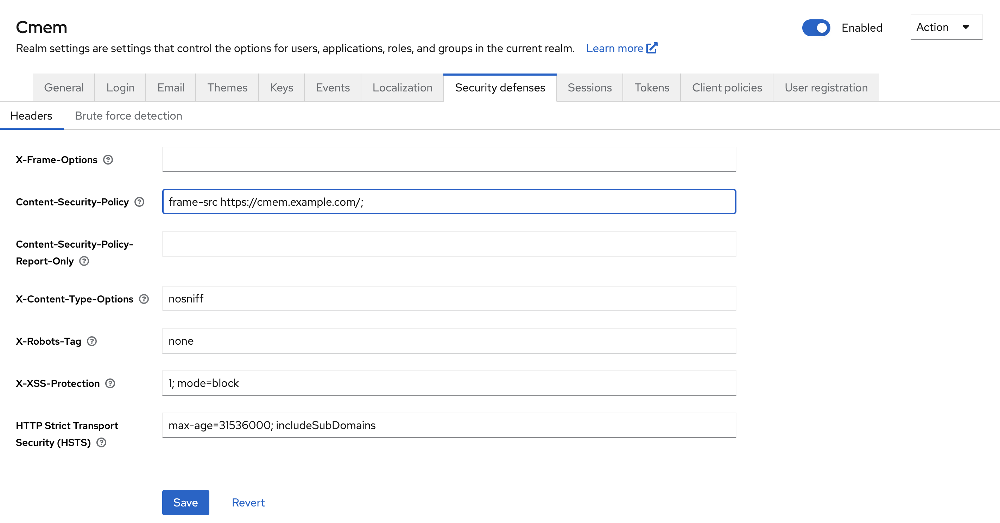
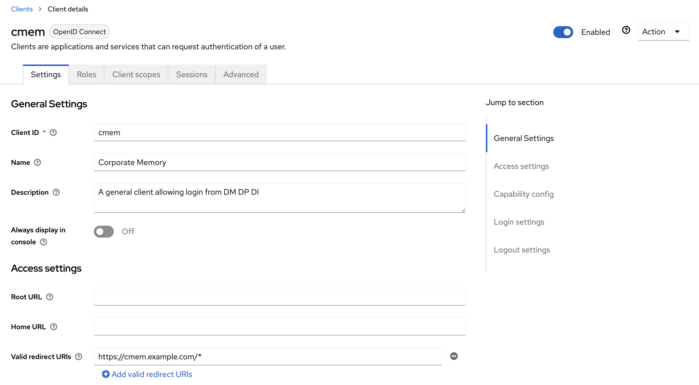
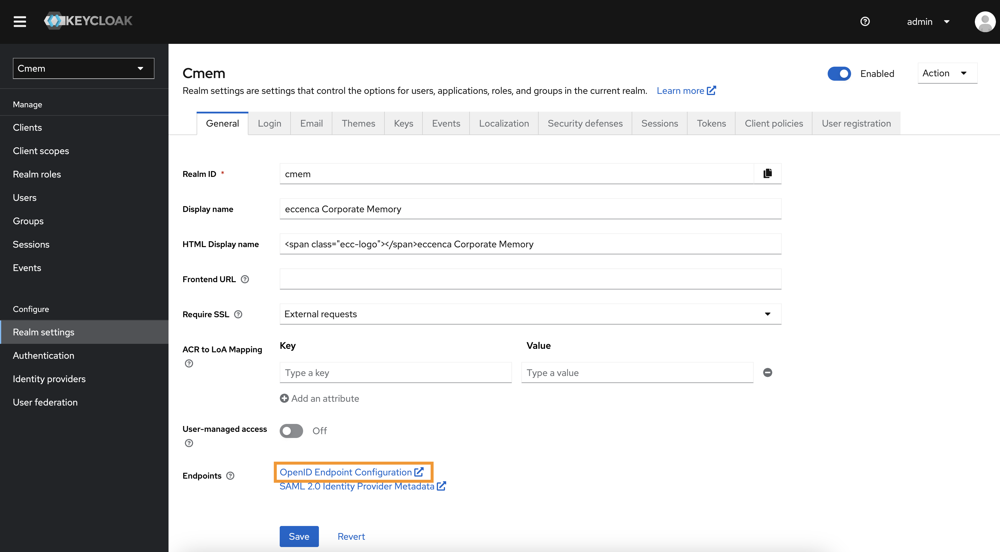

---
tags:
    - Configuration
    - Security
    - Keycloak
---
# Configure Corporate Memory with external Keycloak

## Introduction

Often there already exists a Keycloak deployment in your environment or you want to deploy multiple stages or deployments of corporate memory but only using one Keycloak. Here you often have keycloak deployed in a different domain than Corporate Memory, i.e. cmem.example.com and keycloak.example.com. For this circumstance this page give some hints.

## Configuration in Keycloak

When using a keycloak in a different domain, you have to allow this domain in the keycloak settings:

-   In Realm Settings go to Security defenses tab
    -   X-Frame-Options need to be cleared
    -   The Content-Security-Policy header needs to be defined for allowing the framing of the login mask of keycloak for the deployment frame-src <https://cmem.example.com/>;
-   In Clients go to i.e. `cmem` client
    -   add `https://cmem.example.com/*` to Valid redirect URIs

{ class="bordered" }

{ class="bordered" }

## Configuration in Corporate Memory

### Environments

When running CHO you can configure the keycloak through editing `environments/config.env`. Then just add the variables below. You can get those from the `.well-known` url from your instance, e.g. `https://keycloak.example.com/auth/realms/cmem/.well-known/openid-configuration`:

```bash
OAUTH_AUTHORIZATION_URL=${EXTERNAL_BASE_URL}/auth/realms/cmem/protocol/openid-connect/auth
OAUTH_TOKEN_URL=${EXTERNAL_BASE_URL}/auth/realms/cmem/protocol/openid-connect/token
OAUTH_JWK_SET_URL=${EXTERNAL_BASE_URL}/auth/realms/cmem/protocol/openid-connect/certs
OAUTH_USERINFO_URL=${EXTERNAL_BASE_URL}/auth/realms/cmem/protocol/openid-connect/userinfo
OAUTH_LOGOUT_REDIRECT_URL=${EXTERNAL_BASE_URL}/auth/realms/cmem/protocol/openid-connect/logout?redirect_uri=${EXTERNAL_BASE_URL}
OAUTH_CLIENT_ID=cmem
```



### Dataintegration (optional)

In default configuration Dataintegration is configured through environments. However you can also edit this in Dataintegration's config file `dataintegration.conf`:

```bash
oauth.clientId = ${OAUTH_CLIENT_ID}
oauth.authorizationUrl = ${OAUTH_AUTHORIZATION_URL}
oauth.tokenUrl = ${OAUTH_TOKEN_URL}
oauth.logoutRedirectUrl = ${OAUTH_LOGOUT_REDIRECT_URL}
```

### Dataplatform (optional)

In default configuration Dataplatform is configured through environments. However you can also edit this in Dataplatforms's config file `application.yml`:

```yaml
spring.security.oauth2:
  resourceserver:
    anonymous: "${DATAPLATFORM_ANONYMOUS}"
    jwt:
      jwk-set-uri: "${OAUTH_JWK_SET_URL}"
  client:
    registration:
      keycloak:
        client-id: "${OAUTH_CLIENT_ID}"
        authorization-grant-type: "authorization_code"
        client-authentication-method: "basic"
        redirectUri: "${DEPLOY_BASE_URL: 'http://localhost' }/dataplatform/login/oauth2/code/{registrationId}"
        scope: # openid is mandatory as spring somehow does not add it to the userinfo request
          - openid
          - profile
          - email
    provider:
      keycloak:
        jwk-set-uri: "${OAUTH_JWK_SET_URL}"
        authorization-uri: "${OAUTH_AUTHORIZATION_URL}"
        token-uri: "${OAUTH_TOKEN_URL}"
        user-info-uri: "${OAUTH_USERINFO_URL}"
        user-name-attribute: "preferred_username"
```

### cmemc

In cmemc you also need to change the keycloak cmemc tries to authenticate before connecting to corporate memory. You have to add this:

```bash
OAUTH_TOKEN_URI=https://keycloak.example.com/auth/realms/cmem/protocol/openid-connect/token
```

### Helm charts (optional)

In the helm charts we assumed you deploy keycloak by official charts, either via operator, or via helm charts. In either way you can configure the the base realm path in the value section.

```yaml
  # This is the base keycloak realm url, e.g. https://cmem.example.com/auth/realms/cmem
  .Values.global.keycloakIssuerUrl: https://keycloak.example.com/auth/realms/cmem
  .Values.global.oauthClientId: cmem
```
