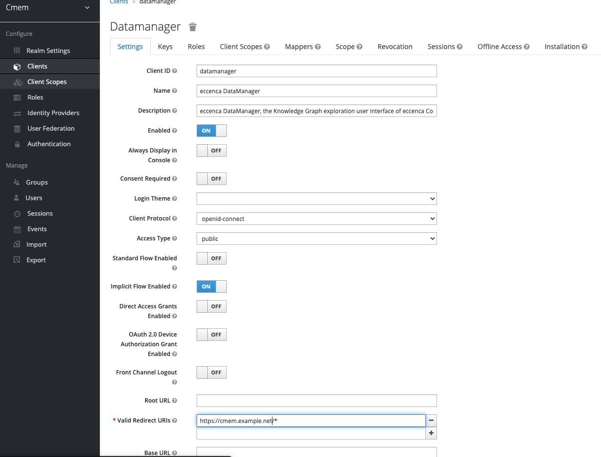

---
tags:
    - Configuration
    - Security
---
# Production-Ready Settings

If you plan to deploy Corporate Memory in a publically accessible environment you need to take care about some final configuration steps.

## Restrict Redirect URLs

As stated in the [Keycloak Server Administration Guide](https://www.keycloak.org/docs/latest/server_admin/index.html#unspecific-redirect-uris_server_administration_guide):

> Make your registered redirect URIs as specific as possible. Registering vague redirect URIs for Authorization Code Flows may allow malicious clients to impersonate another client with broader access.

Corporate Memory uses the following clients to authenticate against keycloak.
For each client, you have to adjust the **Valid Redirect URIs** field.

- datamanager
- dataintegration

Go to `Cmem-Realm` → `Clients` → `datamanger / dataintegration` and enter your deploy URL, e.g., `https://cmem.example.net/*`.



## Password Policies

If you create users in Keycloak, make sure these users have strong passwords.
To enforce this, setting up [password policies](https://www.keycloak.org/docs/latest/server_admin/index.html#_password-policies) can help.

## Cookie Settings

In Keycloak you should enforce the secure flag for keycloak cookies.
Go to `Cmem-Realm` → `Realm Settings` → `Login` and change **Require SSL** to `all requests`.
If you are running without SSL, you will no longer be able to log in to Corporate Memory.

Once this is done, make sure DataPlatform and DataIntegration use `HTTPS` to connect to Keycloak.
See the usage of `DATAPLATFORM_AUTH_URL`, `OAUTH_AUTHORIZATION_URL` and `OAUTH_TOKEN_URL`.


## CORS Settings

### DataPlatform

DataPlatform uses `http.cors.allowedOrigins *` as the default setting.
It is recommended to correctly set the values for the following headers:

- `Access-Control-Allow-Origin`:  specifies which domains can access a site's resources. For example, if ABC Corp. has domains `ABC.com` and `XYZ.com`, then its developers can use this header to securely grant `XYZ.com` access to ABC.com's resources.
- `Access-Control-Allow-Methods`: specifies which HTTP request methods (`GET`, `PUT`, `DELETE`, etc.) can be used to access resources. This header lets developers further enhance security by specifying what methods are valid when XYZ accesses ABC's resources.

Detailed configuration options can be found [here](./../dataplatform/index.md).

This is an example section from DataPlatform `application.yml`:

```yaml
## Cross-Origin Resource Sharing (CORS) settings
http:
  cors:
    allowedOrigins:
      - "https://cmem.example.net"
    allowedMethods:
      - "OPTIONS"
      - "HEAD"
      - "GET"
      - "POST"
      - "PUT"
      - "DELETE"
      - "PATCH"
```

### DataIntegration

DataIntegration uses `cors.config.allowOrigins *` as the default setting. 
It is recommended to correctly set the value for the `Access-Control-Allow-Origin` header.
It specifies which domains can access a site's resources.
For example, if ABC Corp. has the domains `ABC.com` and `XYZ.com`, you can use this header to securely grant `XYZ.com` access to `ABC.com`'s resources.
Detailed configuration options can be found [here](./../dataintegration/index.md).

This is an example section from `dataintegration.conf`:

```text
## Cross-Origin Resource Sharing (CORS) settings
# CORS configuration ###
cors.enabled = true
# List of domains that are allowed to do requests.
# Wildcard '*' means "All domains".
cors.config.allowOrigins = "*"
# Support cookies, auth etc. for the configured domain under allowOrigins.
# If set to true, allowOrigins must not have '*' configured.
cors.config.allowCredentials = false
```

