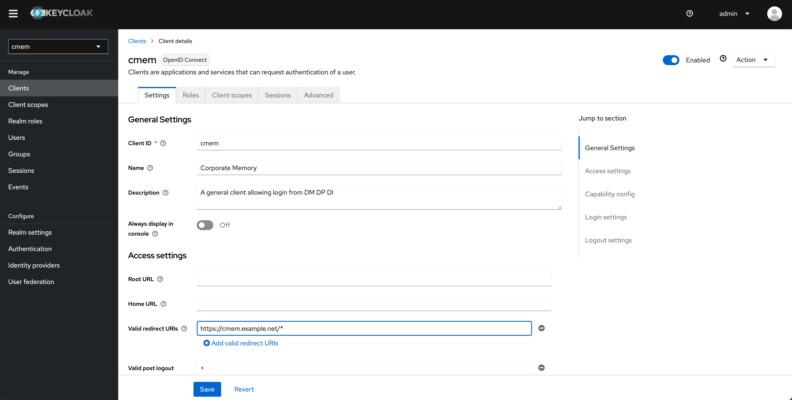
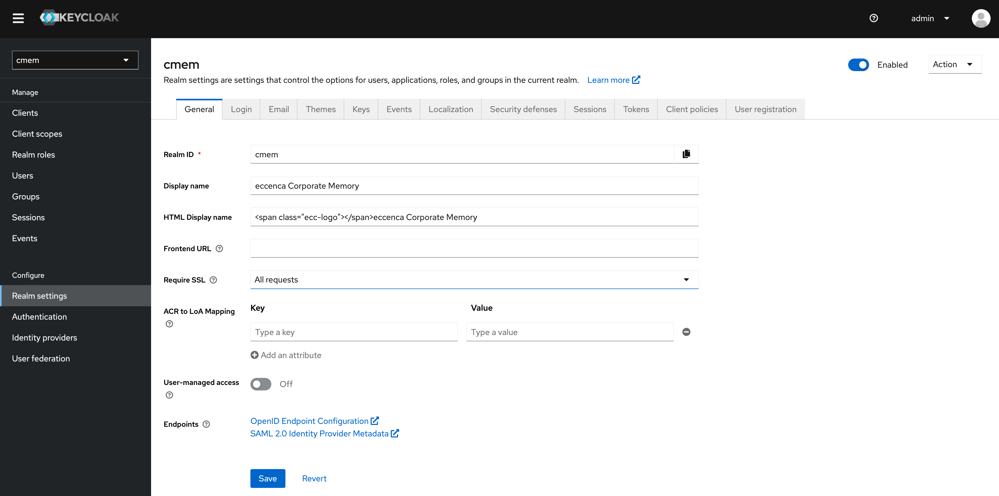

---
tags:
    - Configuration
    - Security
---
# Production-Ready Settings

If you plan to deploy Corporate Memory in a non-trusted environment, you need to take care about some final configuration steps.

## Restrict Redirect URLs

As stated in the [Keycloak Server Administration Guide](https://www.keycloak.org/docs/latest/server_admin/index.html#unspecific-redirect-uris_server_administration_guide):

> Make your registered redirect URIs as specific as possible. Registering vague redirect URIs for Authorization Code Flows may allow malicious clients to impersonate another client with broader access.

Corporate Memory uses the `cmem` client to authenticate against Keycloak, so adjust the **Valid Redirect URIs** field for this client.

Select`cmem` realm, then **Clients** → `cmem` and enter your deploy URL, e.g., `https://cmem.example.net/*`.



## Password Policies

If you create users in Keycloak, make sure these users have strong passwords.
To enforce this, setting up [password policies](https://www.keycloak.org/docs/latest/server_admin/index.html#_password-policies) can help.

## Cookie Settings

### Keycloak

In Keycloak you should enforce the secure flag for Keycloak cookies.
Select `cmem` realm, then **Realm settings** → **General** and change **Require SSL** to `All requests`.
If you are running Corporate Memory without SSL for testing, you will no longer be able to login after this step.

Once this is done, make sure Explore backend (DataPlatform) and Build (DataIntegration) use `HTTPS` to connect to Keycloak.
See the usage of `DATAPLATFORM_AUTH_URL`, `OAUTH_AUTHORIZATION_URL` and `OAUTH_TOKEN_URL`.



### Explore backend (DataPlatform)

For Explore backend (DataPlatform) you can uncomment these cookie setting in `application.yml`.

```yaml
## This is important to set flags for DP session cookies
server.servlet.session.cookie.same-site: Strict

# If this is enabled it only allows usage of cookies if TLS connection are available
server.servlet.session.cookie.secure: true
```

### Build (DataIntegration)

Similar to Explore backend (DataPlatform), you can also set cookie settings for Build (DataIntegration) inside `productions.conf` for `docker compose` deployments or in `dataintegration.conf` in helm deployments

```yaml
# sets "secure" flag in PLAY_SESSION cookie
# https://www.playframework.com/documentation/2.8.x/SettingsSession
play.http.session.secure = ${DATAINTEGRATION_SECURE_COOKIE}
```

In the [Play documentation](https://www.playframework.com/documentation/2.8.x/SettingsSession), you can find further information, i.e. also setting `sameSite = "lax"`or `strict`. By default Build (DataIntegration) sets this to `lax`


## CORS Settings

### Explore backend (DataPlatform)

Explore backend (DataPlatform) uses `http.cors.allowedOrigins *` as the default setting.
It is recommended to set custom values for the following headers:

- `Access-Control-Allow-Origin`:  specifies which domains can access a site's resources. For example, if ABC Corp. has domains `ABC.com` and `XYZ.com`, then its developers can use this header to securely grant `XYZ.com` access to ABC.com's resources.
- `Access-Control-Allow-Methods`: specifies which HTTP request methods (`GET`, `PUT`, `DELETE`, etc.) can be used to access resources. This header lets developers further enhance security by specifying what methods are valid when XYZ accesses ABC's resources.

Detailed configuration options can be found [here](../explore/dataplatform/index.md).

This is an example section from Explore backend (DataPlatform) `application.yml`:

```yaml
## Cross-Origin Resource Sharing (CORS) settings
http:
  cors:
    allowedOrigins:
      - "https://cmem.example.net"
    allowedMethods:
      - "OPTIONS"
      - "HEAD"
      - "GET"
      - "POST"
      - "PUT"
      - "DELETE"
      - "PATCH"
```

### DataIntegration

DataIntegration uses `cors.config.allowOrigins *` as the default setting.
It is recommended to set custom values for the `Access-Control-Allow-Origin` header.
It specifies which domains can access a site's resources.
For example, if ABC Corp. has the domains `ABC.com` and `XYZ.com`, you can use this header to securely grant `XYZ.com` access to `ABC.com`'s resources.
Detailed configuration options can be found [here](./../dataintegration/index.md).

This is an example section from `dataintegration.conf`:

```text
## Cross-Origin Resource Sharing (CORS) settings
# CORS configuration ###
cors.enabled = true
# List of domains that are allowed to do requests.
# Wildcard '*' means "All domains".
cors.config.allowOrigins = "*"
# Support cookies, auth etc. for the configured domain under allowOrigins.
# If set to true, allowOrigins must not have '*' configured.
cors.config.allowCredentials = false
```

