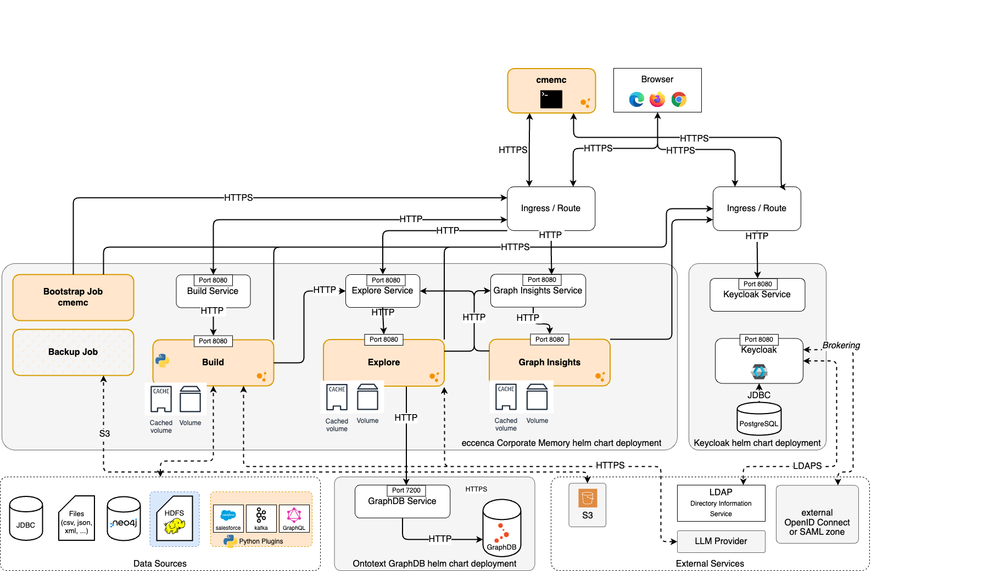

# Scenario: Kubernetes Deployment

## Introduction

This page describes the basic principles of installing Corporate Memory in a
Kubernetes cluster with `helm` and `kubectl`.
It will not explain the basic principles of Kubernetes or help in installing
the required tools.

The code examples in this section assume that you have a POSIX-compliant shell
(Linux, macOS, or WSL for Windows), a working `KUBECONFIG`, and a fully
provisioned cluster.

## Requirements

-   Access credentials for the eccenca infrastructre (e.g. Docker Registry) → [contact us to get yours](https://eccenca.com/en/contact)
-   A license for [GraphDB](https://www.ontotext.com/products/graphdb/)
-   [Kubectl](https://kubernetes.io/docs/tasks/tools/install-kubectl-linux/)
-   [Helm](https://helm.sh/docs/intro/install/)
-   If deploying on K3D, download a [static binary](https://github.com/k3d-io/k3d/releases)

## Architecture

 

## General Notice

Although this document lists value files for the three charts, we suggest always
looking at the default `values.yaml` file from the archive or repository.
The examples shown here are very basic and should not represent a production
environment. The `CHANGELOG.md` and `README.md` files in the archives or
repositories can also give some insights.

We assume that the k8s namespaces are already created.
You can either deploy all three components into one namespace or into separate ones.

``` console
kubectl create namespace graphdb
kubectl create namespace keycloak
kubectl create namespace cmem
```

## GraphDB Installation

To install GraphDB, we will use the Ontotext Helm chart.
You can get the source code from [github](https://github.com/Ontotext-AD/graphdb-helm/tree/main).
Additionally have a look at GraphDBs [documentation page](https://graphdb.ontotext.com/documentation/).

Be aware, that with Version 11 of GraphDB you are required to deploy a license
file, even in the Free edition.
You can aquire one by [filling a form](https://www.ontotext.com/products/graphdb/).
See also the [licensing documentation](https://graphdb.ontotext.com/documentation/11.1/licensing.html).

### 1. Obtain the chart

You can download the GraphDB chart from [github](https://github.com/Ontotext-AD/graphdb-helm/releases)
or add their repository to your environment with `helm`:

``` console
helm repo add ontotext https://maven.ontotext.com/repository/helm-public/
helm repo update
```

### 2. Configuration

Create a file named `graphdb-values.yaml` to configure your GraphDB deployment.
For a basic setup, you can start with an empty file and add configurations as needed.
For production, you should configure persistence, resource limits, and any
specific GraphDB settings.
Download a [basic example value file](files/graphdb-values.yaml) (`graphdb-values.yaml`).

Here is a minimal example that disables ingress and sets resources,
persistence and security:

``` yaml
ingress:
  enabled: false

resources:
  limits:
    memory: 4Gi
    cpu: 2000m
  requests:
    memory: 4Gi
    cpu: 500m

license:
  # Reference to a secret containing 'graphdb.license' file that will be
  # mounted in the GraphDB pod. The value is processed as a Helm template.
  existingSecret: "graphdb-license"
  # File name of the GraphDB license file in the existing license secret.
  # The default is graphdb.license, but it can be changed to map
  # to a different secret key.
  licenseFilename: graphdb.license

security:
  enabled: true
  provisioningUsername: provisioner
  provisioningPassword: iHaveSuperpowers

persistence:
  enabled: true
  volumeClaimTemplate:
    name: "storage"
    spec:
      accessModes: [ "ReadWriteOnce" ]
      resources:
        requests:
          storage: 5Gi
```

### 3. Install the GraphDB chart

First, create the license secret as mentioned above.
Then, install the GraphDB chart using `helm`:

``` console
kubectl --namespace graphdb create secret generic graphdb-license \
  --from-file graphdb.license

helm upgrade --install graphdb ontotext/graphdb \
  --namespace graphdb \
  -f graphdb-values.yaml
```

This will deploy GraphDB into the `graphdb` namespace.

### 4. Accessing GraphDB

To access the GraphDB user interface without exposing it via an Ingress,
you can use `kubectl port-forward`. This is useful for initial setup and verification.

First, get the name of the GraphDB service:

``` console
kubectl get svc --namespace graphdb
```

Assuming the service is named `graphdb`, forward a local port to the
service port (`7200`):

``` console
kubectl port-forward svc/graphdb 7200:7200 --namespace graphdb
```

Now you can access the GraphDB workbench in your browser at [http://localhost:7200](http://localhost:7200).

## Keycloak Installation

This guide provides instructions on how to install Keycloak using the
provided Helm chart.

### 1. Obtain the chart

We strongly recommend to download the chart and execute the install commands against a local environment.


``` console
wget https://helm.eccenca.com/keycloak/latest.tgz
tar -xzf latest.tgz
```

``` console
# this requires gitlab.eccenca.com access
git clone ssh://git@gitlab.eccenca.com:8101/devops/keycloak-helm.git
```

You can also use the helm package manger, but then you have to take care about restoring from a backup on your own.
The mechanism for that is included in the chart, but the helm command requires you have the sql dump file on your local machine.

``` console
helm repo add --force-update eccenca https://helm.eccenca.com
helm repo update eccenca
```

### 2. Configuration

Create a file named `keycloak-values.yaml` to configure your Keycloak deployment.
At a minimum, you should configure the initial admin credentials and the
ingress settings.
You can also [download the minimum value file](files/keycloak-values.yaml) (`keycloak-values.yaml`).

``` yaml
---
postgres:
  internal: true
  provisioning:
    enabled: true
    # If true, this will drop the public schema and
    # re-provision the database on every start.
    force: true

ingress:
  enabled: true
  className: nginx
  annotations:
    cert-manager.io/common-name: "kc.docker.localhost"
  hosts:
    - host: "kc.docker.localhost"
      paths:
        - path: /auth
          pathType: Prefix
          serviceName: keycloak
          servicePort: 8080
  tls:
    - hosts:
         - "kc.docker.localhost"
      secretName:  keycloak-ingress-cert
```

You will also need to configure TLS, for example by using `cert-manager`.
Please see the `README.md` file in the chart repository for explanations.

### 3. Install the Keycloak chart

Use `helm` to deploy the chart into the `keycloak` namespace.

With local extracted helm chart:

``` console
helm upgrade -i keycloak ./keycloak-helm \
  --namespace keycloak \
  -f keycloak-values.yaml
```

Or from helm repository:

``` console
helm upgrade --install keycloak eccenca/keycloak-helm \
  --namespace keycloak \
  -f keycloak-values.yaml

# if you use sqldump provisioning you have to restart keycloak:
kubectl --namespace keycloak delete pods/keycloak-0
```

This command will install the Keycloak chart in the `keycloak` namespace using
your custom configuration.
Be aware that the example tries to restore the database from a dump provided
inside the chart.
You can disable this if you like.

### 4. Accessing Keycloak

Once deployed, you can access the Keycloak user interface via the hostname you
configured in your `keycloak-values.yaml`.

``` bash
Release "keycloak" does not exist. Installing it now.
NAME: keycloak
LAST DEPLOYED: Mon Nov 17 22:54:46 2025
NAMESPACE: keycloak
STATUS: deployed
REVISION: 1
DESCRIPTION: Install complete
TEST SUITE: None
NOTES:
1. Get the application URL by running these commands:
  https://kc.docker.localhost/auth
```

## Installation Corporate Memory

This guide provides instructions on how to install the chart using `kubectl`
and `helm`.
You need to have a keycloak instance and a supported graph database installed.

### 1. Obtain the chart

``` console
wget https://releases.eccenca.com/cmem-helm/latest.tgz
tar -xzf latest.tgz
cd cmem
```

``` console
helm repo add --force-update cmem-helm https://helm.eccenca.com
helm repo update cmem-helm
```

``` console
# this requires gitlab.eccenca.com access
git clone https://gitlab.eccenca.com/cmem/cmem-helm.git
```

### 2. Configuration

By default, Corporate Memory is subject to the eccenca free Personal,
Evaluation and Development License Agreement (PEDAL),
a license intended for non-commercial usage.

If you have a dedicated license file, create a secret with a `license.asc` data entry:

``` console
kubectl create secret generic cmem-license \
  --from-file license.asc
  --namespace cmem
```

Then, add the secret name to your `values.yaml` file for the key `global.license`.

To configure your Corporate Memory deployment, create a file named `cmem-values.yaml`.
At a minimum, you should configure the

- `hostname`, under which the deployment is reachable later
- `cmemClientSecret`, if you use the postgres provisioning dump the default is fine
- `keycloakBaseUrl` / `keycloakIssuerUrl`, where keycloak and the realm can be found
- `explore.store.graphdb`-values as database connection
- `ingress`-values like `host` and `tls.secretName`, if you use `certmanager`.

You can also [download the minimum value file](files/cmem-values.yaml) (`cmem-values.yaml`).

Edit `cmem-values.yaml` and adjust the configuration to your needs.

``` yaml
ingress:
  enabled: true
  className: nginx
  annotations:
    cert-manager.io/cluster-issuer: <cluster-issuer-if-present>
  hosts:
    - host: "<your-cmem-hostname>"
      paths:
        - path: /
          pathType: Prefix
          serviceName: explore
          servicePort: 8080
        - path: /dataintegration
          pathType: Prefix
          serviceName: dataintegration
          servicePort: 8080
  tls:
    - hosts:
         - "<your-cmem-hostname>"
      secretName:  cmem-ingress-cert

global:
  protocol: "https"
  cmemClientId: cmem-service-account
  cmemClientSecret: c8c12828-000c-467b-9b6d-2d6b5e16df4a
  hostname: "<your-hostname>"
  keycloakBaseUrl: https://<your-keycloak-hostname>/auth/
  keycloakIssuerUrl: https://<your-keycloak-hostname>/auth/realms/cmem

  # (if license secret was created)
  # license: cmem-license

explore:
  store:
    graphdb:
      enabled: true
      repository: cmem
      user: provisioner
      password: "iHaveSuperpowers"
      host: "<your-graphdb-hostname>"
      sslEnabled: false

```

#### (Optional) Graph Insights

Setting up Graph Insights in Kubernetes deployment done with helm is described in our
[documentation](../../deploy-and-configure/configuration/graphinsights/#b-enable-in-helm-deployment).

### 3. Install the Corporate Memory chart

To pull the Corporate Memory images, you need to provide credentials for the eccenca
Docker Registry.

``` console
kubectl create secret docker-registry eccenca-docker-registry-credentials \
  --docker-server=https://docker-registry.eccenca.com \
  --docker-username=<your-docker-username> \
  --docker-password=<your-docker-password> \
  --namespace cmem
```

Replace the placeholders with the provided registry details and credentials.

Now use `helm` to deploy the chart.
This command will install the chart in the specified namespace using your
custom configuration.

``` console
# In case you have the chart or repostiory locally available
helm upgrade --install cmem . \
  --namespace cmem \
  -f cmem-values.yaml

# or use our helm repository
helm upgrade --install cmem cmem-helm/cmem \
  --namespace cmem \
  -f cmem-values.yaml
```

### 4. Verify the installation

After the installation is complete, you can check the status of the pods:

``` console
kubectl get pods --namespace cmem
```

You can also check the rollout status of the StatefulSets:

``` console
kubectl rollout status statefulset/explore --namespace cmem
kubectl rollout status statefulset/dataintegration --namespace cmem
```
