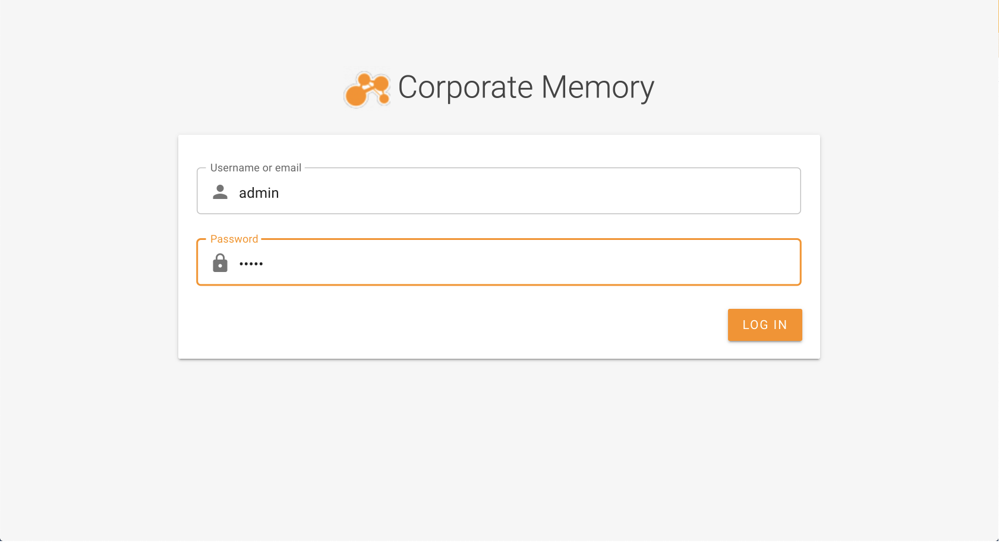

# Introduction

This page describes a docker-compose based orchestration running on your local machine and accessible via browser.

The code examples in this section assumes that you have POSIX-compliant shell (linux, macOS or WSL for Windows).

## Requirements

- Access credentials to eccenca Artifactory and eccenca Docker Registry → [contact us to get yours](https://eccenca.com/en/contact)
- [docker](https://www.docker.com/) and [docker-compose](https://docs.docker.com/compose/install/) (v1) installed locally
- [git](https://git-scm.com/book/en/v2/Getting-Started-Installing-Git) installed locally
- At least 4 CPUs and 12GB of RAM (recommended: 16GB) dedicated to docker

## Setup & Check Installation Environment

Download the [Corporate Memory docker orchestration](https://releases.eccenca.com/docker-orchestration/) from eccenca Artifactory.

Open a terminal window, create a directory, copy and extract docker orchestration there.

```shell-session
# create eccenca-corporate-memory directory in your ${HOME} and set as a working dir

$ mkdir ${HOME}/eccenca-corporate-memory && cd ${HOME}/eccenca-corporate-memory

# cp Corporate Memory docker orchestration distribution in the local directory
# Change VERSION to the version you have downloaded e.g. v20.03

$ cp ${HOME}/Downloads/cmem-orchestration-VERSION.zip ./
$ unzip cmem-orchestration-VERSION.zip
$ rm cmem-orchestration-VERSION.zip
$ git init && git add . && git commit -m "stub"
```

Check your local environment:

```shell-session
# run the following command (without $) to check your docker server version, should be at least 19.03
# to have the current security patches, always update your docker version to the latest one

$ docker info | grep -i version
Server Version: 19.03.8

# check docker-compose version, should be at least 1.25.0
# update to the latest version if necessary

$ docker-compose --version
docker-compose version 1.25.4, build 8d51620a

# login into eccenca docker registry

$ docker login docker-registry.eccenca.com
Username: yourusername
Password:
Login Succeeded
```

## Installation

To install Corporate Memory, you need to modify your local hosts file (located in /etc/hosts), minimal configuration is as follows:

```text
##
# Host Database
#
# localhost is used to configure the loopback interface
# when the system is booting.  Do not change this entry.
##
127.0.0.1 localhost
127.0.0.1 docker.localhost
127.0.0.1 corporate.memory
```

Corporate Memory uses Ontotext GraphDB triple store as default backend. Graphdb is available as free version and does not requires a license. If you have a license for graphdb you can copy the file to the ```license```folder inside Corporate Memory's root folder.

```shell-session
$ cp YOUR_SE_LICENSE_FILE ${HOME}/cmem-orchestration-VERSION/licenses/graphdb-se.license
# or
$ cp YOUR_EE_LICENSE_FILE ${HOME}/cmem-orchestration-VERSION/licenses/graphdb-ee.license
```

Then change the file ```environments/config.env``` to use the correct version:

```text

###############################
# Stores                      #
###############################
# default: graphdb-se
#DP_STORE=graphdb-ee
DP_STORE=graphdb-free

```

Run the command to clean workspace, pull the images, start the Corporate Memory instance and load initial data:

```shell-session
$ cd ${HOME}/cmem-orchestration-VERSION

# Pulling the images will take time

$ make clean-pull-start-bootstrap
```

You should see the output as follows:

```shell-session
/usr/local/bin/docker-compose kill
/usr/local/bin/docker-compose stop
/usr/local/bin/docker-compose down --volumes --remove-orphans
Removing network dockerlocal_default
Removing volume dockerlocal_stardog
/usr/local/bin/docker-compose rm -v --force
No stopped containers
Pulling apache2         ... done
Pulling datamanager     ... done
Pulling store           ... done
Pulling postgres        ... done
Pulling keycloak        ... done
Pulling dataplatform    ... done
Pulling dataintegration ... done
Pulling cmemc           ... done
/usr/local/bin/docker-compose  up -d
Creating network "dockerlocalhost_default" with the default driver
Creating volume "dockerlocalhost_postgres_volume" with default driver
Creating volume "dockerlocalhost_import_volume" with default driver
Creating volume "dockerlocalhost_store_volume" with default driver
Creating dockerlocalhost_store_1       ... done
Creating dockerlocalhost_apache2_1     ... done
Creating dockerlocalhost_datamanager_1 ... done
Creating dockerlocalhost_postgres_1    ... done
Creating dockerlocalhost_cmemc_1       ... done
Creating dockerlocalhost_keycloak_1    ... done
Creating dockerlocalhost_dataplatform_1    ... done
Creating dockerlocalhost_dataintegration_1 ... done
/home/user/cmem-orchestration-v22.2.2//scripts/waitForSuccessfulStart.dist.sh
Waiting for healthy orchestration................... done
Remove existing bootstrap data from triple store and import shipped data from DP
chmod a+r conf/cmemc/cmemc.ini
docker run -i --rm --network dockerlocalhost_default --env "OAUTH_CLIENT_SECRET=c8c12828-000c-467b-9b6d-2d6b5e16df4a" --volume /home/user/cmem-orchestration-v22.2.2/data:/data --volume /home/user/cmem-orchest
ration-v22.2.2/conf/cmemc/cmemc.ini:/config/cmemc.ini docker-registry.eccenca.com/eccenca-cmemc:v22.2 -c cmem admin store bootstrap --import
Update or import bootstrap data ... done
make[1]: Leaving directory '/home/ttelleis/aztest/cmem-orchestration-v22.2.2'

CMEM-Orchestration successfully started with store graphdb-free.
Please open http://docker.localhost for validation.
Run make logs to see log output
```

## Initial Login / Test

Open your browser and navigate to <http://docker.localhost>


| account | password | description                                                                                 |
| ------- | -------- | ------------------------------------------------------------------------------------------- |
| `admin` | `admin`  | Is member of the global admin group (can see and do anything)                               |
| `user`  | `user`   | Is member of the local user group (can not change access conditions or see internal graphs) |



After successful login, you will see Corporate Memory interface. You can now proceed to the :arrow_right:[Getting Started](../../../getting-started/index.md) section.

