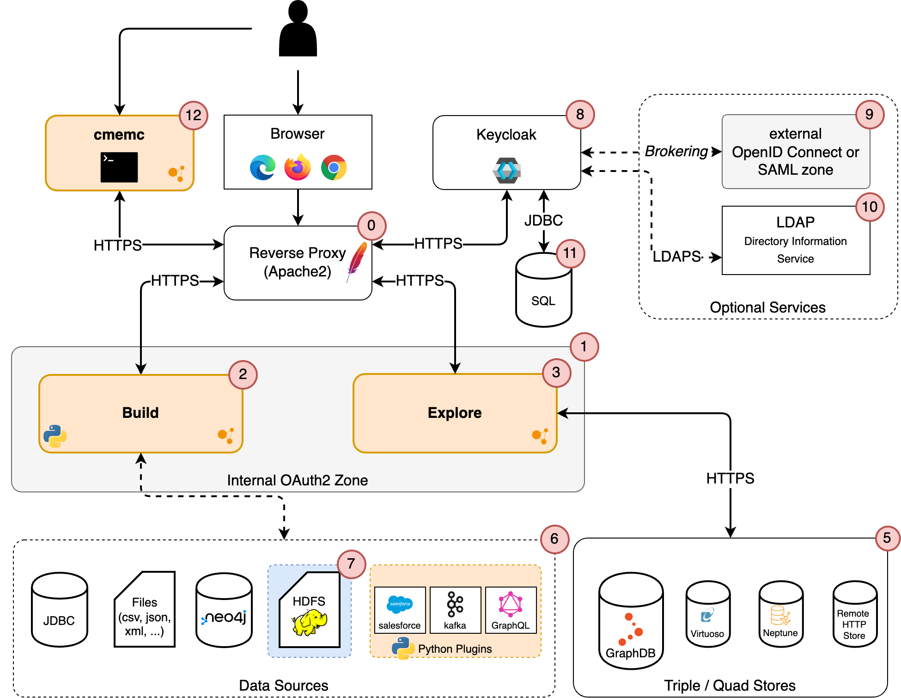

# System Architecture

This page describes the overall system architecture of eccenca Corporate Memory and its components.

eccenca Corporate Memory consists of three core components:

- (2) [eccenca Build](../configuration/dataintegration/index.md)
- (3) [eccenca Explore](../configuration/datamanager/index.md), and
- (12) [cmemc (Corporate Memory Control)](../../automate/cmemc-command-line-interface/index.md)

_Build_ (2) is the Corporate Memory component which enables integration of datasets into a single consistent knowledge graph.
Datasets in their original format are mapped to RDF schemata and then linked to and persisted into a knowledge graph.
The data integration is performed semi-automatically based on domain-specific integration rules and vocabularies (OWL ontologies).
Corporate Memory supports multiple kinds of source integration data sources (6) such as SQL databases or files of different formats.
These files can be processed with _Build_ either locally or on a remote Spark cluster (7).

_Explore_ (3) is a single-page JavaScript application which enables creating and managing knowledge graphs based on established W3C standards.
It is a generic data browser suitable to edit, explore and query the created knowledge graph.
_Explore_ provides convenient options to create specific data views by using [Shapes Constraint Language](https://www.w3.org/TR/shacl/) (SHACL).

_Explore_ (3) also acts as the semantic middleware application which provides a unified access to semantic graph data.
Additionally, _Explore_ manages authorization of the users according to the access control lists defined in the Triple Store.
The knowledge graph is stored in a quad store (5) connected to _Explore_.
This can either be a physical store like [GraphDB](http://graphdb.ontotext.com/), [Virtuoso](https://virtuoso.openlinksw.com/) or a remotely accessible SPARQL 1.1 compliant HTTP endpoint.

Keycloak (8) provides authentication.
Keycloak can act as an authentication broker for already existing, external OpenId Connect or SAML infrastructures (9).
In addition to that, Keycloak supports a wide variety of internal user management configuration scenarios and the option to connect to an external LDAP server for user and group synchronization (10).
Keycloak uses the embedded Java-based relational database H2 as a default to store its configuration data.
However, it is highly recommended to [use a relational database](https://www.keycloak.org/server/db) (11) for production use instead.
Refer to the [Keycloak manual](https://www.keycloak.org/guides#server) for further information on possible setups.

[cmemc](../../automate/cmemc-command-line-interface/index.md) (12) (**C**orporate **Mem**ory **C**ontrol) is the eccenca Corporate Memory Command Line Interface (CLI).
cmemc is intended for System Administrators and Linked Data Experts who wants to automate and remote control activities on Corporate Memory.
