# Development and Publication of Marketplace Packages

## Introduction

Marketplace Packages are archives that bundle content, functionality, and configuration from Corporate Memory for sharing and reuse.

Each package has its own release cycle.
Packages can be installed and uninstalled during runtime.

In order to support the development and publication of Marketplace Packages, we published a [package-template](https://github.com/eccenca/cmem-package-template).
Please have a look at this template to get started.

This page gives an overview of the concepts you need to understand in order to develop packages.

## Package Structure

Use the [package-template](https://github.com/eccenca/cmem-package-template) to create the boilerplate for a package repository.

### License

!!! info "No publication without license"

    Packages without a license declaration cannot be published to a Corporate Memory Marketplace Server.

Our template will bootstrap your package with an _Apache License 2.0 ([`Apache-2.0`](https://spdx.org/licenses/Apache-2.0.html))_.
See <https://spdx.org/licenses/> if you need a different license.
You can remove a license entirely; however, a package that does not declare a license cannot be published.

### Manifest

The `manifest.json` is the central package definition.
It contains all relevant package metadata and describes the package contents.
It is used to present package details and contents to the `inspect` command<!-- or in the marketplace frontends-->, to install, configure and uninstall all parts of a package.

#### Metadata

`package_type`
:   `project`
    :   A package that may ship any content, mainly intended to contain Build projects, (instance/data) graphs, SHACL shapes, workspace configuration, query catalogs, etc.

    `vocabulary`
    :   A package that is supposed to contribute vocabulary / ontology contents, such as `rdf:`, `org:`, `sso:`, etc. Such a package may contain multiple vocabularies / ontologies. Packaging related SHACL shapes is reasonable, too.

`package_id`
:   Unique package identifier

`package_version`
:   Semantic version identifier string of the package, but limited to proper releases.

`metadata.name`
:   The package name in English.

`metadata.description`
:   The package description in English.

`metadata_comment`
:   A maintainer or publisher comment.

#### Files

A package can contain graphs or Build projects. These contents are referenced in the `manifest.json`.

##### Graphs

Use the following structure to include a graph.
`register_as_vocabulary` and `import_into` are optional instructions.
We suggest to organize graphs in a respective sub-folder (here `graphs/`), but this is up to you:

```json
"files": [
    …
    {
        "file_type": "graph",
        "file_path": "graphs/file.ttl",
        "graph_iri": "http://www.example.org/file/",
        "register_as_vocabulary": true,
        "import_into": [
            "http://www.example.org/integration_graph/"
        ]
    },
    …
]
```

##### Projects

Use the following structure to include a project.
We suggest to organize projects in a respective sub-folder (here `projects/`), but this is up to you:

```json
"files": [
    …
    {
        "file_type": "project",
        "file_path": "projects/my-build-project.zip",
        "project_id": "my-build-project"
    },
    …
]
```

#### Dependencies

Dependencies to other (vocabulary) packages or to Python plugins can be declared in the `copier copy` answers.
The dependencies are added to the `manifest.json` as described in the next sections.

##### Python Plugin Packages

Use the following to declare a dependency to a Python plugin:

```json
"dependencies": [
    …
    {
      "dependency_type": "python-package",
      "pypi_id": "cmem-plugin-pyshacl"
    },
    …
]
```

##### (Vocabulary) Packages

Use the following to declare a dependency to a (vocabulary) package:

```json
"dependencies": [
    …
    {
      "dependency_type": "vocabulary",
      "package_id": "w3c-rdfs-vocab"
    }
    …
]
```

## Package Development Cycle

!!! info "`cmemc package` reference"

    The [cmemc package command group](../../../automate/cmemc-command-line-interface/command-reference/package/index.md)
    contains of the needed commands to support the complete package lifecycle.

Some packages are simply wrapping existing artifacts into a managed structure (e.g. existing vocabulary/ontology).

Most (solution) package development and evolution will be a back and forth between a package repository (making changes to `manifest.json` in terms of adding/removing dependencies, graph files, or Build project files) and a Corporate Memory (package development) instance.

The following pages give an overview about this feature:

{ width="50%" }

### Install (local) Packages

Use the following command to install a local package folder content (or built `.cpa` file) to a Corporate Memory (package development) instance.

```sh
cmemc package install --input PATH
```

Make changes to graphs, configuration, or Build projects as needed.
Newly created or imported graphs or Build projects need to be registered in `manifest.json` so they will be fetched by `export`.

### Export Contents into a Package

Use the following command to export the file artifacts declared in `manifest.json` from a Corporate Memory (package development) instance to a local package folder.

```sh
cmemc package export PACKAGE_ID
```

Run this to initially populate package contents from a solution configuration. You can also use it to update contents after making changes on your Corporate Memory (package development) instance, capturing them for building and releasing as a Marketplace Package.

### Inspect Packages

Review and verify the contents of a package with the following command:

```sh
cmemc package inspect PACKAGE_PATH
```

### Build Packages

During development you can install a package from a local path (plain folder or a `.cpa` package) using the `cmemc package install --input PATH` command.

Use the `cmemc package build` command.
This will build a package archive from a package directory.

This command processes a package directory, validates its content including the manifest, and creates a versioned Corporate Memory package archive (`.cpa`) with the following naming convention: `{package_id}-v{version}.cpa`.

### Publish Packages

Package archives can be published to the Marketplace Server using the `cmemc package publish` command.
After being published packages can be found and installed directly from the Marketplace Server (potential users do not need to have the local package folder or `.cpa` file available).
