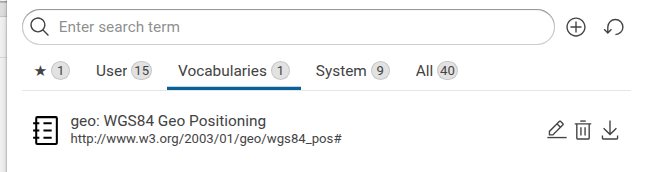
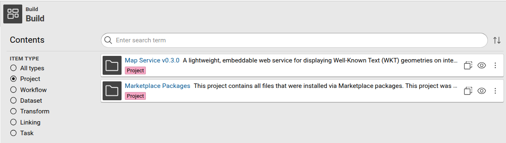

# Installation and Usage of Marketplace Packages

## Installation

If you want to install a marketplace package, you need to use cmemc's package command group.

You can either install from a remote marketplace or from a locally obtained `.cpa` file

```shell-session title="Install a package from marketplace"
$ cmemc package install w3c-xsd-vocab
Installing package 'w3c-xsd-vocab' from marketplace ... done
```

```shell-session title="Install a package from cpa file:"
$ cmemc package install --replace --input my-package-v0.0.0-4b7516f.cpa
Installing package 'my-package' from 'my-package-v0.0.0-4b7516f.cpa'
done
```

## Usage

Depending on the content types inside it, an installed package can appear in different places in Corporate Memory, with each item (graph, workflows, projects, ...) surfacing in its respective component.

<div style="clear: both" markdown>

!!! info inline ""

    

**Graphs** such as data graphs but also **Vocabularies** or **Shapes Catelog** are listed in [**Explore > Graphs**](../../../explore-and-author/graph-exploration/#graphs).

</div>

<div style="clear: both" markdown>

!!! info inline ""

    

**Projects** are imported inside [**Build**](../../../build/introduction-to-the-user-interface#projects).
When you install your first project package, Corporate Memory also creates a special project to store all installed files.
This folder is automatically managed by the package system, and removed once the last package is uninstalled.

</div>

<div style="clear: both" />
