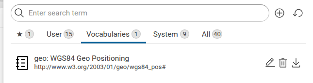
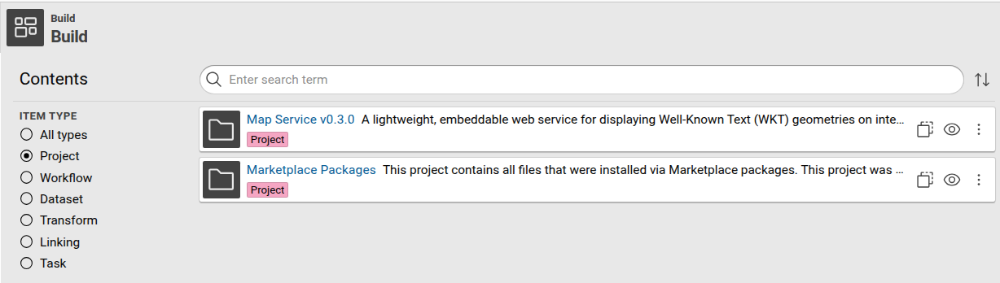

# Installation and Management of Marketplace Packages

## Introduction

Marketplace Packages can be installed directly from a Corporate Memory Marketplace Server (e.g. [https://eccenca.market](https://eccenca.market)), or from local **C**orporate Memory **P**ackage **A**rchives (`.cpa` files) and package directories.

This page describes how to search, install, list, and uninstall Marketplace Packages using `cmemc`.

!!! info "`cmemc package` reference"

    The [cmemc package command group](../../../automate/cmemc-command-line-interface/command-reference/package/index.md)
    contains all needed commands to support the complete package lifecycle.

## Search Packages

Use the following command to search a Marketplace Server for available packages:

```shell title="Search the Marketplace Server"
cmemc package search vocab
```

## Install Packages

Use the following command to install a package from a Marketplace Server:

```shell-session title="Install a package from the Marketplace Server"
$ cmemc package install w3c-xsd-vocab
Installing package 'w3c-xsd-vocab' from marketplace ... done
```

For installing local package archives (`.cpa` files) or package directories, use the `--input` option:

```shell-session title="Install a package from a .cpa file"
$ cmemc package install --replace --input my-package-v0.0.0-4b7516f.cpa
Installing package 'my-package' from 'my-package-v0.0.0-4b7516f.cpa'
done
```

!!! info "Replacing installed packages"

    Use `--replace` to overwrite an already installed package version or package content.
    Without this option, installing over existing content fails.

## List Packages

Use the following command to list all installed packages:

```shell title="List installed packages"
cmemc package list
```

To review the manifest of a package (installed, local directory, or `.cpa` file), use the `inspect` command:

```shell title="Inspect a package manifest"
cmemc package inspect my-package-v0.0.0-4b7516f.cpa
```

## Where Package Contents Appear

Depending on the content types inside it, an installed package appears in different places in Corporate Memory, with each item (graph, project, workflow, ...) surfacing in its respective component.

<div style="clear: both" markdown>

!!! info inline ""

    

**Graphs** such as data graphs but also **Vocabularies** or **Shapes Catalogs** are listed in [**Explore > Graphs**](../../../explore-and-author/graph-exploration/index.md#graphs).

</div>

<div style="clear: both" markdown>

!!! info inline ""

    

**Projects** are imported into [**Build**](../../../build/introduction-to-the-user-interface/index.md#projects).
When you install your first project package, Corporate Memory also creates a special project to store all installed files.
This project is automatically managed by the package system, and removed once the last package is uninstalled.

</div>

<div style="clear: both" />

## Uninstall Packages

Use the following command to uninstall a package:

```shell title="Uninstall a package"
cmemc package uninstall PACKAGE_ID
```

This removes all package contents from the Corporate Memory instance, including graphs and Build projects that were installed as part of the package.
