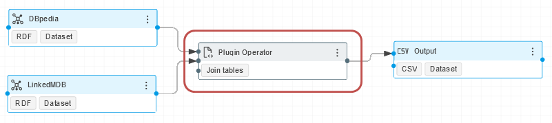
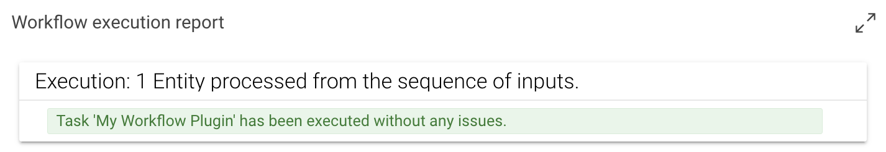
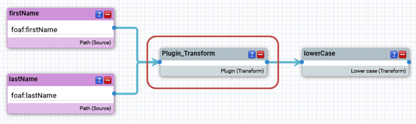

# Python Plugin Development

## Getting Started

The CMEM Python SDK supports two kinds of operator plugins. These are supported by [cmem-plugin-base](https://github.com/eccenca/cmem-plugin-base), which is the underlying dependency for [cmem-plugin-template]. Those two types of cmem-plugin-base plugins are

### Workflow plugins

A workflow plugin implements a new operator (task) that can be used within a workflow.
A workflow plugin may accept an arbitrary list of inputs and optionally returns a single output.



A minimal plugin that just outputs the first input looks like this:

```py title="workflow.py"
from typing import Sequence
from cmem_plugin_base.dataintegration.context import ExecutionContext, ExecutionReport
from cmem_plugin_base.dataintegration.description import PluginParameter, Plugin
from cmem_plugin_base.dataintegration.entity import Entities
from cmem_plugin_base.dataintegration.plugins import WorkflowPlugin

@Plugin(label="My Workflow Plugin")
class MyWorkflowPlugin(WorkflowPlugin):

    def execute(
        self, inputs: Sequence[Entities], context: ExecutionContext
    ) -> Entities:
        context.report.update(
            ExecutionReport(
                entity_count=1,
                operation="wait",
                operation_desc="Entity processed from the sequence of inputs.",
            )
        )
        return inputs[0]
```

The lifecycle of a plugin is as follows:

-   The plugin will be instantiated once the workflow execution reaches the respective plugin.
-   The execute function is called with the results of the connected input operators.
-   The output is forwarded to the next subsequent operator.

Because the returned Entities object can only be iterated once, the above process has to be repeated each time the output is iterated over.
Multiple iterations happen if the output of the workflow plugin is connected to multiple operators.



### Transform plugins

A transform plugin can be used in transform and linking rules. It accepts an arbitrary number of inputs and returns an output. Each input as well as the output consists of a sequence of values.



A minimal plugin that just outputs the first input looks like this:

```py title="transform.py  " linenums="1"
from typing import Sequence
from cmem_plugin_base.dataintegration.description import PluginParameter, Plugin
from cmem_plugin_base.dataintegration.plugins import TransformPlugin


@Plugin(label="My Transform Plugin")
class MyTransformPlugin(TransformPlugin):
    def transform(self, inputs: Sequence[Sequence[str]]) -> Sequence[str]:
        return inputs[0]
```

### Plugin Context

The [cmem-plugin-base](https://github.com/eccenca/cmem-plugin-base/) package describes [context](https://github.com/eccenca/cmem-plugin-base/blob/main/cmem_plugin_base/dataintegration/context.py) objects, which are passed to the plugin depending on the executed method.

| Class              | Description                                                                                                                                         |
| ------------------ | --------------------------------------------------------------------------------------------------------------------------------------------------- |
| `SystemContext`    | Passed into methods to request general system information.                                                                                          |
| `UserContext`      | Passed into methods that are triggered by a user interaction.                                                                                       |
| `TaskContext`      | Passed into objects that are part of a DataIntegration task/project.                                                                                |
| `ExecutionReport`  | Workflow operators may generate execution reports. An execution report holds basic information and various statistics about the operator execution. |
| `ReportContext`    | Passed into workflow plugins that may generate a report during execution.                                                                           |
| `PluginContext`    | Combines context objects that are available during plugin creation or update.                                                                       |
| `ExecutionContext` | Combines context objects that are available during plugin execution.                                                                                |

## Producing and Consuming Entities

To Produce and Consume the Entities, understanding [entities](https://github.com/eccenca/cmem-plugin-base/blob/main/cmem_plugin_base/dataintegration/entity.py) is required.

### Entities


| Class          | Description                                                        |
| -------------- | ------------------------------------------------------------------ |
| `Entities`     | Holds a collection of entities and their schema                    |
| `Entity`       | An Entity can represent an instance of any given concept.          |
| `EntitySchema` | An entity schema that represents the type of uri and list of paths |
| `EntityPath`   | A path in a schema                                                 |

### How to Produce Entities


TODO: Actions

-   check setup both for plugin and connecting instance
-   add copier instructions to copy template
-   create a project with workflow - add plugin, test and produce entities
-   see the output.

```py title="entities-producer.py" linenums="1" hl_lines="62 86"
"""Entities Producer"""
import uuid
from secrets import token_urlsafe
from typing import Sequence

from cmem_plugin_base.dataintegration.context import ExecutionContext, ExecutionReport
from cmem_plugin_base.dataintegration.description import Plugin, PluginParameter
from cmem_plugin_base.dataintegration.entity import (
    Entities,
    Entity,
    EntitySchema,
    EntityPath,
)
from cmem_plugin_base.dataintegration.plugins import WorkflowPlugin


@Plugin(
    label="Produce Entities",
    description="Generates random values of X rows a Y values.",
    documentation="""
This example workflow operator generates random values as Entities.

The values are generated in X rows a Y values. Both parameter can be specified:

- 'number_of_entities': How many rows do you need.
- 'number_of_values': How many values per row do you need.
""",
    parameters=[
        PluginParameter(
            name="number_of_entities",
            label="Entities (Rows)",
            description="How many rows will be created per run.",
            default_value="10",
        ),
        PluginParameter(
            name="number_of_values",
            label="Values (Columns)",
            description="How many values are created per entity / row.",
            default_value="5",
        ),
    ],
)
class EntitiesProducer(WorkflowPlugin):
    """Entities Producer Plugin"""

    def __init__(self, number_of_entities: int = 2, number_of_values: int = 2) -> None:
        if number_of_entities < 1:
            raise ValueError("Entities (Rows) needs to be a positive integer.")

        if number_of_values < 1:
            raise ValueError("Values (Columns) needs to be a positive integer.")

        self.number_of_entities = number_of_entities
        self.number_of_values = number_of_values

    def execute(
        self, inputs: Sequence[Entities], context: ExecutionContext
    ) -> Entities:
        self.log.info("Start creating random values.")
        self.log.info(f"Config length: {len(self.config.get())}")
        value_counter = 0
        entities = []
        for _ in range(self.number_of_entities):
            entity_uri = f"urn:uuid:{str(uuid.uuid4())}"
            values = []
            for _ in range(self.number_of_values):
                values.append([token_urlsafe(16)])
                value_counter += 1
                context.report.update(
                    ExecutionReport(
                        entity_count=value_counter,
                        operation="wait",
                        operation_desc="entities generated",
                    )
                )
            entities.append(Entity(uri=entity_uri, values=values))
        paths = []
        for path_no in range(self.number_of_values):
            path_uri = f"https://entities.org/vocab/RandomValuePath/{path_no}"
            paths.append(EntityPath(path=path_uri))
        schema = EntitySchema(
            type_uri="https://entities.org/vocab/RandomValueRow",
            paths=paths,
        )
        self.log.info(f"Happy to serve {value_counter} entities.")
        return Entities(entities=entities, schema=schema)
```

From line 62 to 86 is responsible for producing entities with random token values.

```py title="entities-consumer.py" linenums="1"
class EntitiesConsumer(WorkflowPlugin):
    """Entities Consumer"""

    def execute(self, inputs: Sequence[Entities], context: ExecutionContext):
        value_counter = 0
        for item in inputs:
            for entity in item.entities:
                for _ in entity.values:
                    value_counter += 1
        context.report.update(
            ExecutionReport(
                entity_count=value_counter,
                operation="wait",
                operation_desc="entities received",
            )
        )
```

## Plugin Configuration

TODO

## Logging

TODO: mention log method

The Python standard output is redirected to the DataIntegration standard output.
By default, `print` and logging statements will therefore be printed to the standard output (e.g. of the docker container).
The default Python logging configuration applies, so logs can be redirected to files or other outputs as well.
