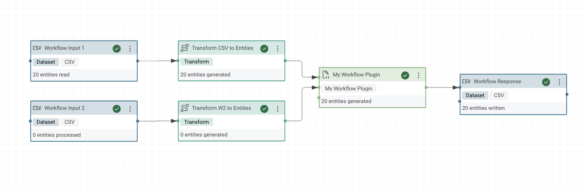
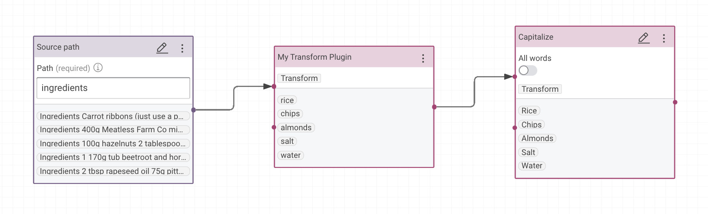
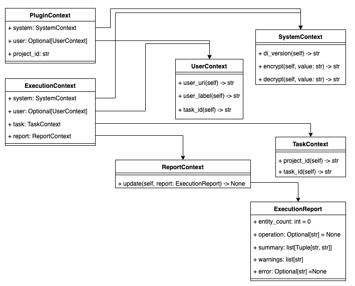
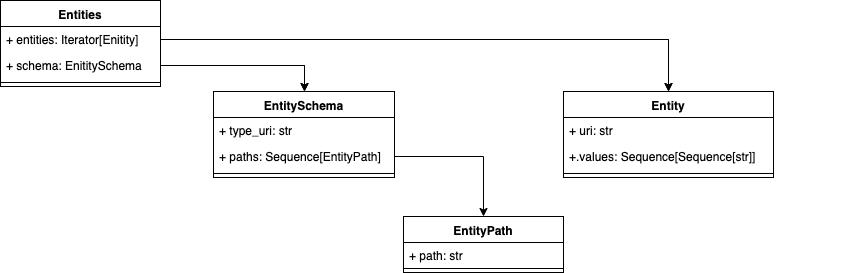

# Python Plugin Development

## Introduction

Python plugins are small software projects which extend the functionality of eccenca Corporate Memory.
They have its own release cycle and are not included in the main software.
Python plugins can can be installed and uninstalled during runtime.

In order to support the development of python plugins, we published a [base package](https://github.com/eccenca/cmem-plugin-base) as well as a [project template](https://github.com/eccenca/cmem-plugin-template).
Please have a look at these projects to get started.

This page gives an overview of the concepts you need to understand in order to develop plugins.

## Base Package

`cmem-plugin-base` is a Python library that provides a set of base classes for developing plugins for the eccenca Corporate Memory (CMEM) platform. These base classes provide a consistent interface for defining new plugins, handling configuration, and communicating with the DataIntegration of CMEM.

## Plugin Types

The following plugin types are defined.

### Workflow Plugins

A workflow plugin implements a new operator (task) that can be used within a workflow.
A workflow plugin may accept an arbitrary list of inputs and optionally returns a single output.

The lifecycle of a workflow plugin is as follows:

-   The plugin will be instantiated once the workflow execution reaches the respective plugin.
-   The `execute` function is called and gets the results of the ingoing operators as input.
-   The output is forwarded to the next operator.

The following depiction shows a task of the plugin **My Workflow Plugin**.
The task has two connected incoming tasks and one connected outgoing task.



The corresponding source code of the plugin is listed below.

```py title="workflow.py"
from typing import Sequence
from cmem_plugin_base.dataintegration.context import ExecutionContext
from cmem_plugin_base.dataintegration.description import PluginParameter, Plugin
from cmem_plugin_base.dataintegration.entity import Entities
from cmem_plugin_base.dataintegration.plugins import WorkflowPlugin

@Plugin(label="My Workflow Plugin")
class MyWorkflowPlugin(WorkflowPlugin):
    """My Workflow Plugin"""

    def execute(
        self, inputs: Sequence[Entities], context: ExecutionContext
    ) -> Entities:
        return inputs[0]
```

### Transform Plugins

A transform plugin can be used in transform and linking rules.
It accepts an arbitrary number of inputs and returns an output.
Each input as well as the output consists of a sequence of values.

The image below shows a value transformation that uses the **My Transform Plugin** plugin.
The plugin splits the input string into a list of words and forwards only the last one.



The corresponding source code of the plugin is listed below.

```py title="transform.py"
from typing import Sequence
from cmem_plugin_base.dataintegration.description import PluginParameter, Plugin
from cmem_plugin_base.dataintegration.plugins import TransformPlugin


@Plugin(label="My Transform Plugin")
class MyTransformPlugin(TransformPlugin):
    """My Transform Plugin"""

    def transform(self, inputs: Sequence[Sequence[str]]) -> Sequence[str]:
        for item in inputs:
            return item[0].split(" ")[-1]
```

## Plugin

The `@Plugin` decorator is used to mark a Python class as a Workflow/Transform Operator plugin. This decorator takes several parameters that provide information about the plugin, such as the `label`, `plugin_id`, and `description`. It also allows for defining a list of `parameters` that can be used to customize the plugin behavior. The `documentation` parameter can be used to provide additional information about the plugin that will be displayed in the Workflow Editor.

## Plugin Parameter

The `PluginParameter` represents a parameter that can be used to customize a Workflow/Transform Operator plugin's behavior.

The `PluginParameter` class can be instantiated multiple times within a `@Plugin` decorator to create a list of `parameters` that can be used to customize the plugin's behavior. The `param_type` parameter can be set to a specific parameter type class that extends the `ParameterType` base class to validate user input and provide additional functionality.

The `PluginParameter` has several parameters that can be specified when initializing an instance:

-   `name`: The name of the parameter. This is a required parameter and must be specified.
-   `label`: A visible label of the parameter. This is an optional parameter and can be left blank. If left blank, the name of the parameter will be used as the label.
-   `description`: A visible description of the parameter. This is an optional parameter and can be left blank.
-   `param_type`: Optionally overrides the parameter type. Usually, this does not have to be set manually as it will be inferred from the plugin automatically.
-   `default_value`: The parameter default value (optional). If not specified, it will be inferred from the plugin automatically.
-   `advanced`: A boolean flag indicating whether or not this is an advanced parameter that can only be changed in the advanced section. This is an optional parameter and defaults to False.
-   `visible`: A boolean flag indicating whether or not the parameter will be displayed to the user in the UI. This is an optional parameter and defaults to True.

## Parameter Type

The `ParameterType` class is a generic class that serves as the base for all other parameter types. It has methods for converting parameter values to and from strings, and for providing auto-completion suggestions.

### Concrete Parameter Types

There are several concrete parameter types defined in the module, including `StringParameterType`, `IntParameterType`, `FloatParameterType`, `BoolParameterType`, `PluginContextParameterType`, and `EnumParameterType`. These correspond to different types of parameters that a plugin might use, such as strings, integers, and boolean values.

Each concrete parameter type implements the `from_string` and `to_string` methods for converting parameter values to and from strings.

[`EnumParameterType`](https://github.com/eccenca/cmem-plugin-base/blob/main/cmem_plugin_base/dataintegration/types.py#L154) also takes an additional argument in its constructor to specify the enumeration type it represents.

!!! Example "Concrete Parameters Initialization"

    ```python
    """Concrete Parameters Example"""
    from enum import Enum
    from typing import Sequence

    from cmem_plugin_base.dataintegration.context import ExecutionContext
    from cmem_plugin_base.dataintegration.description import Plugin, PluginParameter
    from cmem_plugin_base.dataintegration.entity import (
        Entities,
    )
    from cmem_plugin_base.dataintegration.plugins import WorkflowPlugin
    from cmem_plugin_base.dataintegration.types import EnumParameterType


    class Animal(Enum):
        """Animal Enum"""

        CAT = 1
        DOG = 2
        HORSE = 3
        LION = 4


    @Plugin(
        label="Concrete Parameters Example",
        description="Use of concrete parameters and set default values",
        documentation="""
    - `value_int`: A parameter of Integer Type
    - `value_float`: A parameter of Integer Type
    - `value_str`: A Parameter of String Type
    - `value_bool`: A Parameter of Boolean Type
    - `value_enum`: A Parameter of Enum Type
    """,
        parameters=[
            PluginParameter(
                name="value_int",
                label="Integer",
                description="A parameter of Integer Type",
                default_value=10,
            ),
            PluginParameter(
                name="value_float",
                label="Float",
                description="A parameter of Integer Type",
                default_value=5.0,
            ),
            PluginParameter(
                name="value_str",
                label="String",
                description="A Parameter of String Type",
                default_value="eccenca Developer",
            ),
            PluginParameter(
                name="value_bool",
                label="Boolean",
                description="A Parameter of Boolean Type",
                default_value=True,
            ),
            PluginParameter(
                name="value_enum",
                label="Enum",
                description="A Parameter of Enum Type ",
                param_type=EnumParameterType(enum_type=Animal),
                default_value=Animal.CAT,
            ),
        ],
    )
    class ConcreteParameters(WorkflowPlugin):
        """Example Workflow Plugin: Random Values"""

        def __init__(
            self,
            value_int: int = 10,
            value_float: float = 5.0,
            value_str: str = "eccenca Developer",
            value_bool: bool = True,
            value_enum: Animal = Animal.CAT,
        ) -> None:
            self.value_int = value_int
            self.value_float = value_float
            self.value_str = value_str
            self.value_bool = value_bool
            self.value_enum = value_enum

        def execute(self, inputs: Sequence[Entities], context: ExecutionContext) -> None:
            self.log.info("Concrete Parameters Example")
            self.log.info(f"{self.value_int}")
            self.log.info(f"{self.value_float}")
            self.log.info(f"{self.value_str}")
            self.log.info(f"{self.value_bool}")
            self.log.info(f"{self.value_int}")

    ```

### DataIntegration Parameter Types

In addition to concrete parameter types, the base package offers some special types that are derived from data integration. These special types include Password, Dataset, Multiline, Choice Type, and others. These types are provided to enhance the development of plugins and offer greater flexibility when creating custom parameters.

#### Choice ParameterType

[`ChoiceParameterType`](https://github.com/eccenca/cmem-plugin-base/blob/main/cmem_plugin_base/dataintegration/parameter/choice.py) that represents a parameter type with a pre-defined set of choices. It allows users to select from the available choices using autocompletion, and provides labels for each of the choices. [Example](https://github.com/eccenca/cmem-plugin-number-conversion/blob/87c5c17796386301117637e8bc9f4f9542fcb344/cmem_plugin_number_conversion/transform/__init__.py#LL32C5-L32C5)

#### Dataset ParameterType

[`DatasetParameterType`](https://github.com/eccenca/cmem-plugin-base/blob/main/cmem_plugin_base/dataintegration/parameter/dataset.py) can be used as a parameter type for plugins that require dataset input. It provides autocompletion suggestions based on the user's query terms and allows filtering datasets by dataset type (csv, json, etc.) in the current project. It also returns the label of the selected dataset as its value. [Example](https://github.com/eccenca/cmem-plugin-kaggle/blob/main/cmem_plugin_kaggle/kaggle_import.py#L278)

#### Graph ParameterType

[`GraphParameterType`](https://github.com/eccenca/cmem-plugin-base/blob/main/cmem_plugin_base/dataintegration/parameter/graph.py) that represents a parameter type for selecting a knowledge graph. It provides autocompletion suggestions for available graphs, based on various filtering criteria, such as whether to show DI project graphs or system resource graphs, and which classes the graphs should belong to.

#### Multiline ParameterType

[`MultilineStringParameterType`](https://github.com/eccenca/cmem-plugin-base/blob/main/cmem_plugin_base/dataintegration/parameter/multiline.py) is used to represent a multiline string parameter type in a DataIntegration, which allows multiline text entry from users. [Example](https://github.com/eccenca/cmem-plugin-graphql/blob/263c3b712990d80d6ef180baad2e0cfdef836e93/cmem_plugin_graphql/workflow/graphql.py#L51)

#### Password ParameterType

[`PasswordParameterType`](https://github.com/eccenca/cmem-plugin-base/blob/main/cmem_plugin_base/dataintegration/parameter/password.py) is a parameter type that can be used in plugins to handle password strings. When a `password` is entered by a user, this parameter type will encrypt and store the password so that it cannot be viewed by the user or stored in plain text. [Example](https://github.com/eccenca/cmem-plugin-kaggle/blob/main/cmem_plugin_kaggle/kaggle_import.py#L293)

These are some examples of special type parameters, and you can find more for your plugin development [here](https://github.com/eccenca/cmem-plugin-base/tree/main/cmem_plugin_base/dataintegration/parameter).

#### Code ParameterTypes

[`CodeParameterType`](https://github.com/eccenca/cmem-plugin-base/blob/main/cmem_plugin_base/dataintegration/parameter/code.py) supports various different code languages.

Currently, the following types are supported:

- `JinjaCode`: Jinja 2 templates
- `JsonCode`: JSON
- `XmlCode`: XML
- `SparqlCode`: SPARQL queries
- `SqlCode`: SQL queries
- `YamlCode`: YAML configuration

The simplest way to employ a code type is to annotate the respective parameter in the constructor:

!!! Example "Example Jinja code parameter"

    ```python
    @Plugin(label="Code test plugin")
    class TransformTestPlugin(TransformPlugin):

        def __init__(self, jinja: JinjaCode = JinjaCode("default template"):
            self.jinja = jinja

If a plugin with a code parameter is created or edited in the UI, a code editor with syntax highlighting will be shown to the user.

### AutoComplete Method

The `ParameterType` class also defines an `autocomplete()`, which can be used to provide auto-completion suggestions for a parameter value.
The `EnumParameterType`is an example of a parameter type that uses auto-completion suggestions. This is a method that is designed to assist with autocompleting values when querying terms. It is a special method that requires attention as it plays an important role in providing suggestions for autocomplete functionality.

`autocomplete()` takes in three parameters: `query_terms`, `depend_on_parameter_values`, and `context`. It returns a list of `Autocompletion` objects, which represent the possible auto-completion results.

-   The `query_terms` parameter is a list of lower case conjunctive search terms. These are the search terms that the user has entered, and the `auto-completion()` will attempt to find results that match all of them.

-   The `depend_on_parameter_values` parameter is a list of values for the parameters that the `auto-completion()` depends on. These values will be used to generate the auto-completion results. The type of each parameter value is the same as in the init method, which means that if a `password` parameter is specified, the type of the parameter value will be of `Password` Type.

-   The `context` parameter represents the `PluginContext` in which the auto-completion is requested. This could be, for example, the context of a specific plugin, or the context of the entire system.

#### Autocompletion

The method returns a list of `Autocompletion` objects, which represent the possible auto-completion results. Each `Autocompletion` object has two attributes: value and label.

-   The `value` attribute represents the value to which the parameter value should be set.
-   The `label` attribute is an optional label that a human user would see instead.

!!! Note

    `autocomplete()` should be modified to generate actual auto-completion results based on the input parameters.

!!! Example

    ```python
    class KaggleSearch(StringParameterType):
    """Kaggle Search Type"""

    autocompletion_depends_on_parameters: list[str] = ["username", "api_key"]

    # auto complete for values
    allow_only_autocompleted_values: bool = True
    # auto complete for labels
    autocomplete_value_with_labels: bool = True

    def autocomplete(
        self,
        query_terms: list[str],
        depend_on_parameter_values: list[Any],
        context: PluginContext,
    ) -> list[Autocompletion]:
        auth(depend_on_parameter_values[0], depend_on_parameter_values[1].decrypt())
        result = []
        if len(query_terms) != 0:
            datasets = search(query_terms=query_terms)
            for dataset in datasets:
                slug = get_slugs(str(dataset))
                result.append(
                    Autocompletion(
                        value=f"{slug.owner}/{slug.name}",
                        label=f"{slug.owner}/{slug.name}",
                    )
                )
            result.sort(key=lambda x: x.label)  # type: ignore
            return result
        if len(query_terms) == 0:
            label = "Search for kaggle datasets"
            result.append(Autocompletion(value="", label=f"{label}"))
        result.sort(key=lambda x: x.label)  # type: ignore
        return result
    ```
    The `KaggleSearch` class is a `StringParameterType` that allows users to search for Kaggle datasets. It inherits from the `StringParameterType` class and overrides its `autocomplete()` to provide autocompletion(of type `Autocompletion`) for search results.

    The `autocomplete()` method uses the search function to search for datasets on Kaggle and returns a list of `Autocompletion` objects representing the search results.

    The `autocompletion_depends_on_parameters` attribute of the KaggleSearch class is a list of strings that specifies which parameter values this autocomplete method depends on. In this case, it depends on the values of the `username` and `api_key` parameters in order to authenticate the Kaggle API.

    If the `query_terms` list is empty, it returns a single Autocompletion object with an empty value and a label prompting the user to search for Kaggle datasets.

    The `allow_only_autocompleted_values` attribute is set to `True`, which means that the user can only select values from the autocomplete suggestions. The autocomplete_value_with_labels attribute is set to `True`, which means that the autocomplete suggestions include both values and human-readable labels.

    *This code block is derived from [cmem-plugin-kaggle](https://github.com/eccenca/cmem-plugin-kaggle)*

## Context Objects

The [cmem-plugin-base](https://github.com/eccenca/cmem-plugin-base/) package describes [context objects](https://github.com/eccenca/cmem-plugin-base/blob/main/cmem_plugin_base/dataintegration/context.py), which are passed to the plugin depending on the executed method.



### Basic Understanding

Context objects have been introduced to provide a way to access context-dependent functionalities during plugin creation, update, or execution.

These context objects allow accessing various useful functionalities such as the current OAuth token, updating the execution report for workflows, DI version, and current project details.

!!! Note

    Having a basic understanding of context objects and their functionalities can help developers effectively use them to create and execute plugins in DataIntegration.

### System Context

SystemContext can be used to obtain important system information. It has three methods: di_version, encrypt, and decrypt. The `di_version()` returns the version of the running [DataIntegration](../../dataintegration-apis/index.md) instance. The encrypt and decrypt methods can be used to secure values using a secret key that is configured in the system. Overall, the SystemContext is useful when needing to obtain system information or encrypt/decrypt values in a secure manner.

!!! Example

    -   [Password Parameter Type](https://github.com/eccenca/cmem-plugin-base/blob/main/cmem_plugin_base/dataintegration/parameter/password.py#LL10C6-L10C6): it is used to decrypt an encrypted password value.

    -   [Example](https://github.com/eccenca/cmem-plugin-kaggle/blob/main/cmem_plugin_kaggle/kaggle_import.py#L381) of decrypting the key.

### User Context

UserContext can be used to obtain information about the user that is interacting with the system. It has three methods: `user_uri()`, `user_label()`, and `token()`. The `user_uri()` returns the URI of the user, which can be used to identify them uniquely. The `user_label()` returns the name of the user, which can be used for display purposes. The `token()` retrieves the OAuth token for the user, which can be used to authenticate requests made on behalf of the user.

!!! Example

    [Here](https://github.com/eccenca/cmem-plugin-kafka/blob/main/cmem_plugin_kafka/utils.py#L391): The UserContext is used to set up the cmempy user access before accessing the resource from the dataset.

### Task Context

TaskContext can be used to obtain information about the project and task that an object is part of. The `project_id()` returns the identifier of the project, which can be used to retrieve information about the project or to associate the object with the project. The `task_id()` returns the identifier of the task, which can be used to retrieve information about the task or to associate the object with the task. This information can be used for various purposes, such as retrieving additional metadata about the project or task, or associating the object with the project or task in order to perform specific operations.

!!! Example

    [Here](https://github.com/eccenca/cmem-plugin-kafka/blob/7551d6087f0c134cef53b3120a949eb513692bf5/cmem_plugin_kafka/workflow/producer.py#L219) is an example of how the context object can be used to retrieve the `project_id` of the current `task`.

### Execution Report

ExecutionReport is used to provide insight into the execution of a workflow operator. It contains important information such as the number of `entities` that have been processed, a short label and `description` of the executed operation, a `summary` table representing the summary of the report, any warnings or user-friendly messages that occurred during execution, and an `error` message in case a fatal error occurred.

ExecutionReport is used by workflow operators to generate execution reports. This information can be used for various purposes, such as providing insight into the performance of the operator, identifying any warnings or errors that occurred during execution, and stopping the workflow execution in case a fatal error occurred. The information contained in the ExecutionReport can also be displayed in real-time in the user interface.

!!! Example

    [Here](https://github.com/eccenca/cmem-plugin-kafka/blob/7551d6087f0c134cef53b3120a949eb513692bf5/cmem_plugin_kafka/workflow/producer.py#LL242C15-L242C15), the execution report with the number of successful messages sent by the producer and a summary of Kafka statistics. It also includes information about the operation performed (i.e., write) and a description of the operation (i.e., messages sent), making it easier to track the progress of the process.

### Report Context

ReportContext is used to pass context information into workflow plugins that may generate a report during execution. It contains a single method called update that can be called repeatedly during operator execution to update the current execution report. `update()` takes an instance of the ExecutionReport as input and updates the current report with the information contained in the ExecutionReport. This allows plugins to generate reports that can be used for various purposes, such as providing insight into the performance of the plugin, identifying any warnings or errors that occurred during execution, and stopping the workflow execution in case a fatal error occurred.

!!! Example

    [Here](https://github.com/eccenca/cmem-plugin-kafka/blob/7551d6087f0c134cef53b3120a949eb513692bf5/cmem_plugin_kafka/utils.py#L339): While producing messages in Kafka, the message count is constantly updated.

### Plugin Context

PluginContext provides important context information during plugin creation or update. It has three attributes: system, user, and project_id.

The `system` attribute is of type SystemContext and contains general system information. The `user` attribute is of type UserContext and contains information about the user. The `project_id` attribute contains the identifier of the project that contains or will contain the plugin.

!!! Note

    After creation, the plugin may be updated or executed by another user.

!!! Example

    All parameters [here](https://github.com/eccenca/cmem-plugin-base/blob/main/cmem_plugin_base/dataintegration/types.py) use the `PluginContext`, to get the context in which the param type is requested.

### Execution Context

ExecutionContext combines context objects that are available during plugin execution. It contains four attributes:

-   `system`: An instance of the SystemContext, which provides general system information.
-   `user`: An optional instance of the UserContext, which provides information about the user that issued the plugin execution.
-   `task`: An instance of the TaskContext, which provides metadata about the executed plugin.
-   `report`: An instance of the ReportContext, which allows to update the execution report.

The ExecutionContext is used to provide context information to plugins during execution, enabling plugins to access information about the environment in which they are running, the user who initiated the execution, and the task being executed. The ReportContext attribute allows plugins to generate and update reports during execution.

!!! Note

    [Here](https://github.com/eccenca/cmem-plugin-mattermost/blob/40c933db4afd70cc78b2804b814ed6998452de80/cmem_plugin_mattermost/workflow/mattermost_plugin.py#L186), The ExecutionContext is only available to the WorkflowPlugins and provides information and resources related to the execution environment. Plugins can use it to access/update information that may impact the report, such as logging and configuration data.

!!! Example

    [Here](https://github.com/eccenca/cmem-plugin-kafka/blob/7551d6087f0c134cef53b3120a949eb513692bf5/cmem_plugin_kafka/workflow/producer.py#L219) is an example of how the context object can be used to retrieve the `project_id` of the current `task` and the `user` associated with the current execution.

## Entities

An `entity` is a structure to describe data objects which are passed around in workflows from one task to another task.
An entity is identified by a `uri` and holds `values`, i.e., a sequence of string sequences (= a list of multi-value fields).

Multiple entities are handled as `entities` objects, which have an attached `schema` to it.

A `schema` contains of `path` descriptions and is identified by a `type_uri`.

The following image shows these terms and their relationships. (1)
{ .annotate }

1. The concrete implementation details of entities can be found in the [entity module](https://github.com/eccenca/cmem-plugin-base/blob/main/cmem_plugin_base/dataintegration/entity.py) of the cmem-plugin-base package.



| Class          | Description                                                        |
| -------------- | ------------------------------------------------------------------ |
| `Entities`     | Holds a collection of entities and their schema                    |
| `Entity`       | An Entity can represent an instance of any given concept.          |
| `EntitySchema` | An entity schema that represents the type of uri and list of paths |
| `EntityPath`   | A path in a schema                                                 |

### Producing Entities

The following section shows the source code of a **Produce Entities** plugin, which is commented below.

```py title="entities-producer.py" linenums="1"
"""Entities Producer"""
import uuid
from secrets import token_urlsafe
from typing import Sequence

from cmem_plugin_base.dataintegration.context import ExecutionContext, ExecutionReport
from cmem_plugin_base.dataintegration.description import Plugin, PluginParameter
from cmem_plugin_base.dataintegration.entity import (
    Entities,
    Entity,
    EntitySchema,
    EntityPath,
)
from cmem_plugin_base.dataintegration.plugins import WorkflowPlugin


@Plugin(
    label="Produce Entities",
    description="Generates random values of X rows a Y values.",
    documentation="""
This example workflow operator generates random values as Entities.

The values are generated in X rows a Y values. Both parameter can be specified:

- 'number_of_entities': How many rows do you need.
- 'number_of_values': How many values per row do you need.
""",
    parameters=[
        PluginParameter(
            name="number_of_entities",
            label="Entities (Rows)",
            description="How many rows will be created per run.",
            default_value="10",
        ),
        PluginParameter(
            name="number_of_values",
            label="Values (Columns)",
            description="How many values are created per entity / row.",
            default_value="5",
        ),
    ],
)
class EntitiesProducer(WorkflowPlugin):
    """Entities Producer Plugin"""

    def __init__(self, number_of_entities: int = 2, number_of_values: int = 2) -> None:
        if number_of_entities < 1:
            raise ValueError("Entities (Rows) needs to be a positive integer.")

        if number_of_values < 1:
            raise ValueError("Values (Columns) needs to be a positive integer.")

        self.number_of_entities = number_of_entities
        self.number_of_values = number_of_values

    def execute(
        self, inputs: Sequence[Entities], context: ExecutionContext
    ) -> Entities:
        self.log.info("Start creating random values.")
        self.log.info(f"Config length: {len(self.config.get())}")
        entities_counter = 0
        value_counter = 0
        entities = []
        for _ in range(self.number_of_entities):
            entity_uri = f"urn:uuid:{str(uuid.uuid4())}"
            entities_counter += 1
            values = []
            for _ in range(self.number_of_values):
                values.append([token_urlsafe(16)])
                value_counter += 1
                context.report.update(
                    ExecutionReport(
                        entity_count=entities_counter,
                        operation="wait",
                        operation_desc="entities generated",
                    )
                )
            entities.append(Entity(uri=entity_uri, values=values))
        paths = []
        for path_no in range(self.number_of_values):
            path_uri = f"https://entities.org/vocab/RandomValuePath/{path_no}"
            paths.append(EntityPath(path=path_uri))
        schema = EntitySchema(
            type_uri="https://entities.org/vocab/RandomValueRow",
            paths=paths,
        )
        self.log.info(
            f"Happy to serve {entities_counter} entities with {value_counter} values."
        )
        context.report.update(
            ExecutionReport(
                entity_count=entities_counter,
                operation="wait",
                operation_desc="entities generated",
                summary=[
                    ("No. of entities", f"{entities_counter}"),
                    ("No. of values", f"{value_counter}"),
                ],
            )
        )
        return Entities(entities=entities, schema=schema)
```

Code explanation:

1. Provide a label, description and short documentation for the plugin. [(#17-27)](#__codelineno-10-17)
2. Define the parameters of the plugin. Here, two parameters are defined, where one specifies the number of `rows` and the other acthe number of `columns`. [(#24-41)](#__codelineno-10-24)
3. Intialise the parameters of the plugin. Additionally, you can validate and raise exceptions from `init()`. [(#46-54)](#__codelineno-10-46)
4. To return Entities we have to create a list of `entities` and its `schema`. As a first step, declare entities as an empty list. [(#62)](#__codelineno-10-62)
5. As previously mentioned, each `Entity` should have a `URI` and it can have sequence of `values`. Here, a list of entities is created with random UUIDs based on rows and values are created based on columns. After each entity is created it is appended to the entities list. [(#64-78)](#__codelineno-10-64)
6. To generate a `schema` (which is of type `EntitySchema`), which should have a `type_uri` and a sequence of `paths`, define an empty list of paths. [(#79)](#__codelineno-10-79)
7. Based on the columns, each unique path is appended to the paths list. Once all paths are added, the schema is updated with `type_uri` and `paths` respectively. [(#80-86)](#__codelineno-10-80)
8. Once the entities and the schema are generated you can return them. [(#101)](#__codelineno-10-101)
9. Update plugin logs using `PluginLogger` which is available as a default logger. [(#87-91)](#__codelineno-10-87)
10. To make your plugin more user-friendly you can use the Context API `report.update()` to update the workflow report. [(#91-100)](#__codelineno-10-86)

### Consuming Entities

Consuming entities in a workflow plugin means that you process at least one `entities` object from the `inputs` list.

The following code shows a plugin which loops through all inputs and counts all entities and its values.

```py title="entities-consumer.py" linenums="1"
"""Consume Entities"""
from typing import Sequence
from cmem_plugin_base.dataintegration.context import ExecutionContext, ExecutionReport
from cmem_plugin_base.dataintegration.description import Plugin
from cmem_plugin_base.dataintegration.entity import Entities
from cmem_plugin_base.dataintegration.plugins import WorkflowPlugin


@Plugin(
    label="Consume Entities",
    description="Reads random values of X rows a Y values.",
    documentation="""
This example workflow operator reads random values.
""",
)
class EntitiesConsumer(WorkflowPlugin):
    """Entities Consumer"""

    def execute(self, inputs: Sequence[Entities], context: ExecutionContext):
        entities_counter = 0
        value_counter = 0
        for item in inputs:
            for entity in item.entities:
                entities_counter += 1
                for _ in entity.values:
                    value_counter += 1
        context.report.update(
            ExecutionReport(
                entity_count=entities_counter,
                operation="wait",
                operation_desc="entities received",
                summary=[
                    ("No. of entities", f"{entities_counter}"),
                    ("No. of values", f"{value_counter}"),
                ],
            )
        )
```

Code explanation:

1. `inputs` from the workflow is a sequence of `Entities` with each item from the input having a list of entities and each entity having values. The entities and values are seperately counted. (#22-26)
2. Once the counting is done, the workflow report is updated with the total number of entities and values as the summary. (#27-37)

## Configuration

Plugins can have an application-wide configuration which cannot be changed on runtime and applies to all instances of this plugin.

This plugin configuration is provided in the `self.config` [PluginConfig](https://github.com/eccenca/cmem-plugin-base/blob/main/cmem_plugin_base/dataintegration/plugins.py#L32) object of the plugin.
The `get` method of this object returns a JSON string of the configuration.

Plugin configurations use the `plugin_id` as a config path in `dataintegration.conf`.

```hocon title="Example plugin configuration"
plugins.python.<plugin_id> = {
    key1 = "value1"
    key2 = "value2"
}
```

## Logging

Logging should be done with the [PluginLogger](https://github.com/eccenca/cmem-plugin-base/blob/main/cmem_plugin_base/dataintegration/plugins.py#L10), which is available as `self.log` in all plugins.

```py
self.log.info("Successfully executed Workflow Plugin")
```

On runtime, this logger will be replaced with a JVM based logging function feeding the plugin logs to the normal DataIntegration log stream.
This JVM-based logger will prefix all plugin logs with `plugins.python.<plugin id>`.
