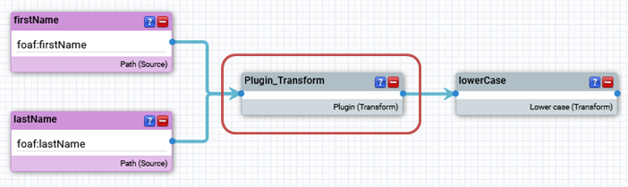

---
tags:
    - Python
---
# Python Plugins

## Introduction

The Python plugin system allows to extend eccenca DataIntegration with custom operators.

## Install and Updating Plugins

Plugins are a released as parts of Python packages. The can but do not need to be open source and published on [pypi.org](https://pypi.org/search/?q=%22cmem-plugin-%22) (a widely used Python Package Index).

If you want to install a python plugin package, you can do this by using [cmemc's](../../automate/cmemc-command-line-interface/index.md) admin workspace python command group.

The following shell commands demonstrate the basic workflow:

```bash
# list all installed python packages
# Note: the list contains plugin packages as well all dependencies which they are using
$ cmemc admin workspace python list
Name                Version
------------------  -----------
certifi             2022.5.18.1
charset-normalizer  2.0.12
cmem-cmempy         22.1.1
cmem-plugin-base    1.2.0
idna                3.3
isodate             0.6.1
jep                 4.0.2
pip                 20.3.4
pyparsing           3.0.9
rdflib              6.1.1
requests            2.27.1
requests-toolbelt   0.9.1
setuptools          52.0.0
six                 1.16.0
urllib3             1.26.9
wheel               0.34.2

# Install a plugin package from pypi.org
$ cmemc admin workspace python install cmem-plugin-graphql
Install package cmem-plugin-graphql ... done

# list available plugins
$ cmemc admin workspace python list-plugins
ID                                 Type            Label
---------------------------------  --------------  -------------
cmem_plugin_graphql-GraphQLPlugin  WorkflowPlugin  GraphQL query

# uninstall the plugin package
$ cmemc admin workspace python uninstall cmem-plugin-graphql
Uninstall package cmem-plugin-graphql ... done

# validate that no plugins are installed
$ cmemc admin workspace python list-plugins
ID    Type    Label
----  ------  -------


```

You can also install specific versions of a package by using version qualifier

```bash
$ cmemc admin workspace python install cmem-plugin-graphql==1.0.0
Install package cmem-plugin-graphql ... done
```

And you can also install a package from a source distribution file

```bash
$ cmemc admin workspace python install cmem-plugin-graphql-1.0.0.tar.gz
Install package cmem-plugin-graphql ... done
```

## Developing Plugins

We recommend to start developing a plugin by creating a new project with our [official python project template (cmem-plugin-template)](https://github.com/eccenca/cmem-plugin-template).

This template will generate a fully configured Python poetry source repository together with build plans for gitlab and github.

Based on the template, you will be able to develop your own plugins. In the following, we will introduce some basic concepts.

### Workflow plugins

A workflow plugin implements a new operator (task) that can be used within a workflow. A workflow plugin may accept an arbitrary list of inputs and optionally returns a single output.


A minimal plugin that just outputs the first input looks like this:

```py title="workflow.py  " linenums="1"
from typing import Sequence
from cmem_plugin_base.dataintegration.entity import Entities
from cmem_plugin_base.dataintegration.description import PluginParameter, Plugin
from cmem_plugin_base.dataintegration.plugins import WorkflowPlugin

@Plugin(label="My Workflow Plugin")
class MyWorkflowPlugin(WorkflowPlugin):

    def execute(self, inputs: Sequence[Entities]) -> Entities:
        return inputs[0]
```

The lifecycle of a plugin is as follows:

- The plugin will be instantiated once the workflow execution reaches the respective plugin.
- The execute function is called with the results of the connected input operators.
- The output is forwarded to the next subsequent operator.

Because the returned Entities object can only be iterated once, the above process has to be repeated each time the output is iterated over. Multiple iterations happen if the output of the workflow plugin is connected to multiple operators.

### Transform plugins

A transform plugin can be used in transform and linking rules. It accepts an arbitrary number of inputs and returns an output. Each input as well as the output consists of a sequence of values.



A minimal plugin that just outputs the first input looks like this:

```py title="transform.py  " linenums="1"
from typing import Sequence
from cmem_plugin_base.dataintegration.description import PluginParameter, Plugin
from cmem_plugin_base.dataintegration.plugins import TransformPlugin


@Plugin(label="My Transform Plugin")
class MyTransformPlugin(TransformPlugin):
    def transform(self, inputs: Sequence[Sequence[str]]) -> Sequence[str]:
        return inputs[0]
```

### Logging

The Python standard output is redirected to the DataIntegration standard output. By default, println and logging statements will therefore be printed to the standard output. The default Python logging configuration applies, so logs can be redirected to files or other outputs as well.

## Preliminaries

This section describes which backend components are needed on the DataIntegration server. When using our official docker images, these components are already installed and enabled.

### Python

An installation of the CPython distribution (at least version 3.3) is required. While other distributions, such as Anaconda, should be working as well, only CPython is officially supported.

### Java Embedded Python (Jep)

The [Jep](https://github.com/ninia/jep) module needs to be installed. The easiest way is to execute:

```bash
pip install jep
```

The libraries contained in the Jep module need to be accessible from the Java Virtual Machine running DataIntegration. This can be achieved by setting an environment variable to the directory path where the Jep module is located:

- :simple-linux: **Linux**: set `LD_LIBRARY_PATH`.
- :simple-apple: **OS X**: set `DYLD_LIBRARY_PATH`.
- :simple-windows: **Windows**: set `PATH`.
  
For alternative installation methods, visit [{ .off-glb }](https://github.com/ninia/jep)
