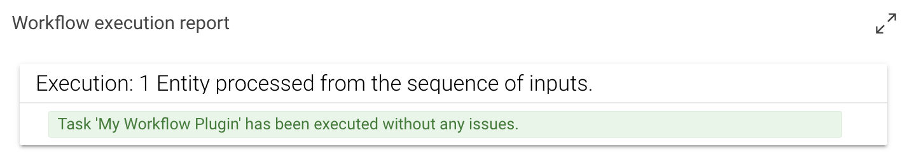

# Python Plugins

## Introduction

The Python plugin system allows to extend eccenca DataIntegration with custom operators.

## Install and Updating Plugins

Plugins are a released as parts of Python packages. The can but do not need to be open source and published on [pypi.org](https://pypi.org/search/?q=%22cmem-plugin-%22) (a widely used Python Package Index).

If you want to install a python plugin package, you can do this by using cmemc's [admin workspace python command group](../../automate/cmemc-command-line-interface/command-reference/admin/workspace/python/index.md).

The following shell commands demonstrate the basic workflow:

```shell-session
# list all installed python packages
# Note: the list contains plugin packages as well all dependencies which they are using
$ cmemc admin workspace python list
Name                Version
------------------  -----------
certifi             2022.5.18.1
charset-normalizer  2.0.12
cmem-cmempy         22.1.1
cmem-plugin-base    1.2.0
idna                3.3
isodate             0.6.1
jep                 4.0.2
pip                 20.3.4
pyparsing           3.0.9
rdflib              6.1.1
requests            2.27.1
requests-toolbelt   0.9.1
setuptools          52.0.0
six                 1.16.0
urllib3             1.26.9
wheel               0.34.2

# Install a plugin package from pypi.org
$ cmemc admin workspace python install cmem-plugin-graphql
Install package cmem-plugin-graphql ... done

# list available plugins
$ cmemc admin workspace python list-plugins
ID                                 Type            Label
---------------------------------  --------------  -------------
cmem_plugin_graphql-GraphQLPlugin  WorkflowPlugin  GraphQL query

# uninstall the plugin package
$ cmemc admin workspace python uninstall cmem-plugin-graphql
Uninstall package cmem-plugin-graphql ... done

# validate that no plugins are installed
$ cmemc admin workspace python list-plugins
ID    Type    Label
----  ------  -------


```

You can also install specific versions of a package by using version qualifier

```shell-session
$ cmemc admin workspace python install cmem-plugin-graphql==1.0.0
Install package cmem-plugin-graphql ... done
```

And you can also install a package from a source distribution file

```shell-session
$ cmemc admin workspace python install cmem-plugin-graphql-1.0.0.tar.gz
Install package cmem-plugin-graphql ... done
```

## Developing Plugins

We recommend to start developing a plugin by creating a new project with our [official python project template (cmem-plugin-template)](https://github.com/eccenca/cmem-plugin-template).

This template will generate a fully configured Python poetry source repository together with build plans for gitlab and github.

Based on the template, you will be able to develop your own plugins.
In the following, we will introduce some basic concepts and describe some best practices.

### Workflow plugins

A workflow plugin implements a new operator (task) that can be used within a workflow.
A workflow plugin may accept an arbitrary list of inputs and optionally returns a single output.


A minimal plugin that just outputs the first input looks like this:

```py title="workflow.py"
from typing import Sequence
from cmem_plugin_base.dataintegration.context import ExecutionContext, ExecutionReport
from cmem_plugin_base.dataintegration.description import PluginParameter, Plugin
from cmem_plugin_base.dataintegration.entity import Entities
from cmem_plugin_base.dataintegration.plugins import WorkflowPlugin

@Plugin(label="My Workflow Plugin")
class MyWorkflowPlugin(WorkflowPlugin):

    def execute(
        self, inputs: Sequence[Entities], context: ExecutionContext
    ) -> Entities:
        context.report.update(
            ExecutionReport(
                entity_count=1,
                operation="wait",
                operation_desc="Entity processed from the sequence of inputs.",
            )
        )
        return inputs[0]
```

The lifecycle of a plugin is as follows:

-   The plugin will be instantiated once the workflow execution reaches the respective plugin.
-   The execute function is called with the results of the connected input operators.
-   The output is forwarded to the next subsequent operator.

Because the returned Entities object can only be iterated once, the above process has to be repeated each time the output is iterated over.
Multiple iterations happen if the output of the workflow plugin is connected to multiple operators.



### Transform plugins

A transform plugin can be used in transform and linking rules. It accepts an arbitrary number of inputs and returns an output. Each input as well as the output consists of a sequence of values.


A minimal plugin that just outputs the first input looks like this:

```py title="transform.py  " linenums="1"
from typing import Sequence
from cmem_plugin_base.dataintegration.description import PluginParameter, Plugin
from cmem_plugin_base.dataintegration.plugins import TransformPlugin


@Plugin(label="My Transform Plugin")
class MyTransformPlugin(TransformPlugin):
    def transform(self, inputs: Sequence[Sequence[str]]) -> Sequence[str]:
        return inputs[0]
```

### Plugin Context

The [cmem-plugin-base](https://github.com/eccenca/cmem-plugin-base/) package describes [context](https://github.com/eccenca/cmem-plugin-base/blob/main/cmem_plugin_base/dataintegration/context.py) objects, which are passed to the plugin depending on the executed method.

| Class              | Description                                                                                                                                         |
| ------------------ | --------------------------------------------------------------------------------------------------------------------------------------------------- |
| `SystemContext`    | Passed into methods to request general system information.                                                                                          |
| `UserContext`      | Passed into methods that are triggered by a user interaction.                                                                                       |
| `TaskContext`      | Passed into objects that are part of a DataIntegration task/project.                                                                                |
| `ExecutionReport`  | Workflow operators may generate execution reports. An execution report holds basic information and various statistics about the operator execution. |
| `ReportContext`    | Passed into workflow plugins that may generate a report during execution.                                                                           |
| `PluginContext`    | Combines context objects that are available during plugin creation or update.                                                                       |
| `ExecutionContext` | Combines context objects that are available during plugin execution.                                                                                |

### Producing and Consuming Entities

To Produce and Consume the Entities, understanding [entities](https://github.com/eccenca/cmem-plugin-base/blob/main/cmem_plugin_base/dataintegration/entity.py) is required.

TODO draw.io image of entities.

```py title="entities-producer.py" linenums="1" hl_lines="62 86"
"""Entities Producer"""
import uuid
from secrets import token_urlsafe
from typing import Sequence

from cmem_plugin_base.dataintegration.context import ExecutionContext, ExecutionReport
from cmem_plugin_base.dataintegration.description import Plugin, PluginParameter
from cmem_plugin_base.dataintegration.entity import (
    Entities,
    Entity,
    EntitySchema,
    EntityPath,
)
from cmem_plugin_base.dataintegration.plugins import WorkflowPlugin


@Plugin(
    label="Produce Entities",
    description="Generates random values of X rows a Y values.",
    documentation="""
This example workflow operator generates random values as Entities.

The values are generated in X rows a Y values. Both parameter can be specified:

- 'number_of_entities': How many rows do you need.
- 'number_of_values': How many values per row do you need.
""",
    parameters=[
        PluginParameter(
            name="number_of_entities",
            label="Entities (Rows)",
            description="How many rows will be created per run.",
            default_value="10",
        ),
        PluginParameter(
            name="number_of_values",
            label="Values (Columns)",
            description="How many values are created per entity / row.",
            default_value="5",
        ),
    ],
)
class EntitiesProducer(WorkflowPlugin):
    """Entities Producer Plugin"""

    def __init__(self, number_of_entities: int = 2, number_of_values: int = 2) -> None:
        if number_of_entities < 1:
            raise ValueError("Entities (Rows) needs to be a positive integer.")

        if number_of_values < 1:
            raise ValueError("Values (Columns) needs to be a positive integer.")

        self.number_of_entities = number_of_entities
        self.number_of_values = number_of_values

    def execute(
        self, inputs: Sequence[Entities], context: ExecutionContext
    ) -> Entities:
        self.log.info("Start creating random values.")
        self.log.info(f"Config length: {len(self.config.get())}")
        value_counter = 0
        entities = []
        for _ in range(self.number_of_entities):
            entity_uri = f"urn:uuid:{str(uuid.uuid4())}"
            values = []
            for _ in range(self.number_of_values):
                values.append([token_urlsafe(16)])
                value_counter += 1
                context.report.update(
                    ExecutionReport(
                        entity_count=value_counter,
                        operation="wait",
                        operation_desc="entities generated",
                    )
                )
            entities.append(Entity(uri=entity_uri, values=values))
        paths = []
        for path_no in range(self.number_of_values):
            path_uri = f"https://entities.org/vocab/RandomValuePath/{path_no}"
            paths.append(EntityPath(path=path_uri))
        schema = EntitySchema(
            type_uri="https://entities.org/vocab/RandomValueRow",
            paths=paths,
        )
        self.log.info(f"Happy to serve {value_counter} entities.")
        return Entities(entities=entities, schema=schema)
```

From line 62 to 86 is responsible for producing entities with random token values.

```py title="entities-consumer.py" linenums="1"
class EntitiesConsumer(WorkflowPlugin):
    """Entities Consumer"""

    def execute(self, inputs: Sequence[Entities], context: ExecutionContext):
        value_counter = 0
        for item in inputs:
            for entity in item.entities:
                for _ in entity.values:
                    value_counter += 1
        context.report.update(
            ExecutionReport(
                entity_count=value_counter,
                operation="wait",
                operation_desc="entities received",
            )
        )
```

### Plugin Configuration

TODO

### Logging

The Python standard output is redirected to the DataIntegration standard output.
By default, `print` and logging statements will therefore be printed to the standard output (e.g. of the docker container).
The default Python logging configuration applies, so logs can be redirected to files or other outputs as well.

## Setup and Configuration

This section describes which backend components are needed on the DataIntegration server.
When using our official docker images, these components are already installed and configured.

### Configuration

The following DataIntegration configuration section describes how to setup and enable the Python Plugin system.

```text
#################################################
# Plugin Configuration
#################################################

# this (optional) file can be used to hold python plugin specific configuration
include "python-plugins.conf"

com.eccenca.di.scripting = {
  python = {
    PythonPluginRegistry = {
      # Python plugins will only be loaded if 'enabled' is set to true.
      enabled = true

      # Plugins will only be loaded below the following base package.
      basePackage = "cmem"
    }

    PythonPackageManager = {
      # Python package installer executable.
      # pipExecutable = "pip"
      pipExecutable = "cmem-pip-wrapper.sh"
    }
  }
}
```

### Python Interpreter

An installation of the CPython distribution (at least version 3.3) is required.
While other distributions, such as Anaconda, should be working as well, only CPython is officially supported.

### Java Embedded Python (Jep)

The [Jep](https://github.com/ninia/jep) package needs to be installed.

The libraries contained in the Jep module need to be accessible from the Java Virtual Machine running DataIntegration.
This can be achieved by setting an environment variable to the directory path where the Jep module is located:

-   :simple-linux: **Linux**: set `LD_LIBRARY_PATH`.
-   :simple-apple: **OS X**: set `DYLD_LIBRARY_PATH`.
-   :simple-windows: **Windows**: set `PATH`.

For alternative installation methods, visit [{ .off-glb }](https://github.com/ninia/jep)

