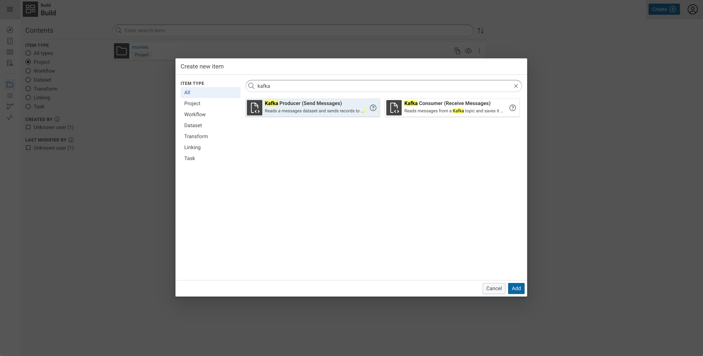
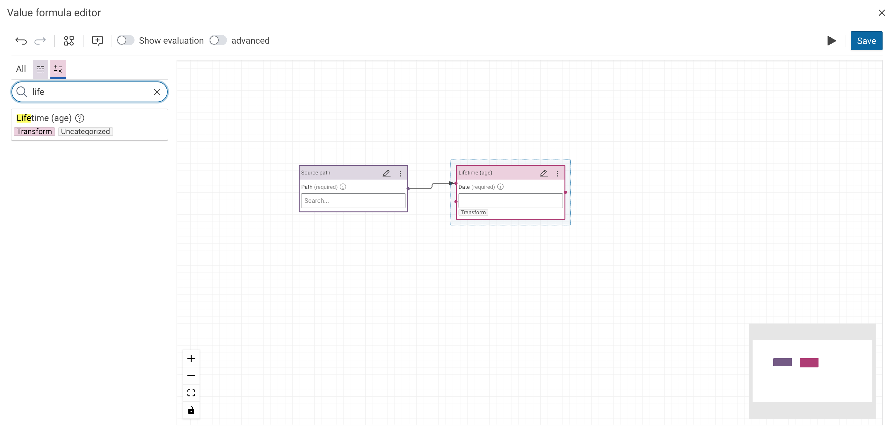

# Installation and Usage of Python Plugins

Plugins are a released as parts of Python packages.
They can but do not need to be open-source and published on [pypi.org](https://pypi.org/search/?q=%22cmem-plugin-%22) (a widely used Python Package Index). One package can contain of multiple plugins.

## Installation

If you want to install a python plugin package, you need to use cmemc's [admin workspace python command group](../../../automate/cmemc-command-line-interface/command-reference/admin/workspace/python/index.md).

The following shell commands demonstrate the basic workflow:

```shell-session title="Install a plugin package from pypi.org:"
$ cmemc admin workspace python install cmem-plugin-graphql
Install package cmem-plugin-graphql ... done
```

```shell-session title="List installed plugins:"
$ cmemc admin workspace python list-plugins
ID                                 Type            Label
---------------------------------  --------------  -------------
cmem_plugin_graphql-GraphQLPlugin  WorkflowPlugin  GraphQL query
```

You can get a list of all installed python packages: (1)
{ .annotate }

1.   This list contains all installed packages in the python environment, not just your plugin packages.

```shell-session title="List all installed python packages:"
$ cmemc admin workspace python list
Name                Version
------------------  -----------
certifi             2022.5.18.1
charset-normalizer  2.0.12
cmem-cmempy         22.1.1
cmem-plugin-base    1.2.0
idna                3.3
isodate             0.6.1
jep                 4.0.2
pip                 20.3.4
pyparsing           3.0.9
rdflib              6.1.1
requests            2.27.1
requests-toolbelt   0.9.1
setuptools          52.0.0
six                 1.16.0
urllib3             1.26.9
wheel               0.34.2
```

You also can (un-)install packages in a specific version or from a source distribution file.
Please have a look at the [admin workspace python command group](../../../automate/cmemc-command-line-interface/command-reference/admin/workspace/python/index.md) for a complete documentation of the package / plugin commands.

## Usage

Depending on the plugin type, an installed plugin can appear in different parts of the [Build workbench](../../../build/introduction-to-the-user-interface/index.md):

<div style="clear: both" markdown>

!!! info inline ""

    

**Workflow Plugins** are listed in the **Create new item** dialog in the **Task** category.
From there, you can create a task in your project and use it in a workflow.

</div>

<div style="clear: both" markdown>

!!! info inline ""

    

**Transform Plugins** are listed in the sidebar of the **Value formula editor** and the **Linking editor** in the **:eccenca-operation-transform: Transform** tab.
Drag and drop it on the canvas, and connect it with ingoing and / or outgoing links to other elements.

</div>

<div style="clear: both" />

## Known Issues

!!! bug "Sharing the `PYTHONPATH` via NFS"

    The `PYTHONPATH` is the location where the installed python plugins and their dependencies are stored for Build (DataIntegration).
    When you share this path via NFS, there are issues with open file locks which will sometimes break the plugin installation requests.
    A workaround for this is to install or upgrade plugins right after rebooting DataIntergration (and before you start a workflow that uses a python plugin).
    We currently advise against using NFS on this path directly.
    The problem is [known by the python community](https://github.com/pypa/pip/issues/6327) but there is no fix or workaround available yet.

