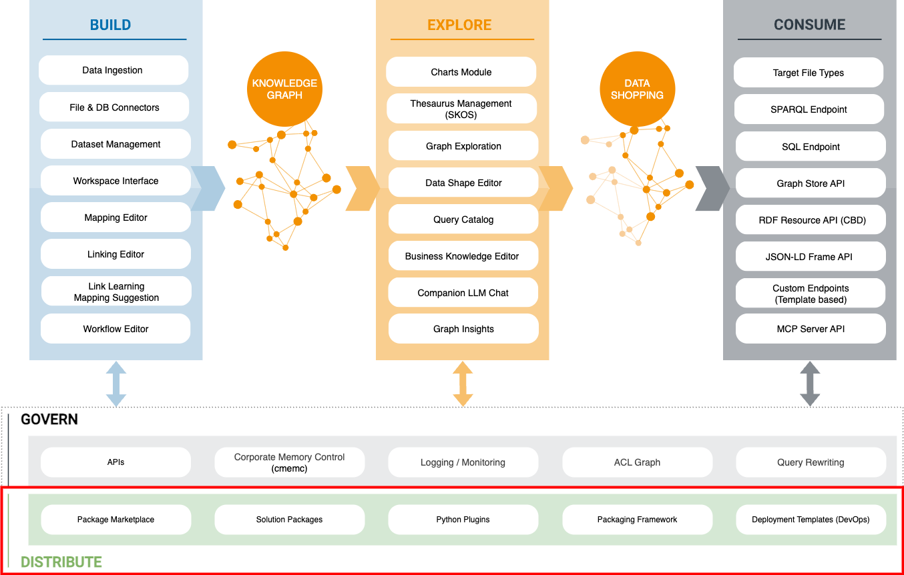

!!! info inline end ""

    

# :material-star: Distribution

This section describes how eccenca Corporate Memory content and data are distributed, shared and reused - across projects, teams, Corporate Memory instances and organizations.

Vocabularies / ontologies, taxonomies, data graphs, Build projects and query catalogs do not need to be moved around one by one.
They are bundled into **Marketplace Packages**: single, versioned artifacts which are offered on a Marketplace Server and can be installed into your Corporate Memory instance with a few clicks.

**:octicons-people-24: Intended audience**: All Corporate Memory users

- :eccenca-module-marketplace: [Marketplace](marketplace/index.md)

    ---

    Discover ready-made ontologies, vocabularies, demo projects and complete solutions in the Marketplace module, and install, update or uninstall them in your Corporate Memory instance.

- :material-star-four-points-outline: [FAIR Data](fair-data/index.md)

    ---

    Make data Findable, Accessible, Interoperable and Reusable: the fifteen FAIR principles mapped to the Corporate Memory mechanisms that implement them, and the six steps of FAIRification.

!!! info "Related sections"

    - [Marketplace Packages: Installation and Management](../develop/packages/installation/index.md) describes the same lifecycle on the command line with [cmemc](../automate/cmemc-command-line-interface/index.md), including the installation of local package archives.
    - [Marketplace Packages: Development and Publication](../develop/packages/development/index.md) describes how to create and publish your own packages.
