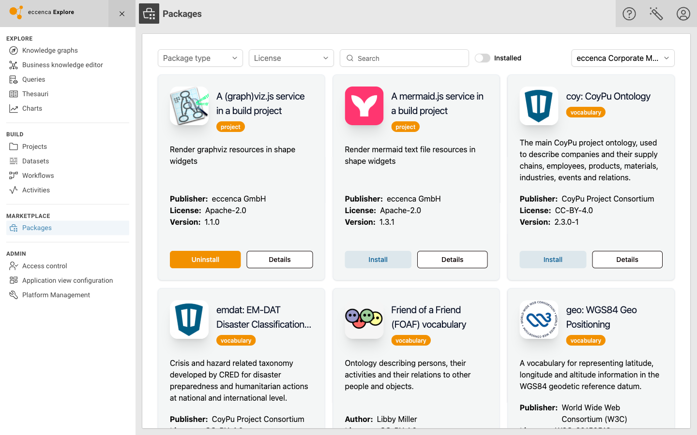
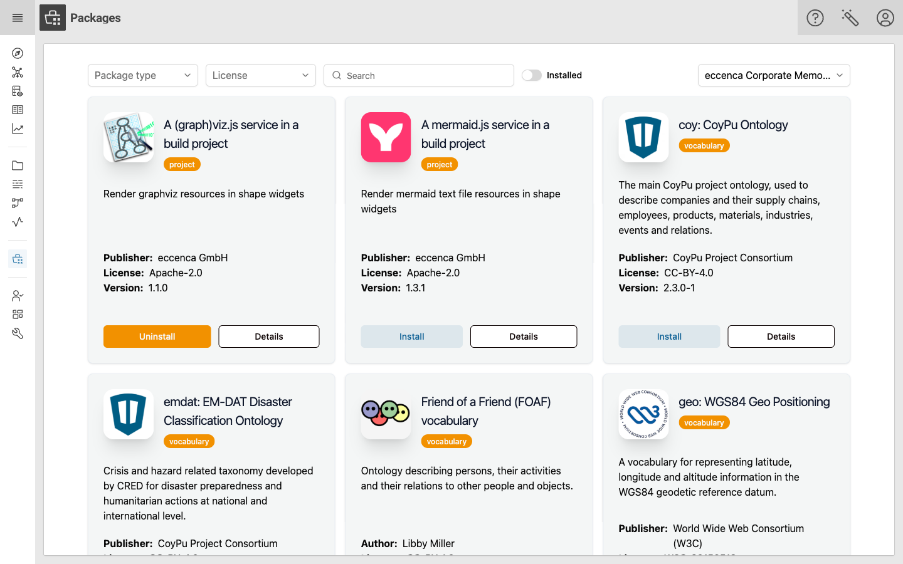
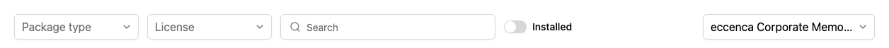
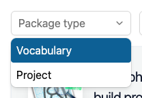
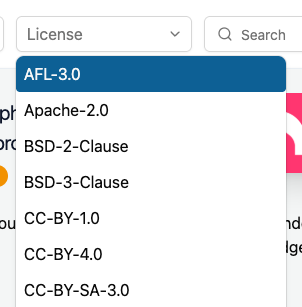
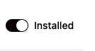
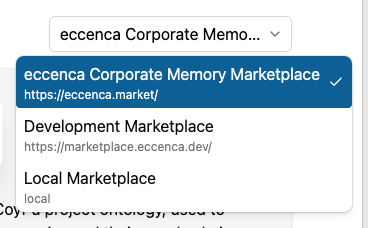
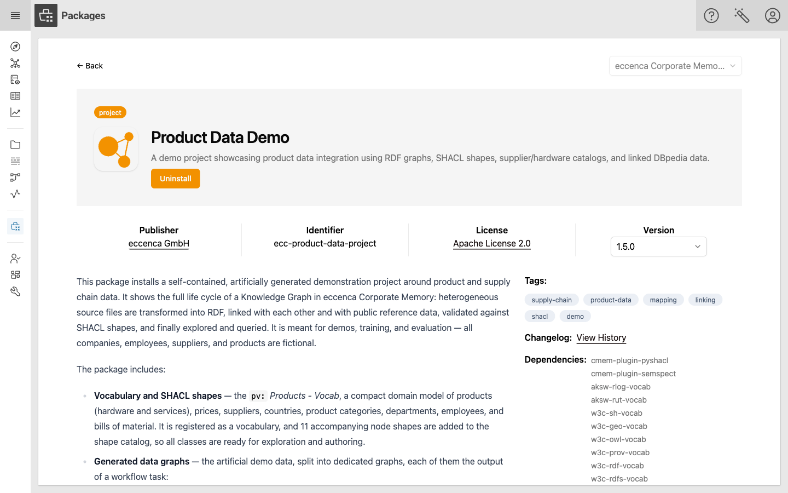

# Marketplace

## Introduction

The Marketplace is the place in eccenca Corporate Memory where you find ready-made content and add it to your instance: ontologies and vocabularies, taxonomies, data graphs, Build projects, query catalogs, as well as complete demo and solution setups.

All of this content is delivered as **Marketplace Packages**.
A package is a single, versioned artifact which bundles everything belonging to a solution, together with the packages and plugins it depends on.
Instead of collecting and importing graphs and projects one by one, you install a package, and Corporate Memory places all its contents where they belong.

Packages are offered by a **Marketplace Server**, a central repository your Corporate Memory instance is connected to.
The public Marketplace Server operated by eccenca is available at [https://eccenca.market](https://eccenca.market).

!!! info "Availability"

    The Marketplace is available starting with eccenca Corporate Memory version 26.1.

    In order to open the Marketplace and to install or uninstall packages, your user account needs the `:Marketplace-Frontend` action, plus access to the graphs a package writes to.
    If the **Packages** entry is missing from the navigation menu, or if the **Install** and **Uninstall** buttons do not react, contact your Corporate Memory administrator.
    See [Access Conditions](../../deploy-and-configure/configuration/access-conditions/index.md) for details.

## Open the Marketplace

To open the Marketplace:

- Click **:material-menu: Open main navigation** in the header.
- Click **:eccenca-module-marketplace: Packages** in the **MARKETPLACE** group.

{ class="bordered" }

## Discover Packages

The overview page lists all packages offered by the [selected Marketplace](#marketplace-top-right), and marks the ones already installed in your instance with an **Uninstall** action.

{ class="bordered" }

Each package is shown as a card with

- the package icon, name and description,
- a badge stating the [package type](#package-types) (`vocabulary` or `project`),
- the publisher or author, the license and the version, and
- the actions **Install** or **Uninstall**, and **Details**.

### Filter and Search

Use the controls above the package list to narrow down what is shown.
They can be combined.

{ class="bordered" }

<div style="clear: both" markdown>

!!! info inline ""

    

#### Package type

Show only **Vocabulary** or only **Project** packages, see [Package Types](#package-types).

</div>

<div style="clear: both" markdown>

!!! info inline ""

    

#### License

Show only packages published under one of the offered [SPDX licenses](https://spdx.org/licenses/).

</div>

<div style="clear: both" markdown>

#### :eccenca-module-search: Search

Show only packages whose name or description contains the entered keyword.

</div>

<div style="clear: both" markdown>

!!! info inline ""

    

#### Installed

Switch on to show only the packages currently installed in your instance.

</div>

<div style="clear: both" markdown>

!!! info inline ""

    

#### Marketplace (top right)

Select which Marketplace you work with.
The drop-down lists all Marketplaces configured for your Corporate Memory instance with their name and URL, and the package list shows the packages of the selected one.
It is inactive if only one Marketplace is configured.

</div>

<div style="clear: both" />

If nothing matches, the page states _No packages match the current filters._
Reset the controls to see the full list again.

### Package Types

`vocabulary`
:   Packages which contribute vocabulary / ontology content, such as `rdf:`, `org:` or `sso:`.
    Such a package can contain several vocabularies as well as the matching SHACL shapes.

`project`
:   Packages which can ship any kind of content, mainly Build projects, (instance / data) graphs, SHACL shapes, workspace configuration and query catalogs.
    Demo and solution packages are of this type.

## Inspect a Package

Click **Details** on a package card to open the package details page.
Use it to check what a package contains and what it pulls in before you install it.

{ class="bordered" }

The details page shows:

- The package type badge, icon, name and short description, together with the **Install** or **Uninstall** button.
- **Publisher** - the organization or person publishing the package, linked to its homepage if provided.
- **Identifier** - the unique package ID, for example `ecc-product-data-project`. You need this ID when you work with [cmemc](#manage-packages-on-the-command-line).
- **License** - the license the package is published under, linked to the license text.
- **Version** - the released version the page shows. Open the list to look at the description, tags and dependencies of another version of this package.
- The long description of the package, describing in detail which graphs, projects, queries and configurations are installed.
- **Tags** - free-text keywords used by the publisher to categorize the package.
- **Changelog** - click **View History** to read the release notes of all versions of this package.
- **Dependencies** - the other Marketplace Packages and [Python plugins](../../develop/python-plugins/index.md) this package needs. They are installed together with the package.
- Screenshots and further images shipped by the package, if any.

Click **:material-arrow-left: Back** to return to the overview.

## Install a Package

To install a package, click **Install**, either on the package card in the overview or on the package details page.
The package is fetched from the Marketplace Server and installed into your Corporate Memory instance, together with the dependencies listed on its details page.

Clicking **Install** starts the installation right away - there is no additional confirmation dialog, so make sure you picked the right package and version beforehand.
Depending on the size of the package and the number of dependencies, the installation can take a while.
Once it has finished, the card and the details page offer **Uninstall** instead of **Install**.

!!! tip "Installing a specific version"

    The latest version is preselected.
    To install an older one, open the package details page, select the version you want in the **Version** list, and click **Install**.

!!! info "One installation at a time"

    Only one installation can run at a time.
    Starting another one while an installation is still in progress results in an error.
    Wait until the running installation has finished, then start the next one.

### Change the Version of an Installed Package

There is no update action in the Marketplace, and the **Version** list does not offer to install another version of a package that is already installed:
as long as a package is installed, its card and its details page only offer **Uninstall**, no matter which version you select.

To move an installed package to another version - a newer as well as an older one:

- [Uninstall](#uninstall-a-package) the package.
- Select the version you want in the **Version** list on the package details page.
- Click **Install**.

!!! warning "The detour via uninstall removes the package contents"

    Since the package has to be uninstalled first, its contents - including your changes to them - are removed before the other version is installed, see [Uninstall a Package](#uninstall-a-package).
    Export what you want to keep beforehand.

    On the command line, `cmemc package install --replace` overwrites an installed package version in place, without uninstalling it first, see [Manage Packages on the Command Line](#manage-packages-on-the-command-line).

## Where the Package Contents Appear

An installed package does not show up as one single item in Corporate Memory.
Its contents surface in the module they belong to:

- **Graphs**, including vocabularies and shapes catalogs, are listed in [**Knowledge Graphs**](../../explore-and-author/graph-exploration/index.md#graphs).
- **Build projects** are imported into [**Projects**](../../build/introduction-to-the-user-interface/index.md#projects).
    When your first project package is installed, Corporate Memory also creates a special project holding all installed files.
    It is managed automatically and removed again once the last package has been uninstalled.
- **Queries** are shipped as a query catalog graph and are therefore available in the [Query module](../../explore-and-author/query-module/index.md).

For a package such as _Product Data Demo_, this means that right after the installation you can start exploring the installed integration graph, run the shipped queries, and execute the shipped workflows.

## Uninstall a Package

To remove a package, click **Uninstall** on the package card or on the package details page, and confirm the **Confirm action** dialog with **Confirm**.

This removes all contents of the package from your Corporate Memory instance, including the graphs and the Build projects that came with it.

!!! warning "Uninstalling removes data"

    Changes you made to the graphs or Build projects of a package are removed together with the package.
    Export what you want to keep before you uninstall.

## Manage Packages on the Command Line

Everything described on this page can also be done with the [cmemc command line interface](../../automate/cmemc-command-line-interface/index.md), which additionally allows you to install packages that are not published on a Marketplace Server, for example a **C**orporate Memory **P**ackage **A**rchive (`.cpa` file) you received directly:

```shell-session title="Install a package from the Marketplace Server"
$ cmemc package install ecc-product-data-project
Installing package 'ecc-product-data-project' from marketplace ... done
```

See [Marketplace Packages: Installation and Management](../../develop/packages/installation/index.md) for the complete workflow and the [package command group](../../automate/cmemc-command-line-interface/command-reference/package/index.md) for the command reference.

## Build Your Own Packages

Vocabularies, graphs, Build projects and configurations of your own solution can be bundled into a Marketplace Package as well, and then be shared with other teams or published to a Marketplace Server.

See [Marketplace Packages: Development and Publication](../../develop/packages/development/index.md) for an overview and the [step-by-step tutorial](../../develop/packages/development/tutorial/index.md) to build your first package.
