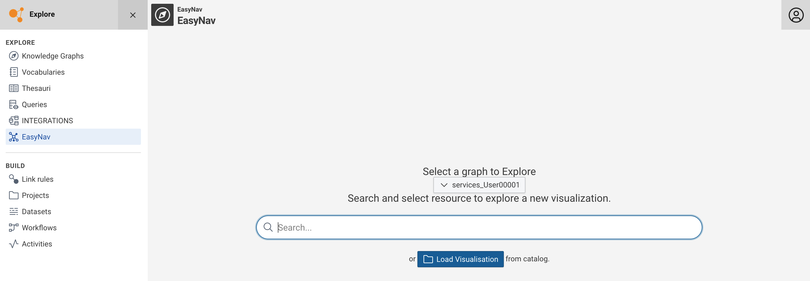
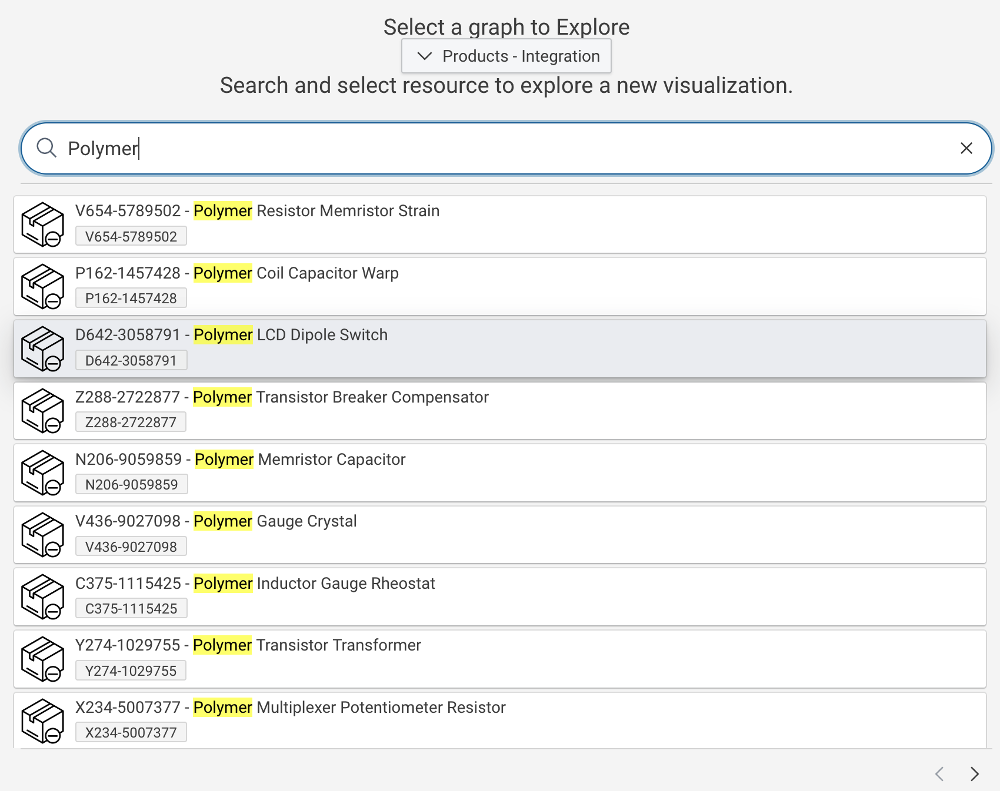
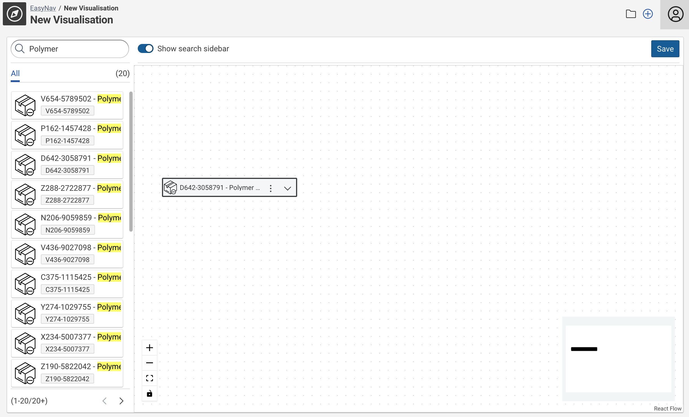
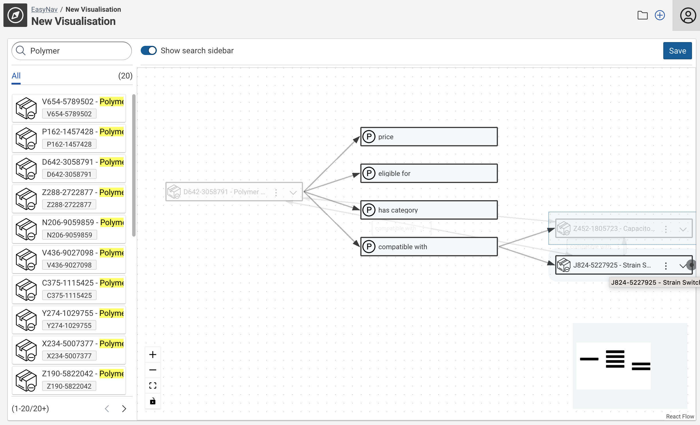
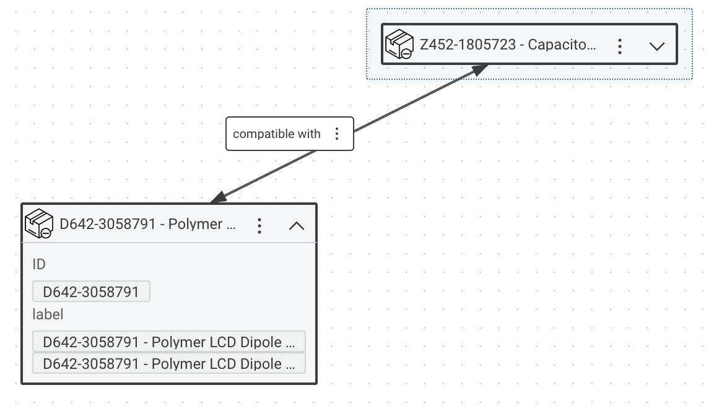

<!--TODO: Update all screenshots-->
<!--TODO: revise as defaults have changed-->
# Business Knowledge Editor

## Introduction

This module allows the visual exploration of Knowledge Graphs.
It allows to save and share explorations.
Furthermore, sophisticated individual search settings (filter presets) can be created and configured per Application view.

## Usage

If enabled, content of Knowledge Graphs can be explored in a visual way, rendering nodes and edges and allowing the user to expand along the relationships between the nodes.

Start using `Business Knowledge Editor` by selecting the respective module entry in the main navigation.

At the module welcome screen the user can either load a saved visualization of start searching for an initial node / resource by providing a search term.

!!! Note

    The graph selection drop-down might or might not be visible depending the existence of an (optional) `Business Knowledge Editor Module` configuration.
    In case no specific module configuration exists or non has not has been set for the current Application view the graph selection will be shown.
    A `Business Knowledge Editor Module` configuration pre-configures a graph.
    Thus, the dropdown will not be shown if such has been configured for the current Application view.

Enter a search term to populate the result list.
Click a result to start the visual graph exploration.

The exploration starts with the selected node (or a saved exploration).
The nodes can further be expanded along the relationships that exist to other resources.
Therefore, click the node expansion button on the right side of a node (the point where the arrows originate in the screenshot below).

Any expanded resource / node can be added to the current exploration by double-clicking the node.
Clicking anywhere on the empty canvas will close the relationship dialog and retain the added nodes and their relationships only.

Click :material-chevron-down: on a node to see literal values related to this resource :material-chevron-up: closes the details again.

`Save` allows to save an exploration, :octicons-plus-circle-24: will start a new exploration while :fontawesome-regular-folder: allows to open any previously saved exploration.

The `Visualization catalog` dialog shows the saved exploration and allows to :octicons-eye-24: open, :octicons-trash-24: delete or to :material-file-link-outline: copy the link to the exploration.

## Setup

This feature is enabled by default.
It can be customized or disabled in the respective Application view configuration section.

Without further (Application view) specific configuration the feature can be used asking for the graph that shall be explored every time a new exploration is started.

Optionally a `Business Knowledge Editor` configuration can be created to provide a fixed graph selection and search filter settings.

### Create a Business Knowledge Editor Configuration

In the `Knowledge Graphs` module navigate to the `CMEM Configuration` graph.

Select the class `Business Knowledge Editor` module and `Create a new "Business Knowledge Editor"`.

Provide a `Name` for your configuration and select the `Default Graph` which contains the nodes you want to explore visually.
This graph can of course be an integration graph.

`Search Configuration` is optional but a powerful feature to create predefined search filter/facets.
If want to use this capability select existing `Search Configuration`s in the drop down or create stubs for the configurations you want to setup.

### Set the Business Knowledge Editor module in the Application view configuration

After creating the `Business Knowledge Editor` module configuration it need to be selected in Application view configuration(s) that shall be using it.

