# Business Knowledge Editor

## Introduction

The Business Knowledge Editor (BKE) allows the visual exploration and authoring of Knowledge Graphs.
Resources are rendered as nodes on a canvas and can be expanded along the relationships that connect them to other resources.
Explorations can be saved as named visualizations, shared and re-opened later.

Which resources can be found, how edges are labeled and which graph is explored by default is controlled by the
:eccenca-module-workspace-configuration: [Application view configuration](../workspace-configuration/index.md) module,
see [Configuration](#configuration) below.

## Usage

Start the module by selecting :eccenca-module-bke: **Business knowledge editor** in the main navigation.

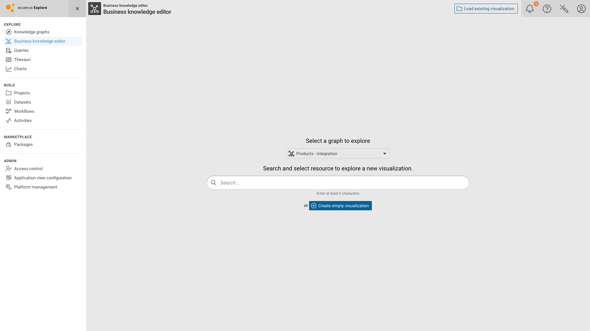{ class="bordered" }

### Starting a visualization

The module welcome screen offers three ways to begin:

- **Search and select a resource** to start a new visualization from that resource.
- **Create empty visualization** to start with an empty canvas, e.g. to [author an ontology](visually-authoring-ontologies/index.md).
- **Load existing visualization** (upper right) to re-open a saved visualization.

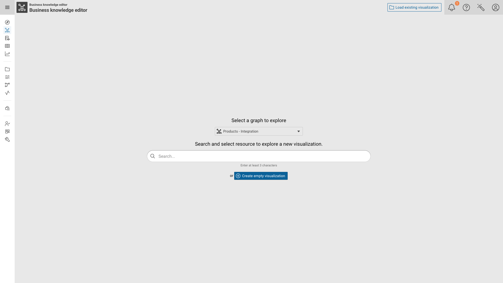{ class="bordered" }

!!! Note

    The **Select a graph to explore** drop-down is only shown if no `contextGraph` is configured for the module in the
    current Application view. If a `contextGraph` is configured, that graph is used and the drop-down is omitted.

Enter at least three characters to populate the result list, then click a result to open the exploration canvas.

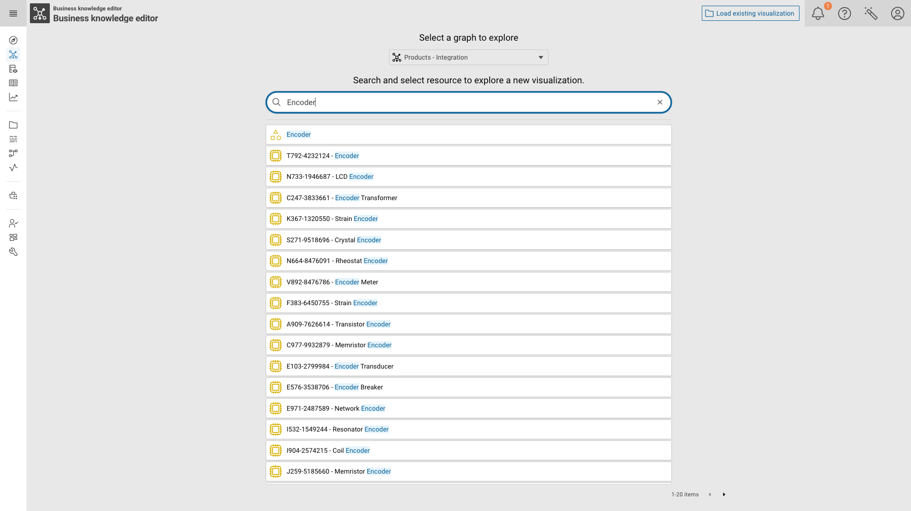{ class="bordered" }

!!! Note

    The result list is produced by the `searchListQueries` configuration of the module.
    By default it contains two presets, one for instances and one for classes, which is why the example above returns the class `Encoder` as well as the hardware instances labeled with it.
    See [Configuration](#configuration) on how to tailor these presets.

### The canvas

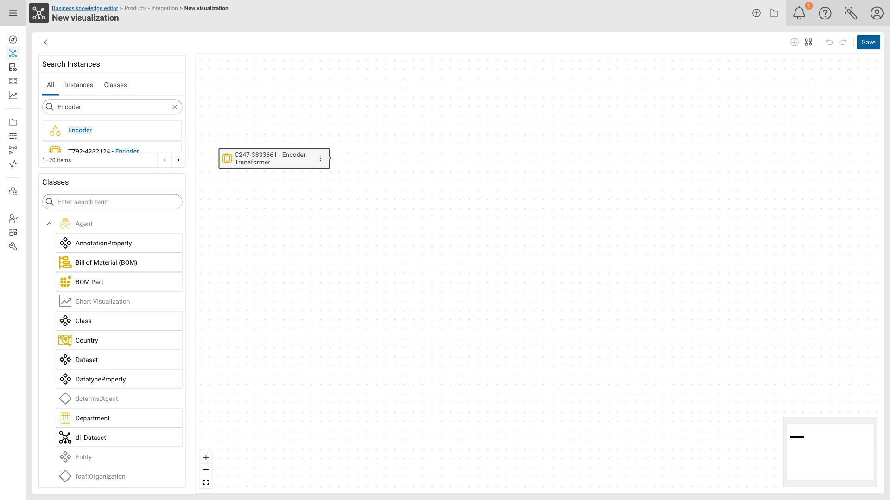{ class="bordered" }

The canvas is framed by:

- **Search Instances** (upper left) — search for further resources to add to the canvas.
  The tabs (`All`, plus one per configured search preset) let you restrict the search to a single preset.
- **Classes** (lower left) — the classes of the explored graph. Drag an entry onto the canvas to create a new resource
  of that class.
- **Canvas toolbar** (upper right) — *Start new visualization from selected nodes*, *Arrange* (auto-layout),
  *Undo*, *Redo* and *Save*.
- **Zoom controls and minimap** — zoom in/out, *Fit View* and an overview of the whole visualization.

### Expanding a resource

Hover a node and click the connector dot on its right edge to open the **Used properties** panel.
It lists every property used by this resource together with the number of related resources.
A :material-arrow-left: in front of the property name marks an incoming (inverse) relation.

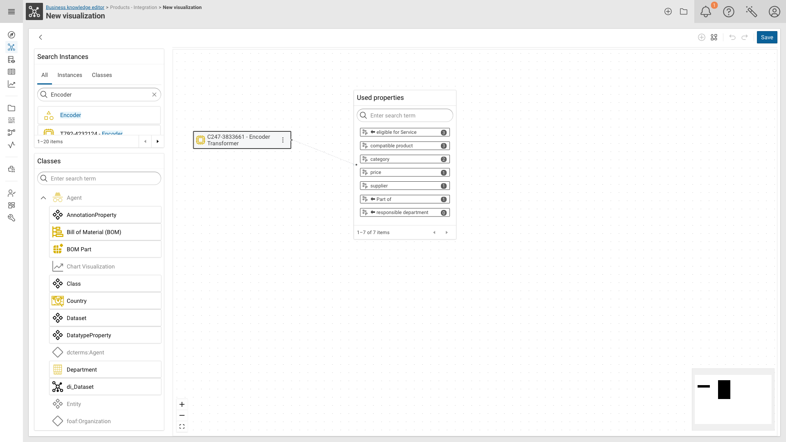{ class="bordered" }

Select a property to open the **Linked Resources** panel with the resources reachable via that property.

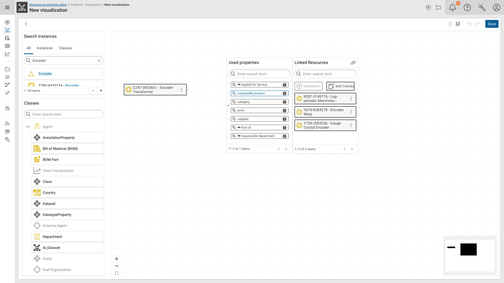{ class="bordered" }

From here you can:

- **click a single resource** to add it to the canvas,
- **drag `Add N entries`** onto the canvas to add all listed resources at once,
- **drag `New <Class>`** onto the canvas to create a new resource of the property's target class and link it directly.
  If the property has no target class or shape defined, this button is disabled and labeled `Undefined target class or shape`.

Repeat the expansion on any node to grow the visualization.
Use *Arrange* in the canvas toolbar to re-layout the result.

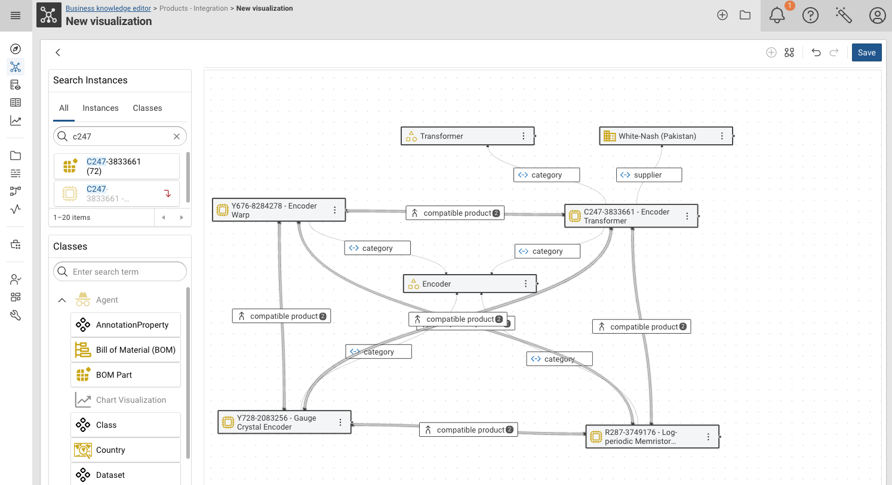{ class="bordered" }

### Inspecting and editing a resource

Double-click a node to open the details panel on the right side.
It shows the literal values of the resource and highlights its relations on the canvas.

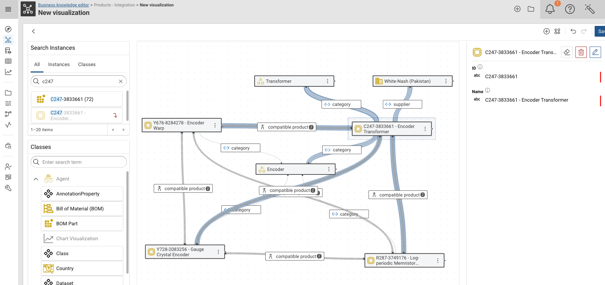{ class="bordered" }

The buttons in the panel header are:

| Button | Description |
| --- | --- |
| :material-eraser: Remove from visualization | Removes the node from the canvas, the resource stays in the graph. |
| :material-delete-outline: Remove from graph | Marks the resource for deletion from the graph. |
| :material-pencil-outline: Edit mode | Switches the panel into a form to change the resource's values. |

The :material-dots-vertical: menu of a node offers *View in Knowledge Graph*, *New query using this resource* and
*Copy resource identifier*.

### Saving

Click **Save** in the canvas toolbar.

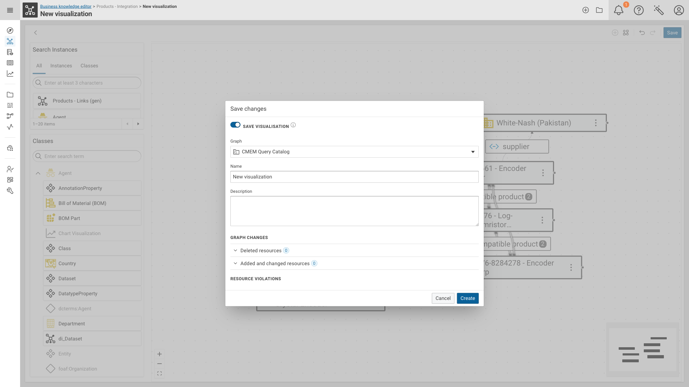{ class="bordered" }

The dialog covers both aspects of a BKE session:

- **SAVE VISUALISATION** — stores the canvas itself as a named visualization.
  Select the **Graph** it is stored in (`CMEM Query Catalog` by default) and provide **Name** and **Description**.
  Switch the toggle off to only write the graph changes without storing a visualization.
- **GRAPH CHANGES** — lists the resources you deleted, added or changed during the session, together with the
  **RESOURCE VIOLATIONS** reported for them.

### Re-opening a saved visualization

Click :material-folder-outline: **Load existing visualization** in the application header to open the
**Visualization catalog**.

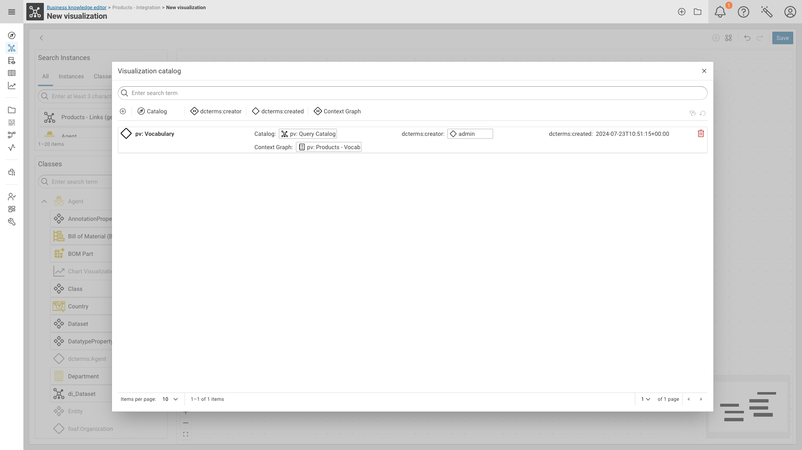{ class="bordered" }

The catalog is a faceted list of all saved visualizations. Click an entry to open it, or use
:material-trash-can-outline: to delete it.

## Configuration

The module is enabled by default.
All of its settings are part of the :eccenca-module-workspace-configuration:
[Application view configuration](../workspace-configuration/index.md) module, in the **Business knowledge editor**
section of the **Modules** list.

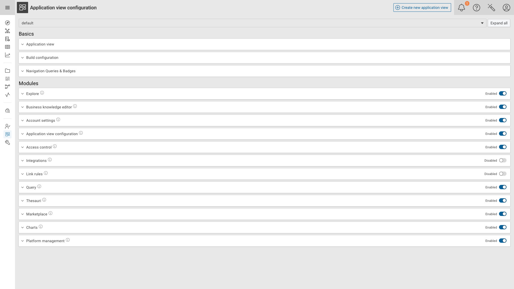{ class="bordered" }

Expand the section to see the parameters.
The **System Default Application View** column shows the platform-wide default, the column named after the current
Application view (`default` in the screenshot) holds the value used by that Application view.

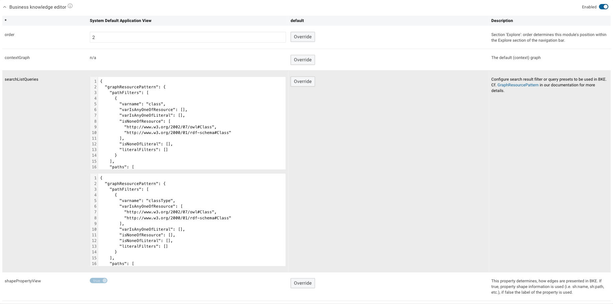{ class="bordered" }

### Parameters

| Parameter | Description |
| --- | --- |
| `order` | Position of the module within the *Explore* section of the navigation bar. |
| `contextGraph` | The graph explored by default. If set, the graph drop-down on the welcome screen is not shown. |
| `searchListQueries` | Search result filter / query presets used by the module. Each entry is a [`GraphResourcePattern`](../../deploy-and-configure/configuration/explore/graph-resource-pattern/index.md) together with a label; the label becomes a tab in the **Search Instances** panel. Defaults to one preset for `Instances` (everything that is not a class) and one for `Classes`. |
| `shapePropertyView` | Determines how edges are presented. If `true`, property shape information is used (`sh:name`, `sh:path`, …), if `false` the label of the property is used. |

### Overriding a parameter for an Application view

Click **Override** next to a parameter to set an Application view specific value.
The value becomes editable and a :material-trash-can-outline: appears to drop the override again and fall back to the
system default. Confirm your changes with **Save** in the application header.

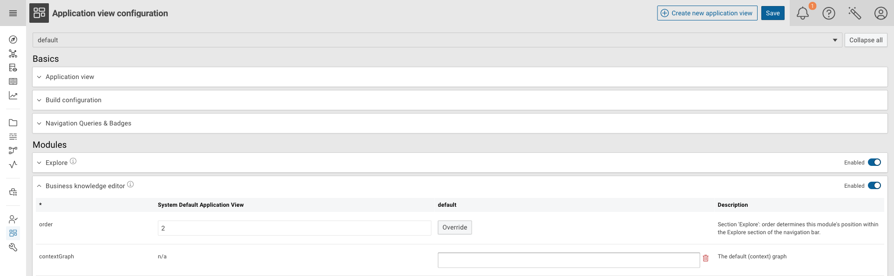{ class="bordered" }

!!! Note

    Toggling the module itself off in the section header removes :eccenca-module-bke: **Business knowledge editor**
    from the navigation of that Application view.
