# Visually Authoring Ontologies

## Introduction

This beginner-level tutorial shows how to use Business Knowledge Editor to visually create new ontology (vocabulary) **classes** and **properties** (object properties and datatype properties).

There are other ways to create new classes and properties in Corporate Memory, for example by using SHACL shapes. Business Knowledge Editor provides an intuitive diagram-based approach that simplifies this process.

The tutorial consists of the following steps, which are described in detail below:

1. Initialize a new ontology
2. Open a new Business Knowledge Editor visualization
3. Create classes
4. Link related classes through an object property
5. Add data properties
6. Save the changes

## Class Diagram

This tutorial uses the following example ontology:

Two classes are related through an `expertIn` object property.

Each class will have its own data property.

---

## 1 Initializing a new ontology

The classes and properties created in this tutorial are stored in a knowledge graph. For this tutorial, create a new ontology graph.

!!! info

    You can also extend an existing vocabulary. In that case, continue with step 2.

To create a new ontology graph:

1. In Corporate Memory, click **Knowledge graphs** under **EXPLORE** in the navigation on the left side of the page.

    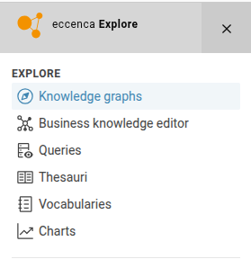{ class="bordered" width="50%" }

2. In the **Graphs** drop-down menu, click the **(+)** button and select **New Ontology (owl:Ontology)**.

    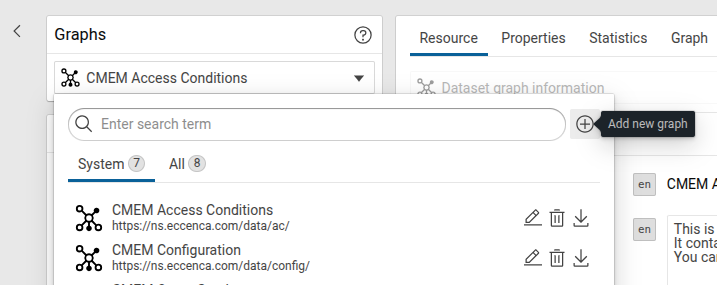{ class="bordered" width="50%" } 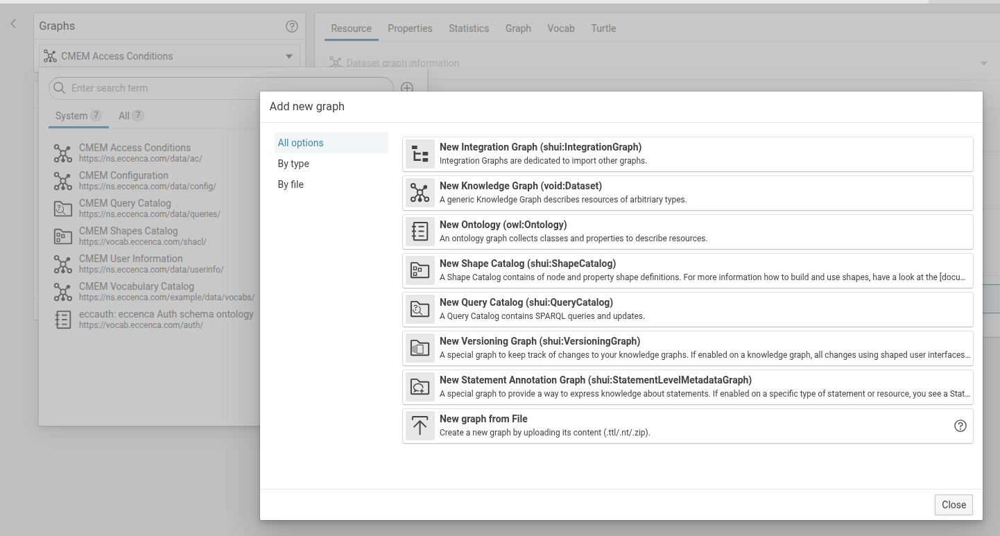{ class="bordered" width="50%" }

3. Define a **Name** and a **Graph URI** for the ontology. In this example, use:
    -   Label: `Custom Dprod`
    -   Graph URI: `http://ld.company.org/custom-dprod/`

---

## 2 Opening a new Business Knowledge Editor visualization

1. In Corporate Memory, click **Business Knowledge Editor** under **EXPLORE** in the navigation on the left side of the page.

    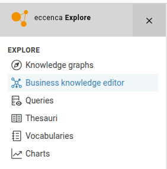{ class="bordered" width="50%" }

2. Select the target graph using the drop-down menu.

    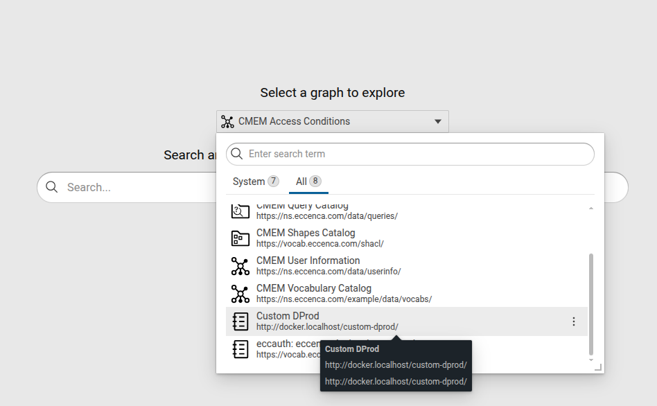{ class="bordered" width="50%" }

3. Create a new empty visualization.

!!! success

    If you see an empty canvas, you are ready to use Business Knowledge Editor to create classes and properties.

---

## 3 Creating classes

New elements can be created from the entries listed in **Classes** on the left side of the canvas.

1. Drag and drop **Class** from the bottom left list into the canvas.

    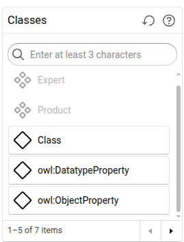{ class="bordered" width="50%" }

!!! info

    If you do not see **Class** in the first entries, use the search bar to find it.

2. Click the newly created **Untitled (Class)** in the canvas to bring up a form on the right side.

    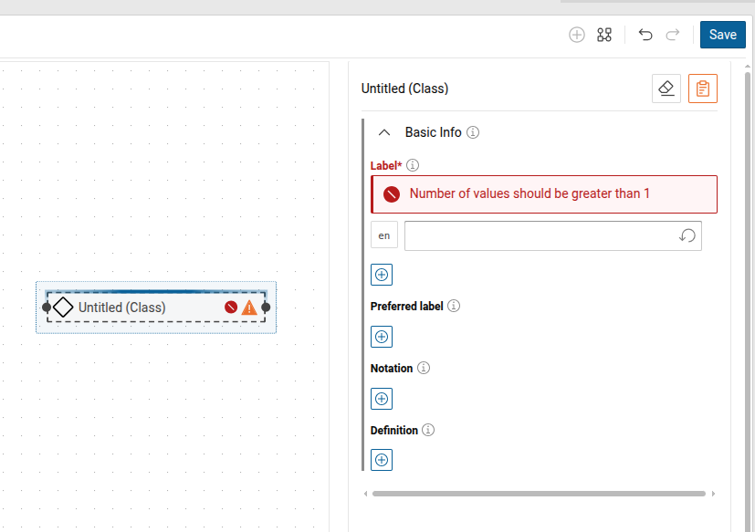{ class="bordered" width="50%" }

3. Fill out the required fields and any optional fields you want to define for the class.

    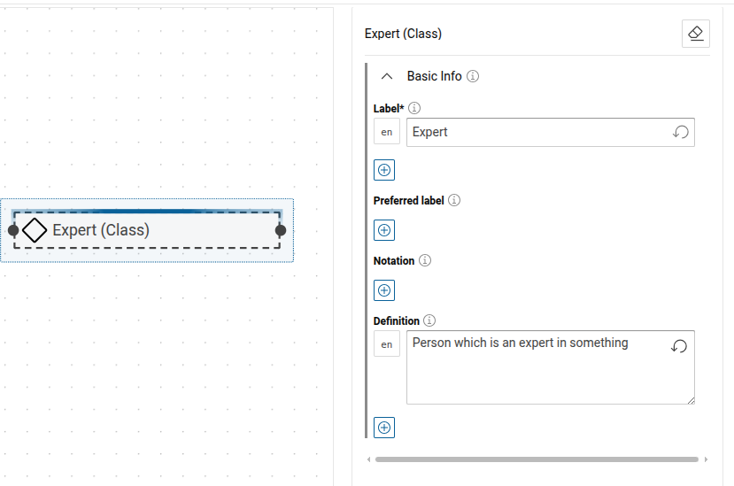{ class="bordered" width="50%" }

---

## 4 Linking related classes through object properties

1. Drag and drop **owl:ObjectProperty** from the bottom left list into the canvas.

    !!! info

        If you do not see **owl:ObjectProperty** in the first entries, use the search bar to find it.

2. Click the newly created **Untitled (Object Property)** in the canvas to bring up a form on the right side.

3. Fill out the required fields and any optional fields you want to define for the object property.

    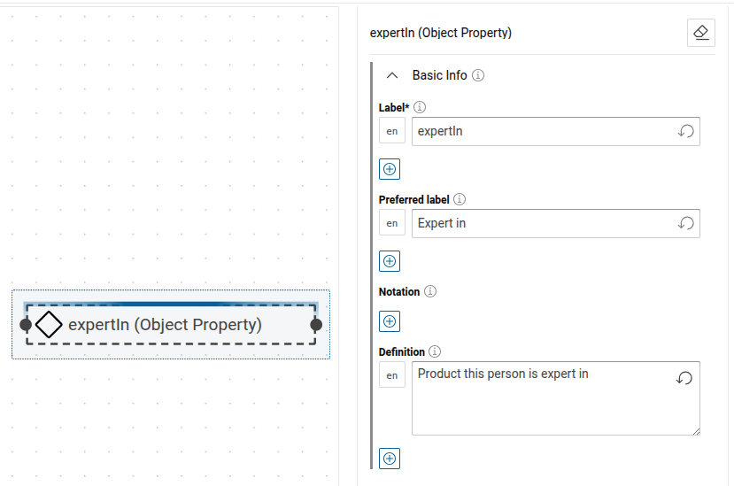{ class="bordered" width="50%" }

4. Click and hold the connector dot at the right edge of the class to begin drawing an arrow, then connect it to the connector dot at the left edge of the object property.

   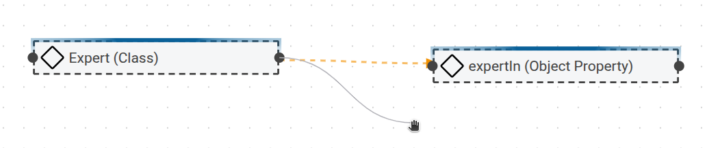{ class="bordered" width="50%" }

5. In the edge type selection window that appears, select **In Domain Of**.

    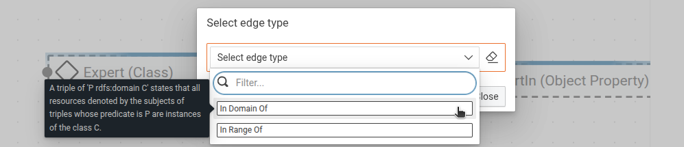{ class="bordered" width="50%" }

    !!! info

        This is one way to associate a property with an existing class. The next step shows another option: creating a new class from an existing property.

6. Click the right-side edge of the object property and select **Range**. This adds **New Class** on the right side.

    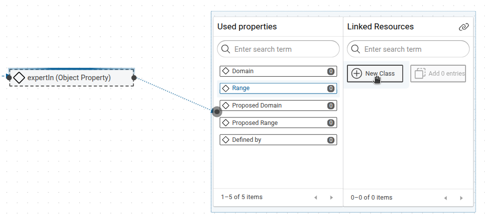{ class="bordered" width="50%" }

7. Drag and drop **New Class** into the canvas.

    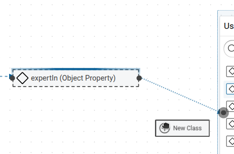{ class="bordered" width="50%" }

8. Click the newly created class to open its form, then fill out the required fields and any optional fields you want to define.

    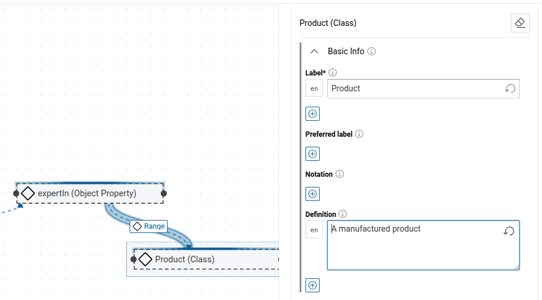{ class="bordered" width="50%" }

!!! success

    The property now links the two concepts through its domain and range.

---

## 5 Adding data properties

Datatype properties can be added to the canvas in the same way as object properties.

1. Drag and drop **owl:DatatypeProperty** from the bottom left list into the canvas.

    !!! info

        If you do not see **owl:DatatypeProperty** in the first entries, use the search bar to find it.

2. Click the newly created **Untitled (Data Property)** in the canvas to bring up a form on the right side.

3. Fill out the required fields and any optional fields you want to define for the data property.

   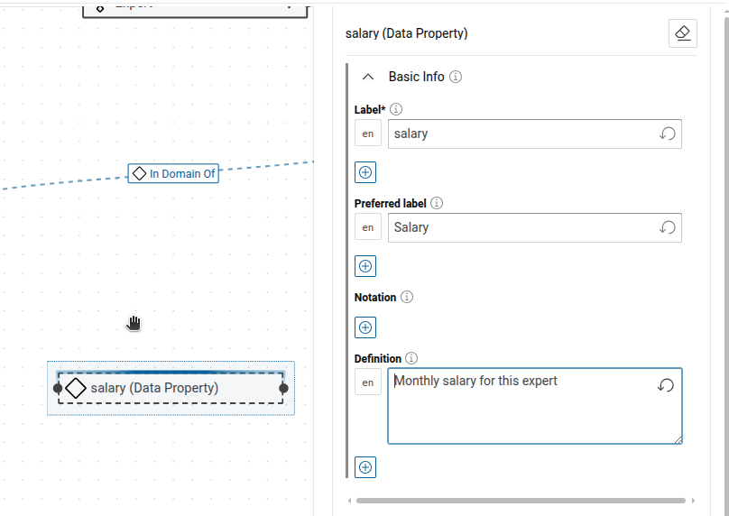{ class="bordered" width="50%" }

4. Click and hold the connector dot at the right edge of the class to begin drawing an arrow, then connect it to the connector dot at the left edge of the data property.

5. In the edge type selection window that appears, select **In Domain Of**.

   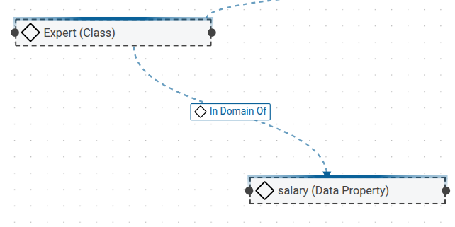{ class="bordered" width="50%" }

!!! warning

    At the time of writing, it is not possible to set a datatype range such as a language-tagged string, float, or date directly in Business Knowledge Editor.
    Save your changes, then complete the datatype definition by using the SHACL shapes approach.

    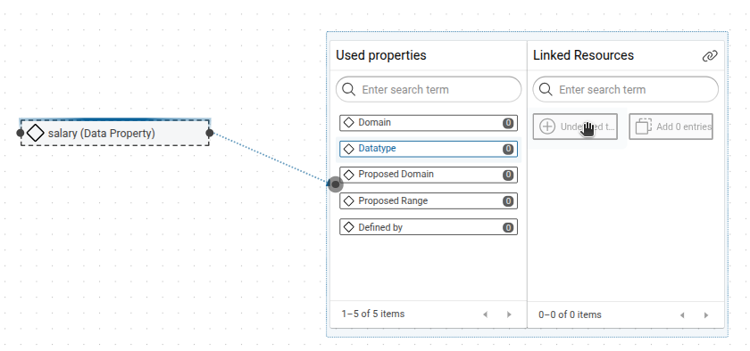{ class="bordered" width="30%" }

## 6 Saving the changes

Save the changes as a named visualization so you can edit your classes and properties later.

1. Click **Save** in the upper-right corner of the canvas.

2. In the **Graph** drop-down selector, choose your ontology (vocabulary).

3. Enter a name for the visualization.

    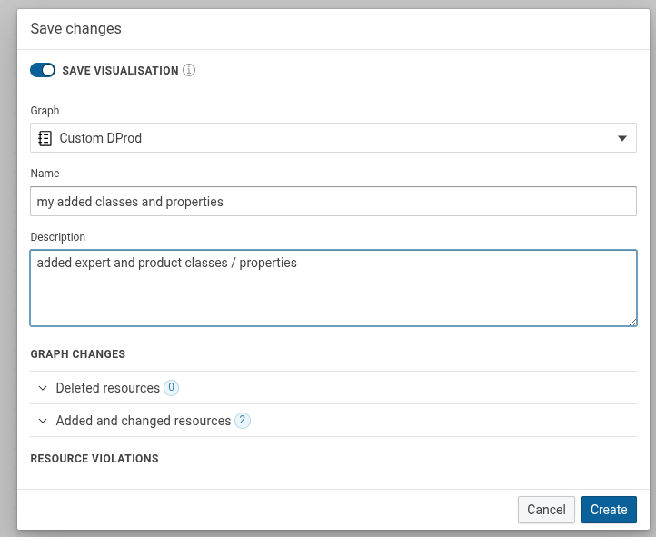

4. Click **Save**.

!!! success

    You have successfully created new concepts and properties inside your ontology using Business Knowledge Editor's canvas.
