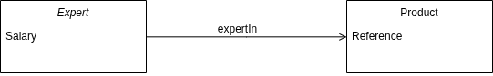

# Visually Authoring Ontologies

## Introduction

This beginner-level tutorial shows how to use Business Knowledge Editor to create new ontology (vocabulary) **classes** and **predicates** (object property, data property) visually.

There are other way of creating new classes and properties within Corporate Memory (using shacl shapes), but Business Knowledge Editor allows for an intuitive "diagram" approach, simplifying the creation.

The tutorial consists of the following steps, which are described in detail below:

1. Initializing a new ontology
2. Opening a new Business Knowledge Editor visualization
3. Creating classes
4. Linking related classes through object properties
5. Adding data properties
6. Saving the changes

## Class Diagram

This tutorial will go through the example of creating an ontology modeling the following diagram:

Two classes will be related to each other through an `expertIn` object property.

Each class will have its own data property.

---

## 1 Initializing a new ontology

The "to-be-created" classes and properties will be saved in a given Knowledge Graph, a new ontology graph will be initialized for this tutorial.

!!! info

    It is also possible to extend an existing vocabulary, in that case directly go to step 2

To create a new ontology graph :

1. In Corporate Memory, click **Knowledge graphs** under **EXPLORE** in the navigation on the left side of the page.

    { class="bordered" width="50%" }

2. In the **Graphs** drop-down menu click the **(+)** button and select **New Ontology (owl:Ontology)**.

    { class="bordered" width="50%" } { class="bordered" width="50%" }

3. Define a **Name** and a **Graph URI** for the ontology. _In this example we will use:_
    -   Label: `Custom Dprod`
    -   Graph URI: `http://ld.company.org/custom-dprod/`

---

## 2 Opening a new Business Knowledge Editor visualization

1. In Corporate Memory, click **Business knowledge editor** under **EXPLORE** in the navigation on the left side of the page.

    { class="bordered" width="50%" }

2. Select the target graph using the drop-down menu.

    { class="bordered" width="50%" }

3. Create an empty visualization.

!!!success

    If you see an empty canvas you are ready to use Business Knowledge Editor to create classes and properties

---

## 3 Creating classes

New elements can be created by using the concepts defined in `Classes` visible in the left side of the canvas

1. Drag and drop **Class** from the bottom left list into the canvas.

    { class="bordered" width="50%" }

!!! info

    If you don't see Class within the first entries you can use the text search bar to find it

2. Click the newly created **Untitled (Class)** in the canvas to bring up a form on the right side.

    { class="bordered" width="50%" }

3. Fill out the form with the required (*) and optional values .

    { class="bordered" width="50%" }

---

## 4 Linking related classes through object properties

1. Drag and drop **owl:ObjectProperty** from the bottom left list into the canvas.

    !!! info

        If you don't see owl:ObjectProperty within the first entries you can use the text search bar to find it

2. Click the newly created **Untitled (Object Property)** in the canvas to bring up a form on the right side.

3. Fill out the form with the required (*) and optional values.

    { class="bordered" width="50%" }

4. Click and hold the edge of the Class to begin drawing an arrow. Link that to the created property's edge.

   { class="bordered" width="50%" }

5. Inside the edge type selection window that pops up, select **In Domain Of**

    { class="bordered" width="50%" }

    !!! info

        This is one way of associating a property with an existing class, below is shown another way (creating new class from an existing property)

6. Click the right side edge of the object property and select **Range** from the selection so that it brings an additional **New Class** on the right side

    { class="bordered" width="50%" }

7. Drag and drop **New Class** into the canvas.

    { class="bordered" width="50%" }

8. Click the newly created class to bring out the form and  fill out with the required (*) and optional values .

    { class="bordered" width="50%" }

!!! success

    The property is now succesfully linking the two concepts together through the use of Domain and Range

---

## 5 Adding data properties

Datatype properties can be added to the canvas the same way as an object property,

1. Drag and drop **owl:DatatypeProperty** from the bottom left list into the canvas.

    !!! info

        If you don't see owl:DatatypeProperty within the first entries you can use the text search bar to find it

2. Click the newly created **Untitled (Data Property)** in the canvas to bring up a form on the right side.

3. Fill out the form with the required (*) and optional values .

   { class="bordered" width="50%" }

4. Click and hold the edge of the Class to begin drawing an arrow. Link that to the created property's edge.

5. Inside the edge type selection window that pops up, select **In Domain Of**

   { class="bordered" width="50%" }

!!! warning

    At the time of writing this tutorial, setting up a datatype range (languaged string, float, date, …) is not possible from within Business Knowledge Editor directly.
    We recommend saving the changes and finish the datatype edition using the shacl shapes approach.

    { class="bordered" width="30%" }

## 6 Saving the changes

It is recommended to save the changes by using a named visualization, in case you need to edit your classes and properties later.

1. Click **Save** from the top right section of the canvas

2. Using the Graph drop-down selector, choose your ontology (vocabulary)

3. Fill out the name

    

4. Click Save

!!! success

    You have successfully created new concepts and properties inside your ontology using Business Knowledge Editor's canvas.
