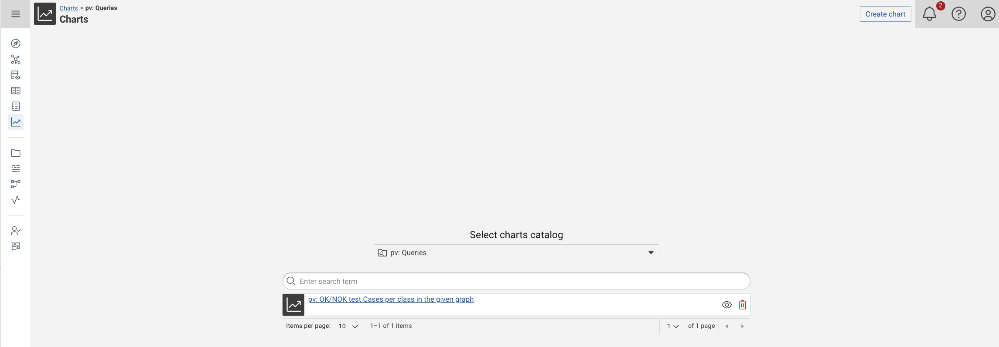

# Charts Catalog and Charts Integration

The **Charts Catalog** is a module suitable to visualize your data in a chart.

## Graph Selection

The charts module lists all the graphs containing queries - which will be the data foundation for your charts.
Select the graphs that contains the queries you want to user to get started.
You will see the charts that are already defined based select any to edit or add a new with **Create chart**.

{ class="bordered" }

## Charts Management

You can open the Charts Catalog from the main menu on the left.
You will see a list of existing charts or the information **Your charts catalog is empty**.
Here you can create a new chart or edit an existing one.

{ class="bordered" }

After selecting **Create Chart** or an existing Chart, you will see the Chart Editor, which is divided into four components:

### Metadata

You can give your charts a name and a description.

### Query selection

Select a query from the :eccenca-application-queries: [Query Catalog](../query-module/index.md) to retrieve the data you want to visualize.

The following activities can be performed in this component:

-   **Select a query** — Select a query to visualize by clicking on a :material-plus-circle-outline: button.
    The Assisted chart form (see below) supports a single query, while the Advanced chart form can use multiple queries.
-   From the dropdown menu:
    -   **Parameters** — Some queries have parameters that need to be filled with real values.
    -   **Preview** — View a preview of the retrieved data.
    -   **View in query catalog** — Opens the query in the query catalog.

### Chart forms

There are two types of forms: **Assisted** and **Advanced**.

The assisted form can be used to create simple chart types such as line, bar, bar-line and pie charts.
It consists of fields that help you visualize your data.

The advanced form is completely flexible when it comes to chart configuration.
It consists of a JSON editor that allows you to configure the chart yourself.

For more information about chart configuration and examples, visit the [echarts.apache.org](https://echarts.apache.org/examples/en/index.html).

### Preview

The main content on the right side is the preview, where you can see the visual results of your changes in the configuration.

When using an advanced chart, you will also see a tab with the datasets that were created from the selected queries.

## Charts Integration

You can integrate your charts into existing Node or Property shapes in order to show a chart in the context of a resource.
To do so, add :material-plus-circle-outline: the **Chart Visualization** property to the shape and select the desired Chart.

!!! Note

    This means that your Chart must be accessible from the Shape Catalog.
    This can be achieved either by copying the chart and query resources into the Shape Catalog graph or by importing the query catalog graph in the Shape Catalog graph.

To customize the chart several placeholders can be used in you queries:

-   `{{shuiResource}}`, the resource currently shown with the node shape of this property shape.
-   `{{shuiMainResource}}`, refers to the main resource rendered in the start node shape of the currently displayed node shape tree (only relevant in case of sub-shape usage).
-   `{{shuiGraph}}`, the currently used graph.
