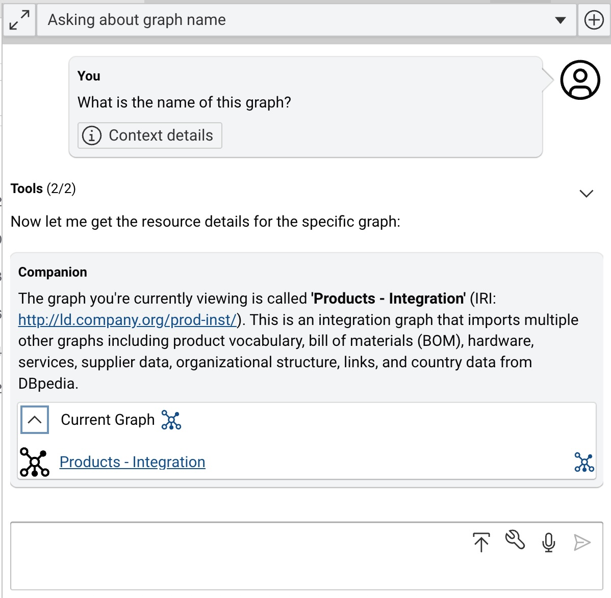

# Companion

The Companion view enables you to interact with your data, graphs, vocabularies, resources and queries in a chat-like way.

## Configuration

<!-- TODO: add details -->

## Usage

{ class="bordered" width="40%" }

You can open the _Chat with Companion_ from any explore module via the :eccenca-application-ai-suggestion: Companion button the top right of the application header, next to the :eccenca-application-useraccount: user menu.

{ class="bordered" width="60%" }

In the companion sidebar, use:

-   :eccenca-toggler-maximize: to increase the size of the sidebar
-   :eccenca-toggler-minimize: to decrease the size of the sidebar
-   :eccenca-item-add-artefact: to start a new conversation
-   the dropdown menu to select or search for a conversation
-   :eccenca-item-upload: to add documents as context to the chat (supported formats include `pdf`, `txt` and `md`)
-   :eccenca-item-wrench: to configure the tools that the LLM can use to answer.
-   :eccenca-item-wrench: to use your microphone to dictate your questions
-   :material-send-variant-outline: to submit your question

To maximise the relevance and accuracy of the generated answer, your question is automatically enriched based on the context of the current view (e.g. the query text, the graph and the resource IRI).

### Tool selection

{ class="bordered" width="40%" }

The companion chat uses various tools to interact with Corporate Memory.
These tools are used autonomously by the configured LLM model to gather the relevant context needed to generate the best answer.
If your use case or question requires you to limit the available tools (e.g. if you only want to use queries from the query catalogue and not generate any), you can configure the tools the model can use via the drop-down widget.

-   Query Catalog related

    `query_list`
    :   Query Catalog: Lists all existing SPARQL queries on this corporate memory instance.

    `query_details`
    :   Query Catalog: Retrieve all information about a certain query in the query catalog.

    `query_execute_saved`
    : Query Catalog: Executes a saved SPARQL query on this corporate memory instance. The query is identified by it's IRI.

-   Query related:

    `query_execute_jsonExecutes`
    :   a `SPARQL SELECT` query on this corporate memory instance. The query is provided as a string.

-   Introspection related:

    `graph_tree`
    :   Retrieves a tree of all the direct and transitive `owl:imports` for a given graph.

    `graph_class_usage`
    :   Shows how classes are connected in a particular graph to each other by different properties.

    `graph_list`
    :   Lists all existing RDF graphs on this corporate memory instance.

    `graph_properties_list`
    :   Lists all used RDF properties used in this graph.

    `graph_classes_list`
    : Lists all used `owl:Class` etc. used in this graph.

    `vocabularies_property_list`
    :   All Properties defined in this knowledge graph by installed vocabularies. While all properties are returned, they can easy be grouped by either their explicit association with an ontology in the isDefinedBy (`rdfs:isDefinedBy`) field, or by the sourceGraph field, which contains the names of the graphs from which the type statements were loaded from.

    `vocabularies_class_list`
    :   All Classes defined in this knowledge graph by installed vocabularies. While all classes are returned, they can easy be grouped by either their explicit association with an ontology in the isDefinedBy (`rdfs:isDefinedBy`) field, or by the sourceGraph field, which contains the names of the graphs from which the type statements were loaded from.

-   Resource related

    `resource_search`
    :   Performs a lucene syntax full text search of labels and descriptions for 'searchTerm' and retrieve list of best matches. The context graph will restrict the search to it includes, or search the full graph. Pattern allows to define a `SPARQL WHERE` clause snippet, which defaults to `{GRAPH ?contextGraph {?resource ?p ?o}}`. Search will always be on the `?resource`, so adjust the pattern, if needed.

  `resource_get`
    :   Retrieves the Concise Bounded Description (CBD) of a resource from the knowledge graph and returns it as JSON-LD.

### Interactive answers

Your answer may include elements that allow rich interaction with specific Corporate Memory views and modules:

<!-- TODO: add details -->

- Queries
- BKE Exploration
- Resource
