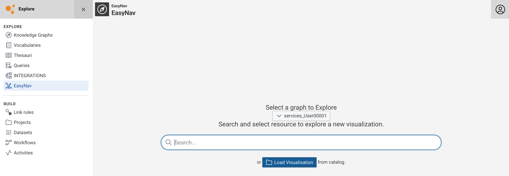
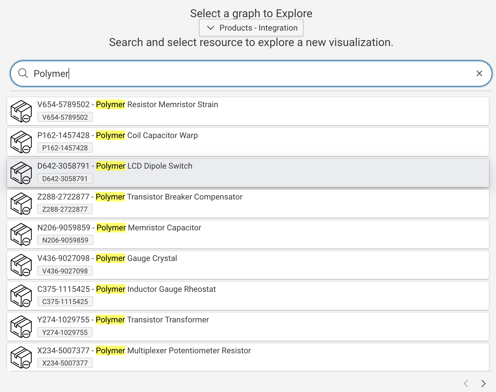
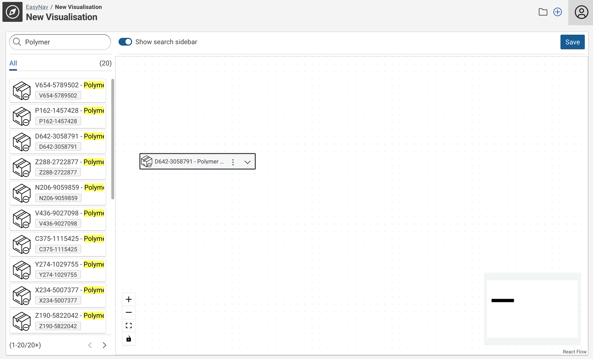
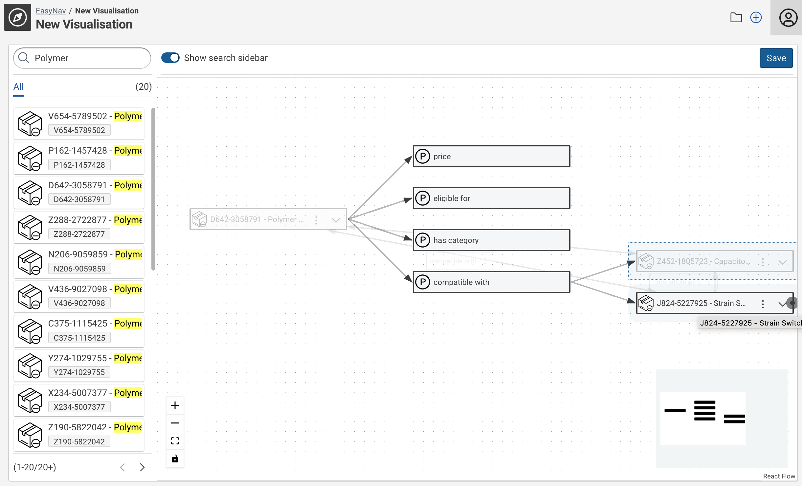
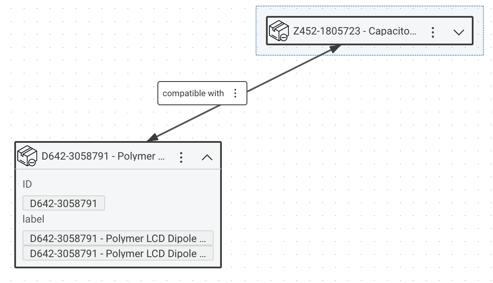

# EasyNav Module

!!! Info

    EasyNav is a preview feature, which is disabled by default.
    Preview features can be unstable.

## Introduction

This feature allows for the visual exploration of Knowledge Graphs.
It allows to save and share explorations.
Furthermore, sophisticated individual search settings (filter presets) can be created and configured per workspace.

## Usage

If enabled, content of Knowledge Graphs can be explored in a visual way, rendering nodes and edges and allowing the user to expand along the relationships between the nodes.

Start using `EasyNav` by selecting the respective module entry in the main navigation.

At the module welcome screen the user can either load a saved visualization of start searching for an initial node / resource by providing a search term.

!!! Note

    The graph selection drop-down might or might not be visible depending the existence of an (optional) `EasyNav Module` configuration.
    In case no specific module configuration exists or non has not has been set for the current workspace the graph selection will be shown.
    A `EasyNav Module` configuration pre-configures a graph.
    Thus, the dropdown will not be shown if such has been configured for the current workspace.

Enter a search term to populate the result list.
Click a result to start the visual graph exploration.

The exploration starts with the selected node (or a saved exploration).
The nodes can further be expanded along the relationships that exist to other resources.
Therefore, click the node expansion button on the right side of a node (the point where the arrows originate in the screenshot below).

Any expanded resource / node can be added to the current exploration by double-clicking the node.
Clicking anywhere on the empty canvas will close the relationship dialog and retain the added nodes and their relationships only.

Click :material-chevron-down: on a node to see literal values related to this resource :material-chevron-up: closes the details again.

`Save` allows to save an exploration, :octicons-plus-circle-24: will start a new exploration while :fontawesome-regular-folder: allows to open any previously saved exploration.

The `Visualization catalog` dialog shows the saved exploration and allows to :octicons-eye-24: open, :octicons-trash-24: delete or to :material-file-link-outline: copy the link to the exploration.

## Setup

This feature needs to be initially enabled in the DataManager configuration file (`application.yml`).
See [configuration of EasyNav module](/deploy-and-configure/configuration/datamanager/easynav-module) for details how to enable it.

Without further (workspace) specific configuration the feature can be used asking for the graph that shall be explored every time a new exploration is started.

Optionally a `EasyNav Module` configuration can be created to provide a fixed graph selection and search filter settings.

### Create a EasyNav Module Configuration

In the `Knowledge Graphs` module navigate to the `CMEM Configuration` graph.

Select the class `EasyNav Module` and `Create a new "EasyNav Module"`.

Provide a `Name` for your configuration and select the `Default Graph` which contains the nodes you want to explore visually.
This graph can of course be an integration graph.

`Search Configuration` is optional but a powerful feature to create predefined search filter/facets.
If want to use this capability select existing `Search Configuration`s in the drop down or create stubs for the configurations you want to setup.

### Set the EasyNav Module in the Workspace configuration

After creating the `EasyNav Module` configuration it need to be selected in workspace configuration(s) that shall be using it.

### Create a Search Configuration

Follow the stub link from creating a new configuration in the `Module` dialog.
Then click edit to provide the necessary details.

At least a `Name` and `Search Weight` need to be specified.
The weight can be used to boost the results of one search configuration over another in case multiple `Search Configuration`s are used.

`Graph Resource Patter` are a topic on its own and explained [here](./GraphResourcePattern).

## Technical Background

`Search Configuration`s will be cumulatively executed when search terms are provided.
Which means each additional `Search Configuration` increases the time to produce results.
