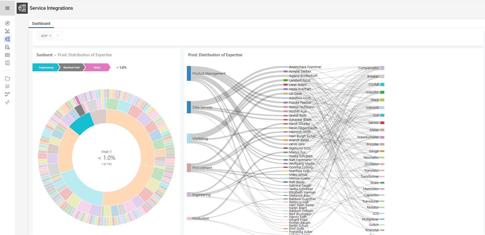

# Embedding Services via the Integrations Module

A DataManager module is available that can be used to embed / integrate other web-services in Corporate Memory. The module can be used and configured globally or individually per workspace configuration.



## Activation and configuration in DataManager

In order to use it you need to add respective configuration section(s) into the DataManager `application.yml` configuration file.

This is a sample for a global configuration that enables the module and shows two services:

``` yaml
js.config.modules.integrations:
  name: "INTEGRATIONS"
  enable: true
  tabs:
    -
      name: "Service One"
      url: "https://one.eccenca.com/service-one"
    -
      name: "Service Two"
      url: "https://two.eccenca.com/service-two"
```

The `name` properties can be customized. Important is that the module is enabled ("`enable: true`") in at least one place (globally or in a certain workspace) in order to be shown.

!!! warning
    In case your Corporate Memory Instance is served via HTTPS, no HTTP services can be used due to browser security limitations.

You can redefine all or parts of the configuration per workspace, e.g. in order to disable the module in a specific workspace add "`modules.integrations.enable: false`" to the configuration of the respective workspace.

A restart of DataManager will be required in order for the configuration change to become effective.

## Link Configuration in DataIntegration

The (module) link configuration in DataIntegration is managed in its own configuration. Thus, the following snippet from a `dataintegration.conf`  shows how to add the "INTEGRATINOS" link to the DataIntegrations menu:

``` js
eccencaDataManager.moduleLinks = [
  {
    path = "explore"
    defaultLabel = "Knowledge Graphs"
    icon = "application-explore"
  },
  {
    path = "vocab"
    defaultLabel = "Vocabularies"
    icon = "application-vocabularies"
  },
  {
    path = "thesaurus"
    defaultLabel = "Thesauri"
    icon = "module-thesauri"
  },
  {
    path = "query"
    defaultLabel = "Queries"
    icon = "application-queries"
  },
  {
    path = "integrations"
    defaultLabel = "INTEGRATIONS"
    icon = "module-integrations"
  }
]
```

!!! Note
    The "`name"` and "`defaultLabel`" property should be aligned in the DataManager and DataIntegration configuration for consistency.

A restart of DataIntegration will be required in order for the configuration change to become effective.

## (Redash) Dashboard Integration

A typical (eccenca) use case for the Integrations Module is to embed redash dashboards. In order show a dashboard in a Corporate Memory make sure your redash instance use the same protocol as your Corporate Memory instance (typically https). Then open the dashboard that should be embedded and click the sharing button { .off-glb width=32 }. In the dialog make sure "*Allow public access*" is enabled. Copy the "*Secret address*" and paste this address into the "`url`" property of a tab configuration, as shown above.

[{ width=561 }](./share_dashboard.png)
