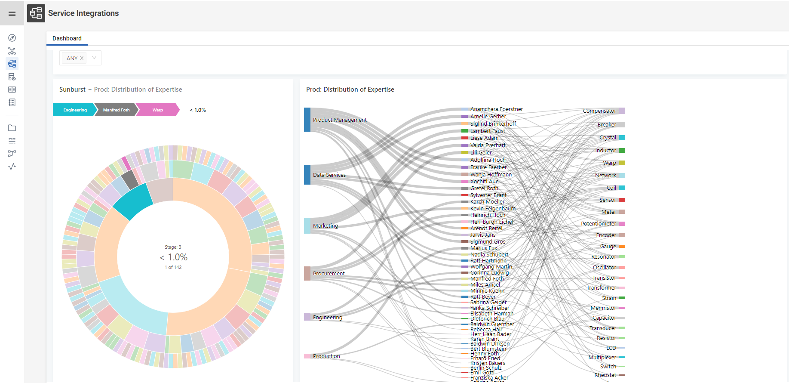

# Service integrations

!!! info

    This module is not activated by default and can be configured in the application view configuration.

The **Service integrations** module embeds external web applications directly into the Corporate Memory user interface.
Instead of switching to a separate tool, users open the integrated service from the main navigation and work with it without leaving their Application view.

A typical use case is a dashboarding service that visualizes data from your Enterprise Knowledge Graph.

{ class="bordered" }

## Usage

Open the module by selecting :eccenca-module-integrations: **Service integrations** in the main navigation.
Each configured service is shown as a tab and renders with its own controls and filters.

## Configuration

Which services are embedded, and under which name they appear, is configured per application view in the
:eccenca-module-workspace-configuration: [Application view](../workspace-configuration/index.md) configuration module.
Different application views can therefore offer different services.
