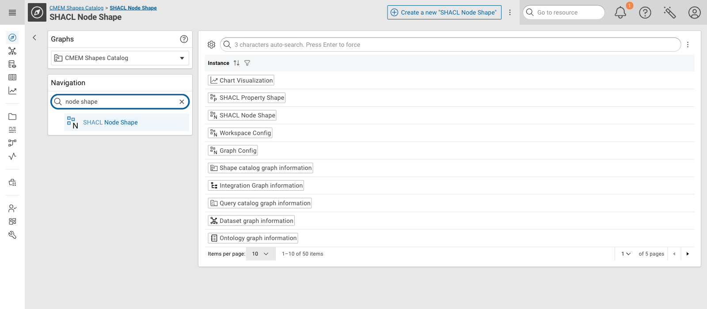
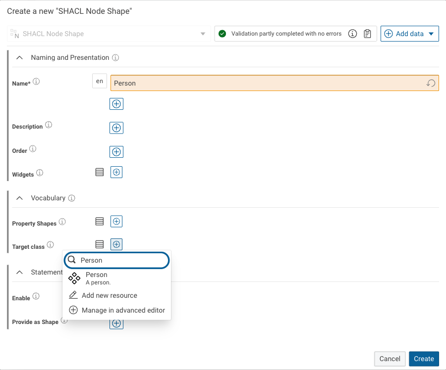
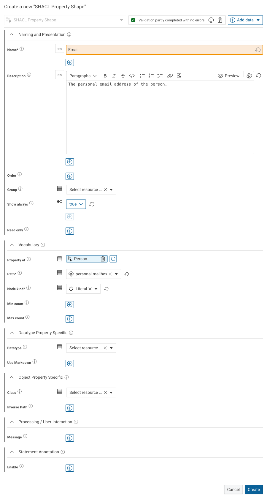
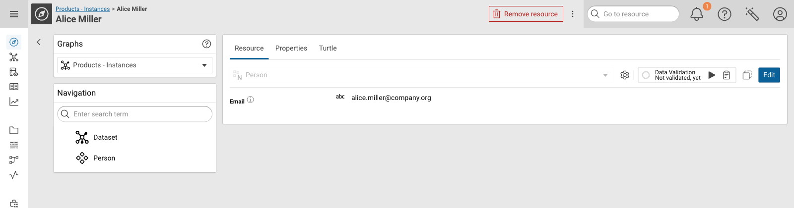
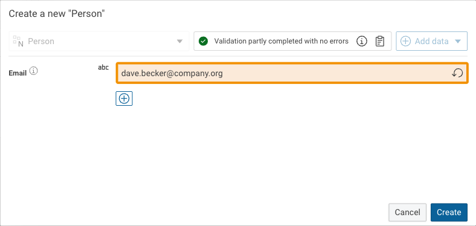

# Building a customized User Interface

## Introduction

Working with shapes allows for creation of a customized Linked Data user interface.
In addition to the **Properties** tab, which lists all statements of a data resource, you can create custom "form"-like data interfaces.
These configurable forms allow for a cleaner interface to view and author data resources.
In addition, they enable integration of data from other resources that are linked to the current resource, creating a more concise view on your data.

Shaped forms are shown on the **Resource** tab of a resource in the **:eccenca-application-explore: Knowledge Graphs** module.

## How forms are defined

You define forms using SHACL shapes.
The shapes state:

1. What types of resources the form definition applies to.
    This is based on the `rdf:type` of a resource.
2. What fields are shown in the form in which order.
    Field contents are retrieved from properties connected to the resource.
3. Which other, linked resources are shown in the form.
    Linked resources can either be shown as links or as their full form.
4. Which texts are used to name and describe fields.

Form definitions are twofold:

1. The form itself is defined as a so called **Node Shape**.
   Node Shapes define which types of resources the form applies to (the Target class), and which fields are shown in the form (the Property Shapes).
   The full list of features is described in [Node Shapes](node-shapes/index.md).
2. The individual fields are defined as so called **Property Shapes**.
   Property Shapes define which property is used to retrieve data for the field (the Path), the name of the field, a description, its cardinality (Min count and Max count), its position in the form (the Order), and whether it should always be shown.
   In case of object properties, it also defines the type of the linked resource (the Class).
   The full list of features is described in [Property Shapes](property-shapes/index.md).

Shapes are stored in a graph of type **Shape Catalog** (`shui:ShapeCatalog`).
eccenca Corporate Memory ships with the **CMEM Shapes Catalog** (`https://vocab.eccenca.com/shacl/`), which holds the shapes for the built-in resource types.
The examples below use this graph.

!!! info "Use your own Shape Catalog"

    The CMEM Shapes Catalog is an internal graph and should stay read-only for non-admin users.
    To add your own shape definitions, create a separate graph instead: open the graph selection, click :eccenca-item-add-artefact: **Add new graph** and select **New Shape Catalog (shui:ShapeCatalog)**.
    Import it into the CMEM Shapes Catalog afterwards (using `owl:imports`).

    All steps below work the same way in your own Shape Catalog — simply select it instead of the CMEM Shapes Catalog.

## Prerequisites

The class your form applies to, as well as the properties you want to show as fields, have to be known to Corporate Memory already, i.e. they have to come from an installed vocabulary or from an ontology graph.

Both the **Target class** and the **Path** field offer an auto-complete which searches the label of a class or property, not its URI or prefixed name.
To find `foaf:Person` you therefore type `Person`, and to find `foaf:mbox` you enter `mail` and select **personal mailbox**.
The auto-complete starts searching after three characters.

## Defining forms

The following example creates a form for resources of the type `foaf:Person` with a single field showing the email address (`foaf:mbox`).

### 1. Create the Node Shape

Open the CMEM Shapes Catalog in the **:eccenca-application-explore: Knowledge Graphs** module and select **SHACL Node Shape** in the **Navigation** section.
The list of existing Node Shapes is shown.

{ class="bordered" }

Click :eccenca-item-add-artefact: **Create a new "SHACL Node Shape"** on the top to open the creation dialog.

Enter the following values:

- **Name:** `Person`
- **Target class:** `Person`

The name is shown only when several shapes apply to the same resource, so that they can be told apart.
The target class binds the form to the resources it should cover.
Select the class from the auto-complete to confirm the value.

{ class="bordered" width="70%"}

Click **Create**.
The Node Shape is created with an automatically generated URI, and a confirmation is shown.

!!! note

    A Node Shape without any Property Shapes is an empty form.
    Opening a matching resource at this point shows the message *"All node shapes are empty, not possible to load a resource"*.
    The form becomes usable once you add fields in the next step.

### 2. Create the Property Shapes

Each field of the form is a separate Property Shape.
Select **SHACL Property Shape** in the **Navigation** section and click :eccenca-item-add-artefact: **Create a new "SHACL Property Shape"** on the top.

Enter the following values:

- **Name:** `Email`
- **Description (optional):** `The personal email address of the person.`
- **Show always (optional):** `true`
- **Property of:** `Person`
- **Path:** `personal mailbox`
- **Node kind:** `Literal`

The name is the field label, displayed left of the value in the form.
The description is shown as a tooltip on the :eccenca-item-info: icon next to the name and is edited as Markdown.
**Show always** set to `true` shows the field even when the resource has no value for it yet, which makes the field available when creating new resources.
**Property of** links the field to the Node Shape created in the previous step.
**Node kind** defines whether the values are literals or links to other resources.

Select the values for **Property of**, **Path** and **Node kind** from the auto-complete.
For **Path**, enter `mail` and select **personal mailbox** (`foaf:mbox`).

{ class="bordered" width="70%"}

Click **Create**.

!!! tip "Required fields"

    **Name**, **Path** and **Node kind** are mandatory — the **Create** button stays disabled until all three are filled in.
    The status indicator at the top of the dialog tells you how many errors are left.

    **Target class** and **Property of** are not enforced by the dialog, but the form does not work without them.

Repeat this step for every field you want to add to the form.

## Using forms

Once a Node Shape exists for a class, the specified form is used in the **:eccenca-application-explore: Knowledge Graphs** module.

### Editing existing resources

While browsing your knowledge graph, you see your shape in action whenever you open a resource which is an instance of the class linked via **Target class**.

The form is rendered on the **Resource** tab.
The shape used to render it is shown in the selector above the form — if several Node Shapes apply to the resource, you can switch between them here.
The **Properties** tab still shows all statements of the resource.

{ class="bordered" }

Click **Edit** to change the values.
The form turns into an editable state with **Cancel** and **Save** in the header.
Use **Add data** to add fields that are not currently shown.

### Creating new resources

You can also create new resources using a shaped form.
Select the class in the **Navigation** section and click **Create a new "…"** in the header.

The dialog shows all fields whose Property Shape has **Show always** set to `true`.
Any other field can be added through the **Add data** menu.

{ class="bordered" width="70%" }

Click **Create**.
The new resource is created with an automatically generated URI and the values you entered.
