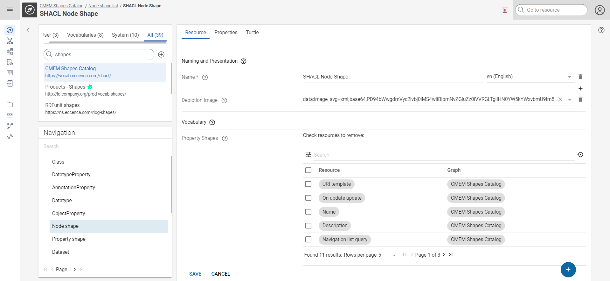

# Building a customized User Interface

## Introduction

Working with shapes allows for creation of a customized Linked Data user interface. In addition to the standard PROPERTIES tab that shows all properties of a data resource, you can create custom "form"-like data interfaces. These configurable forms allow for a cleaner interface to view and author data resources. In addition, they enable integration of data from other resources that are linked to the current resource, creating a more concise view on your data.

## Defining forms

You can define forms using SHACL rules. The rules state:

1. What types of resources the form definition applies to. This is based on the `rdf:type` of a resource.
2. What fields are shown in the form in which order. Field contents are retrieved from properties connected to the resource.
3. Which other, linked resources are shown in the form. Linked resources can either be shown as links or as their full form.
4. Which texts are used to name and describe fields, as well as the tab in the user interface.

Forms are defined in the CMEM Shapes Catalog graph. The graph URI is `https://vocab.eccenca.com/shacl/`.

Form definitions are twofold:

1. The form itself is defined as so called `NodeShape`. NodeShapes define which types of resources the form applies to (the target class), and which fields are shown in the form (the Properties).
2. The individual fields are defined as so called `PropertyShape`. PropertyShapes define which property is used to retrieve data for the field (the path), the name of the field, a description, its cardinality (min and max count), its position in the form (the order), and if it should always be shown. In case of object properties, it also defines the type of the linked resource (the class). The full list of features is described in [PropertyShapes](property-shapes/index.md).

To define a new form, for example for `foaf:Person` resources, navigate to the CMEM Shapes Catalog graph and select `NodeShape` in Navigation. The list of existing NodeShapes is shown. Click "Create a new SHACL Node shape" in the upper right to create a new NodeShape. Enter a name of the resource. An empty NodeShape resource is created and shown.

{ class="bordered" }

To create the initial definition, click { .off-glb } (Edit). A form is shown to you with input fields Name, Property Shapes, Vocabulary, Target class and Statement Annotation. The initial definition requires the name, and the target class. Fields are attached to the form later. Target class in particular binds the form to the resources it should cover. The Target class field features an auto-complete that displays all classes stored in Corporate Memory. The example form should cover resources of the type `foaf:Person`, so enter `foaf:Person` in the Target class field. Click SAVE to save the NodeShape.

{ class="bordered" }

You have now created an "empty" form that covers `foaf:Person` resources with tab name "Person". Navigating to a `foaf:Person` resource, you see a new tab as defined. You can still see all properties of the resource in the PROPERTIES tab.

{ class="bordered" }

To define new fields, for example showing the email address of the person (defined as `foaf:mbox`), navigate to the CMEM Shapes Catalog graph and select `PropertyShape` in Navigation. The list of existing PropertyShapes is shown. Click CREATE NEW PROPERTYSHAPE in the upper right to create a new PropertyShape. Enter a name of the resource. An empty PropertyShape resource is created and shown.

Edit the form using . A form is shown with all relevant properties of a field definition. Required in this step are:

1. The name of the field, which will be displayed left of the data content or input field in the form.
2. The description, which will be displayed as tooltip on the question mark to the right of the name.
3. The path, which states which property the field represents. In this example, it is `foaf:mbox`.
4. The form the field should be shown in (Property of). The field provides an auto-complete, so just enter "Person" and select the NodeShape resource you defined in the previous step.

Click SAVE after filling out the required fields.

{ class="bordered" }

## Using forms

Once a Node Shape is created for a specific class, you are able to use the specified entry form in the Explore component of Corporate Memory.

### Editing existing resources

While browsing your knowledge graph, you will always see your shape in action, when you click on a resource which is an instance of the class which is linked with `shacl:targetClass` from your Node Shape.

The next images demonstrate this behavior :

{ class="bordered" }

### Creating new resources

You can also create new resources by using a shaped form. One way to achieve this, is to select the class in the navigation tree on the lower left part in the Explore component and then click the Floating Action Button at the bottom or use the context menu on upper right side.

The next images demonstrate this behaviour:

{ class="bordered" }

{ class="bordered" }
