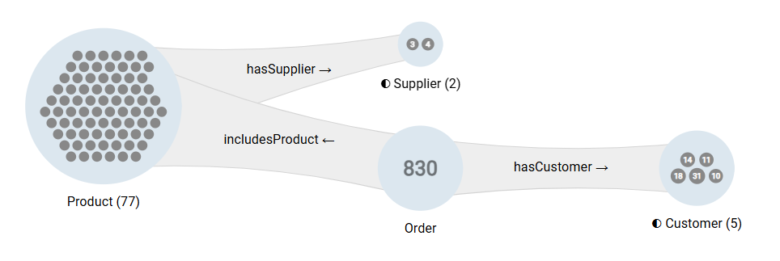

# Core Concepts

Instead of rendering a dense instance-level node-edge diagram, Graph Insights proposes an interactively constructed **schema-level exploration tree** that represents **aggregated graph traversals**, enabling the exploration of the **links between millions of resources**.

---

## The Aggregated Exploration Tree

The fundamental element of the exploration tree is the **group**, a set of resources with the **same class**, optionally filtered by the values of their data properties.

Groups are linked by **connection beams**, a set of object property assertions with the **same object property** that links together one element of each group, optionally filtered by the values of their data properties.

The **exploration tree** is expanded step-by-step by adding a new group for a **user-selected class** connected via a **user-selected object property** to the right of an existing group. 

The **data guided expansion** follows a **left-join pattern**, each resource of the new right group being linked to at least one resource of the unmodified left group. The choices offered to the user are based on the actual graph data to ensure that the new group is not empty.

!!! tip "Exploration Tree Components"
    
    **Groups:** A labelled disk represents a **set of resources**.

    - ***Instance rendering mode:*** Small groups display an individual dot for each resource (e.g., "Product (77)").
    - ***Count-Only rendering mode:*** Large groups display only the number of resources (e.g., "Order (830)").
    - *The transition between these renderings is controlled by the **[max. resources threshold](features/canvas-ui.md#object-threshold-logic)**.*

    **Connections:** A labelled beam connecting two groups represents a **set of object property assertions** between resources of the groups.

{ class="bordered" width="80%" }

!!! warning "Graph Traversals vs. Graph Topology"
    
    The exploration tree visualizes aggregated exploration paths, not the actual graph structure. A single resource may be present in multiple groups simultaneously if it lies at different positions in the expanded paths.

---

## Exploration Loop

Graph Insights is an iterative traversal query builder. Its workflow follows a four-step cycle:

### 1. Seed (Start)

Start the exploration by dragging a **class** from the [class tree](features/category-tree.md#category-tree) in the left pane.

- *Example:* Drag the class `Product` to the canvas.

*Alternatives: Double-click the class or use its context menu item `Start exploration with class`.*

### 2. Expand (Traverse)

Add groups of connected resources by expanding the exploration tree: Point at a group and click the arrow that appears to its right to view the connected top-level classes, then select a object property and direction.

*Example:*

- *Action:* Select the `Product` group and expand to `Order` via `includesProduct`.
- *Result:* A new group (`Order`) appears, containing only the orders that include the products of the `Product` group.

*Alternatives: Double-click the group (or its label) or use its context menu item `Explore connections of the group`.*

### 3. Inspect (Drill Down)

Access instance-level information like the data property values of the resources of the groups and object property assertions of the connections in various ways.

#### Single Resource

Select a resource visible inside a group to display its classes and data properties in the right `Details` pane.

#### Group

Select a group to display a textual description of its contents and histograms of the distribution of classes of its resources.

Open the [resource table](features/objects-table.md) to access the highly configurable tabular listing of all resources of the group and their data properties.

*Hint: selecting a line in the table loads the corresponding resource in the right `Details` pane.*

#### Connection

Select a connection beam and open the [connection table](features/connections.md#connection-table) to  access the highly configurable tabular listing of all object property assertions between the left and right group and their data properties.

### 4. Refine (Filter)

Narrow down any group to your match your current focus using [data property filters](features/objects-table.md#filtering) and [class histograms](features/groups.md#histograms).

*Example:*

- *Action:* Filter the `Order` group by `orderDate` to keep only "2023" values.
- *Result:* The group count updates (e.g., from 830 to 45) and the exploration subtree to its right (if any) is updated to match the reduced starting set of resources. 
  
---

## Exploration Data Sharing

- **Images:** [Export](features/persistence.md#export-visuals) the canvas as SVG or PNG images.
- **CSV data:** Download of the resources of a group or of the table view of a group or connection.
- **Query snippets:** Copy the SPARQL that returns the resources of a group or the data in the table view of a group or connection for use (e.g. a dashboard).
- **[JSON Sharing](features/persistence.md#json-sharing):** Share explorations as JSON-serialization.