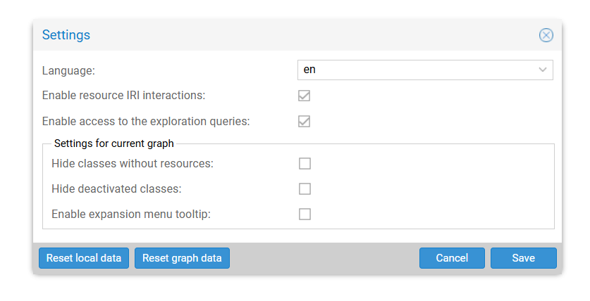
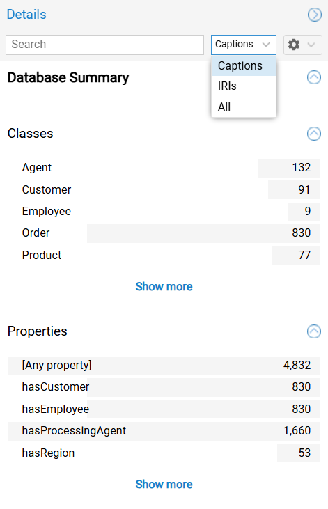

# Application and Dataset Settings

## Application Settings {#settings}

Access global configuration via the top-left dropdown menu.

### General Configuration

- **Technical details:** Toggles visibility of low-level metadata, including **IRIs** and **SPARQL queries**.
- **Tree visibility:** Hides empty or deactivated classes in the class tree.

{ class="bordered" width="60%" }

### Troubleshoot and Reset

1.  **Reset local data:** Clears browser-side preferences (e.g., columns visibility, width, and position).
2.  **Reset graph data:** Performs a "Factory Reset" of the analysis for the current dataset.

!!! danger "Destructive Action"
    
    **Reset graph data** permanently deletes all [user-defined classes](persistence.md#custom-categories) and [saved explorations](persistence.md#saved-explorations) associated with the current database. This cannot be undone.

---

## Database Settings

### Database Summary

When no group or connection is selected, the right pane displays the **database summary**.

- **Action:** Click the empty canvas background to deselect items.
- **Outcome:** The database summary is shown in the right `Details` pane.
    - **Classes:** Lists all available classes and their cardinality.
    - **Object Properties:** Lists all object properties with their object property assertions count.

{ class="bordered" width="30%" }

**Sorting:** Use the `Sort by` dropdown to order lists by `Name` (alphabetical) or `Quantity` (cardinality) to identify the largest entities.