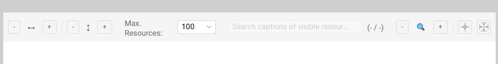
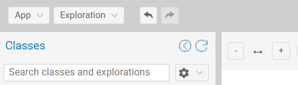
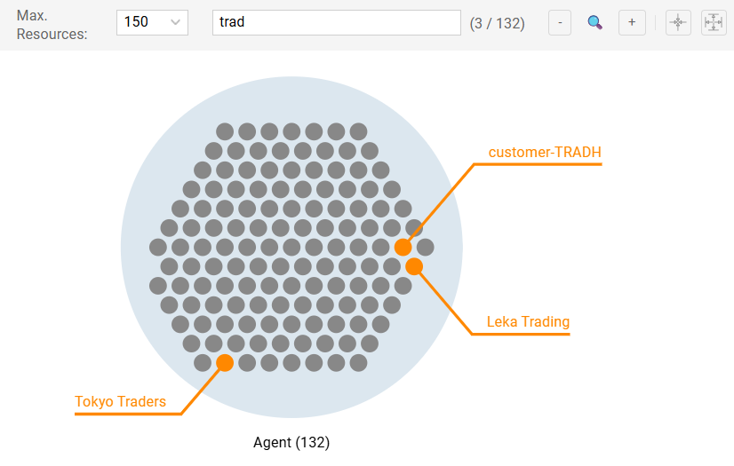

# The Exploration Canvas

The **exploration canvas** is the primary workspace in Graph Insights. It displays the exploration tree, allowing users to manipulate layout, throttle data density, and rapidly locate specific resources within the detailed groups.

## Toolbar Controls

The top toolbar controls the exploration tree rendering and positioning.

{ class="bordered" width="70%" }

### Rendering and Positioning

- **Zooming:** Use `[+]` / `[-]` buttons or the mouse wheel to adjust magnification.
- **Clearance:** Adjusts the spacing between groups to reduce overlap.
    - **Horizontal clearance:** Adjusts left-right distance.
    - **Vertical clearance:** Adjusts top-down distance.
- **Fit to view:** Click the **"target" icon** to center and zoom the exploration tree to fit all groups within the viewport.

### History (Undo/Redo)

Graph Insights maintains a session history stack.

- **Undo:** Reverts the last action (e.g., removing a filter).
- **Redo:** Reapplies the undone action.

{ class="bordered" width="40%" }

!!! warning "Rebuild on Undo"
    
    Some operations (e.g., [user-defined classes](persistence.md#custom-categories) operations) have persistent side effects that may require a rebuild of the exploration state when moving back in the history.

---

## Group Rendering Controls (Max. resources) {#object-threshold-logic}

To optimize browser performance and visual density, Graph Insights uses two different renderings for groups depending on their cardinality.
Use the `Max. resources` dropdown to set the threshold.

### Count-Only Rendering (Count > Threshold)

If a group contains *more* resources than the limit, it is rendered as a single disk displaying its cardinality. This mode is optimal for high-level topology analysis (before subsequent filtering).

{ class="bordered" width="65%" }

### Instance Rendering (Count ≤ Threshold)

If the count is *below* the limit, each resource is rendered as a dot within the group disk.
- The number inside each dot represents its [predecessor](objects.md#predecessors) count (number of resources in the left group linked by the connection). No number means there is only a single predecessor.
- The resources with higher predecessor counts are located at the center of the group.

{ class="bordered" width="65%" }

---

## Global Search (Visible Resources) {#global-search}

Locate specific resources **among those currently visible** in the groups of the exploration.

- **Scope:** Searches only rendered resources on the canvas. It does *not* query the backend for hidden data.
- **Behavior:** Matches are tagged with a (temporary) orange flag and caption.

{ class="bordered" width="65%" }

!!! tip "Flags Management"
    
    Use the `Temporary flags` menu that appears on the top left of the canvas to manage the persistence of the temporary flags.

---