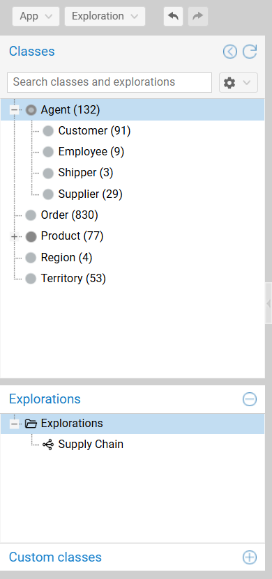

# All Explorations Start from the Class Tree 

The left pane is the **starting point of any exploration**, whether you want to **begin a fresh exploration** with a group from a class of the taxonomy or **recall a pre-existing exploration**.

{ class="bordered" width="30%" }

!!! warning "Further Information"
    
    This section focuses on the **class tree**. See the persistence page for **[saved explorations](persistence.md#saved-explorations)** and **[user-defined classes](persistence.md#custom-categories)**.

---

## Class Tree {#category-tree}

The tree displays the hierarchical taxonomy of the dataset:

- **Hierarchy:** Parent-child relationships (e.g., `Agent` &rarr; `Customer`) reflect the underlying schema.
- **Counts:** The number in parentheses (e.g., `(132)`) indicates the cardinality of the class.
- **Search:** Filters the tree to locate rapidly a specific class (or saved exploration).

### Start an Exploration

The tree is the primary tool to populate the canvas:

- **Drag and drop (Start):** Dragging a class to an empty area clears the canvas and starts a new exploration with a group of the selected class.   
  *Alternatives: Double-click the class or use its context menu item `Start exploration with class`.*
- **Drag and drop (Intersect):** Drag a class onto an **existing** group to apply an intersection filter (e.g., dragging `German Suppliers` onto `VIP Suppliers` restricts the group to resources with **both classes**).

---

## Class Visibility (Deactivation) {#category-visibility}

**Deactivating** a class hides it from the **expansion menu** on the canvas, streamlining the exploration workflow. This is useful for hiding abstract classes (e.g., `Entity`, `Thing`) that render the exploration more tedious.

- **Action:** Right-click a class and select `Deactivate class`.
- **Outcome:** The item turns **light gray**. Expansions steps will skip this class and offer **its direct sub-class** instead.

!!! danger "Caution"
    
    The resources that have **only deactivated classes** are **no longer reachable** via an exploration.

!!! tip "Hiding Deactivated Items"
    
    You can toggle the visibility of deactivated items in the tree via the [application settings](application-settings.md#settings).

---

## Class Tree Configuration Reset

To return the class tree configuration to its initial state, click the **circular arrow icon** in the pane header. This action restores all deactivated classes and reverts caption settings to defaults.