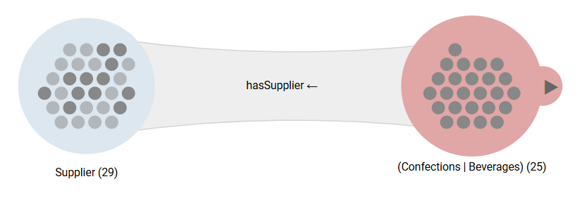
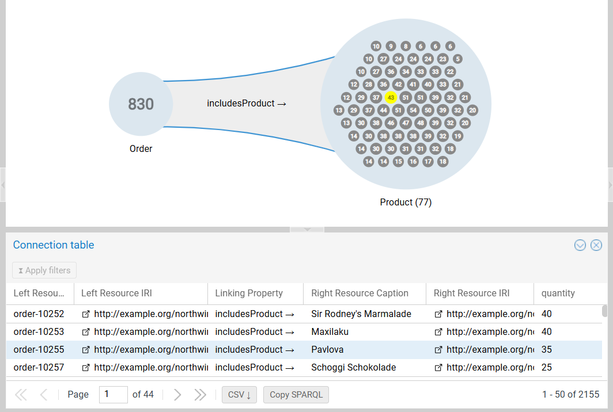

# Connections

In Graph Insights, the connection beams between groups represent **sets of object property assertions**. This page covers visual connection information, underlying edge data inspection, and traversals filtering.

---

## Connectivity Visualization

When a group with visible resources is expanded, or when a connected group directly to its right is updated, it is rerendered to update the visual connectivity information carried by the color of the resource dots:

- **Dark Gray:** There is **no group to the right**, ***or*** the resource has **at least one connection** of the correct type to one of the resources in at least one of the groups to the right.
- **Light Gray (Dimmed):** There is **at least one group to the right**, ***and*** the resource **does not have any connection** of the correct type to any of the resources in the groups to the right.

{ class="bordered" width="75%" }

!!! info "Visual Partition"

    This indicator provides an instant "Visual Partition" of the set. For example, expanding `Supplier` &rarr; `Product` and filtering the products to `Confections` or `Beverages` dims all Suppliers who do not provide confections nor beverages.

!!! tip "Missing Connections"

    This feature is useful to spot single resources that are missing expected connections (the expected connections missing at the group level can be identified in the expansion menu of the group).

---

## Left Group Restriction (Backpropagation) {#backpropagation}

By default, the exploration applies a **left-join pattern**: The left group remains static, while the right group contains the connected resources. The left group restriction switches (permanently) to an **inner-join pattern**, removing from the left group all resources having no successor in the right group.

- **Action:** Right-click the connection to open its context menu and select `Restrict left group`.
- **Outcome:**
    - **Left group filtering:** Only resources with a successor in the right group are retained.
    - **Visual clue:** A solid triangular arrow (`◀`) appears on the connection caption.

{ class="bordered" width="75%" }

!!! warning "Effects of Subsequent Updates"

    Because the switch to an **inner-join pattern** is permanent, any further filtering of the right group will modify the contents of the right group.

    In the example above, narrowing `Confections | Beverages` to `Beverages` only will remove from the `Supplier` group the ones who do not provide beverages.

!!! hint "Multistep Backpropagation"

    To combine constraints from a variety of traversals conjunctively, restrictions are often propagated back to the start node of the exploration (see the [Supply Chain Analysis Tutorial](../tutorial.md#backpropagation)) 

---

## Further Connection Operations

Right-click a connection to manage the exploration structure:

- **Do not restrict left group:** Disables backpropagation (reverts to left-join).
- **Repeat expansion:** Transitively expands the hierarchy (available only for expansions where the left and right groups have the same class - e.g., `is_friend_with`).
- **Remove:** Deletes the connection beam and its entire subtree.

---

## Connection Table {#connection-table}

While the **[table of a group](objects-table.md)** lists resources, the **connection table** lists the individual links (object property assertions) between two groups.

To open it:

1. **Context Menu:** Right-click the connection and select `Show connection table`.
2. **Quick Action:** Click the connection to select it, then click the blue `Show connection table...` button at the bottom of the canvas.

### Table Components

The table displays one row per object property assertion with predefined and variable columns.

{ class="bordered" width="85%" }

- **Left/Right Resource Caption/IRI columns:** Contains the caption and IRI of the left and right resources respectively.
- **Linking Object Property column:** The object property connecting them (e.g., `includesProduct`) and its direction (useful for bidirectional expansions)
- **Optional Data Property columns:** Any values stored on the object property assertions itself (e.g., `quantity`, `discount`).

### Filtering and Interaction

- **Structural columns:** The resource and object property columns support **search** and **sorting**, but the filtering cannot be applied (filter the groups or select another object property instead).
- **Data Property columns:** Full support with filtering like the [resource table](objects-table.md#filtering)
- **Highlighting:** Hovering over a row highlights the corresponding connected resources in the exploration if the groups are in [instance rendering mode](canvas-ui.md#object-threshold-logic).
