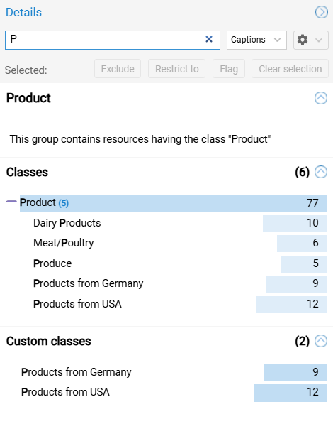
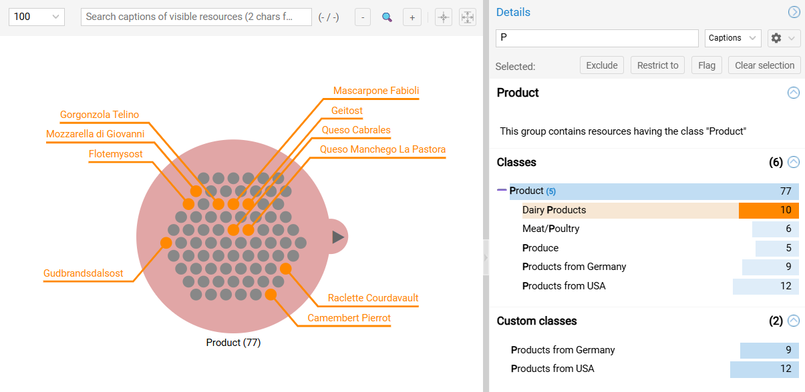
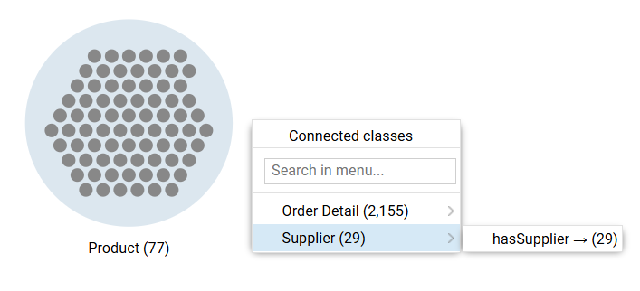
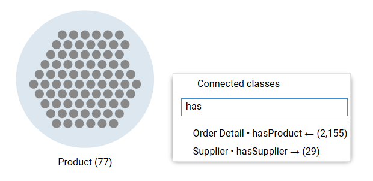

# Groups

Groups are sets of resources with the same class that are the starting and branching points of the aggregated traversals represented by the exploration tree. This page covers the group details and their histograms, the exploration expansion from a group, and the group level operations.

---

## Group Details

Selecting a group opens the **group details** in the right pane.

### Header Section

The header contains:

- The **group caption** that is either:
    - The caption of its class if no class filter was applied
    - A "logical expression" of class captions describing the combination of class filter applied otherwise (see [histogram filtering](#filtering))
- A structured **natural language description** of its contents that details all steps of the traversal.

### Histogram Sections {#histograms}

The **histogram sections** display the distribution of classes within a group. It allows analysts to scrutinize class composition (eg. spot unexpected or missing classes) and perform logical set operations (union, intersection, difference) to restrict the contents of the groups.

- **Scope:** The panel displays counts for all **classes** (including **[user-defined classes](persistence.md#custom-categories)**) present within the selected group.
  *Remark: If user-defined classes are present, a second histogram is shown for better overview*
- **Hierarchy:** Use the `(+)` icons to expand a class (e.g., `Confections`) to reveal the distribution of its sub-classes.
- **Sorting:** Use the dropdown to order bars by `Name` (Alphabetical) or `Quantity` (Cardinality).

{ class="bordered" width="35%" }

#### Resources Flagging {#flagging}

Flagging highlights specific subsets of data for visual inspection without modifying the structure of the exploration.

- **Action:** Select one or more bars in the histogram and click the **Flag** button.
- **Outcome:** Matching resources are tagged with a (temporary) orange flag and caption.
  *Hint: Use the `Temporary flags` menu that appears on the top left of the canvas to manage the persistence of the temporary flags.*

{ class="bordered" width="80%" }

!!! warning "Visibility Threshold"

    Flagging is only visible when the group is in **instance rendering mode** (count <= threshold). See the [threshold setting](canvas-ui.md#object-threshold-logic).

#### Filtering (Set Operations) {#filtering}

Clicking a bar selects the class. Active selections activate the control buttons at the top of the panel: `Exclude`, `Restrict to`, and `Flag`.

Histograms function as a visual facet query builder. Use the buttons to apply boolean logic to the group.

| Logic | Action | Description |
| :--- | :--- | :--- |
| **Simple Filter** | Select **One** &rarr; `Restrict to` | Updates the group to contain *only* resources of the selected type. |
| **Union (OR)** | Select **Multiple** &rarr; `Restrict to` | Retains resources that match **ANY** of the selected classes (e.g., `Beverages` OR `Confections`). |
| **Difference (NOT)** | Select **Any** &rarr; `Exclude` | Removes resources matching the selection from the group. |
| **Intersection (AND)** | **Sequential** Operation | 1. Restrict to `Class A`. 2. Select `Class B` in the updated list. 3. Restrict to `Class B`. **Outcome:** Items that are **BOTH** A and B. |

!!! warning "Multiple Histograms"

    When applying a filter, selections made **simultaneously in different histograms** are combined **conjunctively (AND)** in a facet-like logic.

As filters are applied, the **group caption** updates to reflect the mathematical definition of the group.

- *Example:* `(Beverages | Confections) \ Products from EU`
- *Meaning:* The group contains (Beverages **OR** Confections) **MINUS** (Products from EU).

---

## Exploration Tree Expansion {#expansion-menu}

The **expansion menu** of a group presents the options available for adding a non-empty step to the traversal. It tells you which classes are reachable via which direction of which object properties.

1. **Action:** Click any group to open the menu.
2. **Select:** The menu presents the hierarchy of connecting (directed) **object properties**, organized by target **class**.
    - If the data model includes sub-object properties, point the parent object property to open the sub-menu with its child object property.*
3. **Action:** Click an object property with the required direction for the selected target **class** to add a new connection beam to the exploration.

{ class="bordered" width="65%" }

1. **Alternative:** For schemas with deep object property hierarchies (or if you know exactly which object property) use the search bar to locate specific paths.

{ class="bordered" width="65%" }

---

## Group Operations

Right-click a group or its caption to access its context menu.

- **Export group resources as CSV:** Downloads a file containing all resources of the group.
- **Copy SPARQL Query:** Copies a query that replicates the traversal up to the group and returns all its resources.
- **Edit note:** Adds a text annotation that will be persisted in [saved explorations](persistence.md#saved-explorations).
- **Show resource table:** Opens the tabular view (see the [dedicated page](objects-table.md)).

!!! tip "Usage"

    - The query is intended to be used directly on the database for various datasets with the same model (or slight variations thereof).
    - Use the notes to explain what is the content of the group in your own words. This is particularly relevant for collaborative work.
