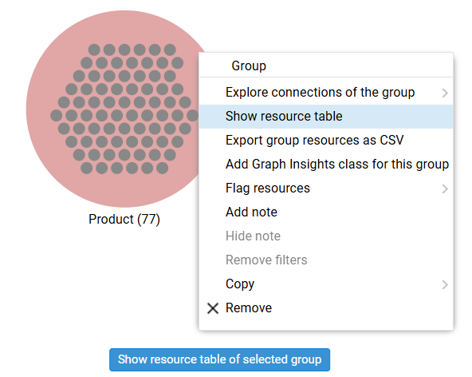
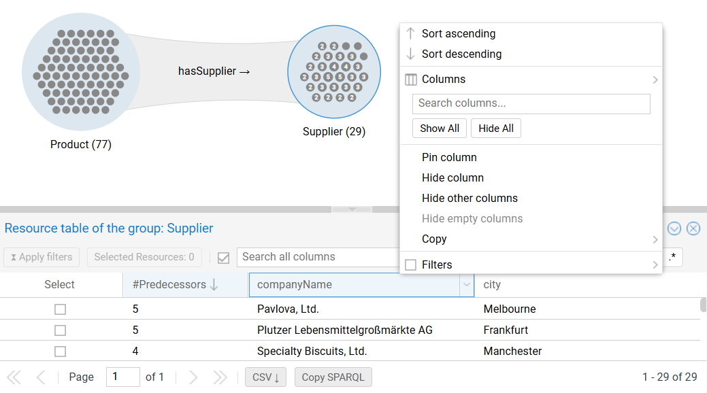
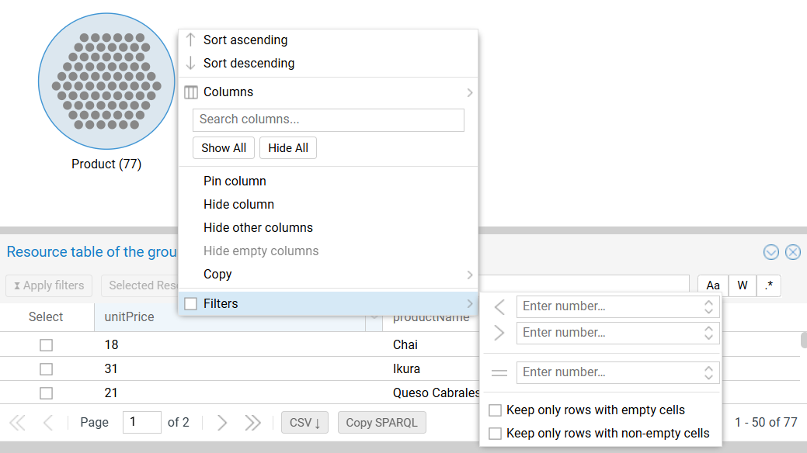
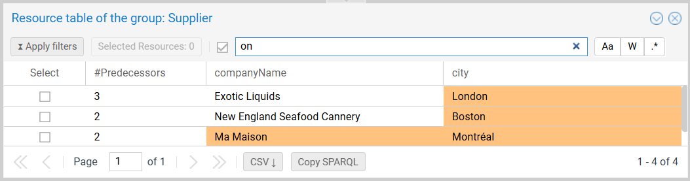

# The Resources Table of a Group

The **resources table of a group** is a highly configurable tabular listing of all resources of the group and their data properties.

To open it, click the blue `Show resource table...` button that appears at the bottom of the canvas when a group is selected,
or right-click the group to open its context menu and select `Show resource table`.

{ class="bordered" width="40%" }

---

## Table Components

The panel displays a spreadsheet view where rows represent resources and columns represent data properties.

{ class="bordered" width="85%" }

- **Column Visibility:** Click `Columns` to hide/show specific data properties or reorder them via drag-and-drop.
- **Sorting:** Click a column header to sort and toggle the sorting direction.
- **Copying Data:** Right-click any cell to copy its value.
- **Predecessors:** The `#Predecessors` column displays the count of incoming links from the parent group. Sort this column to identify the most connected resources.

---

## Filtering {#filtering}

The resource table is the engine for refining the exploration tree. Apply filters here to narrow down the group population to your interest group.

### Filter Lifecycle

Filtering is a two-step process to prevent unnecessary database queries.

1.  **Define and preview:** Set criteria in the column headers. 
    - **Outcome:** The table updates immediately to preview the result, and the column header displays an **hourglass icon (⧖)** (symbolizes filtering).
    - Repeat with further columns as necessary.
2.  **Apply:** Click `Apply filters` (top-left).
    - **Outcome:** The group on the canvas updates, and a **half full disk icon (◐)** appears on the group (indicating filtered content).

{ class="bordered" width="85%" }

### Filter Types

- **Numeric/Date:** Range controls (greater than, less than, equals).
- **String:** Text matching (contains, starts with, regex).
- **Resource selection:** Check specific rows to restrict the group to those individual resources.
- **Existence:** Filter with `Keep only rows with (non-)empty cells`.

{ class="bordered" width="85%" }

### Multi-Column Search

Use the global search bar to perform a string match across **all visible columns**. Matching cells are highlighted in orange.

{ class="bordered" width="85%" }

---

## Interaction and Exports

The group table is tightly coupled with the group representation on the canvas and the [resource details](objects.md) in the right pane.

### Row Interaction

- **Highlighting:** Point or click a row to highlight the corresponding resource in the group (red = selected, yellow = hover).
- **Details:** Clicking a row also loads the **resource details** in the right pane.

### Table-Based Exports

Unlike the bulk group export, table exports respect the **current view** (filters, sorting, columns):

- **CSV Button:** Downloads the **filtered rows**.
- **Copy SPARQL:** Copies the query used to generate the current table view.

!!! tip "Remarks"

    - The query is intended to be used directly on the database for various datasets with the same model (or slight variations thereof).
    - The table query was designed for dashboard integration. Make sure to configure the table to match exactly your requirements.
    - The query might look overcomplicated but it includes lots of special case handling to replicate the table view as close as possible.
