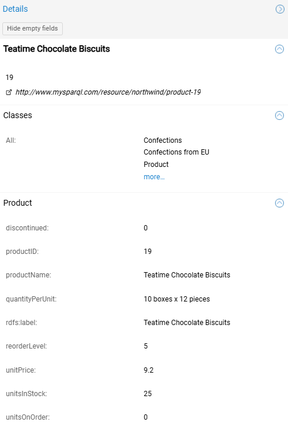
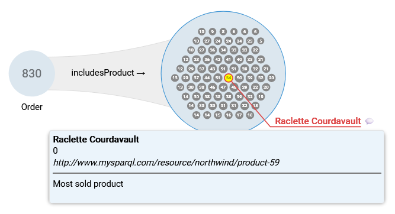
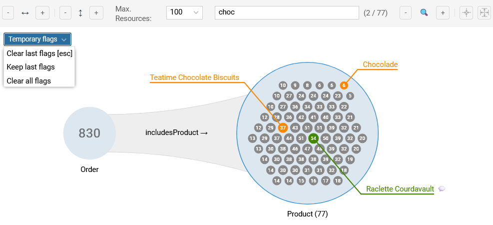
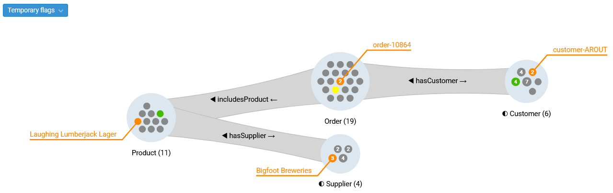
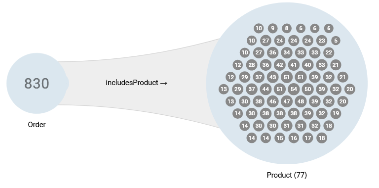
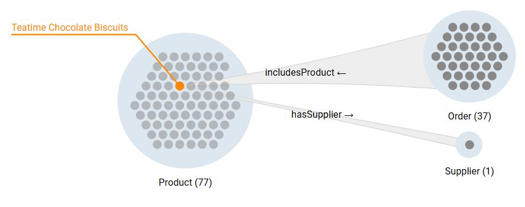
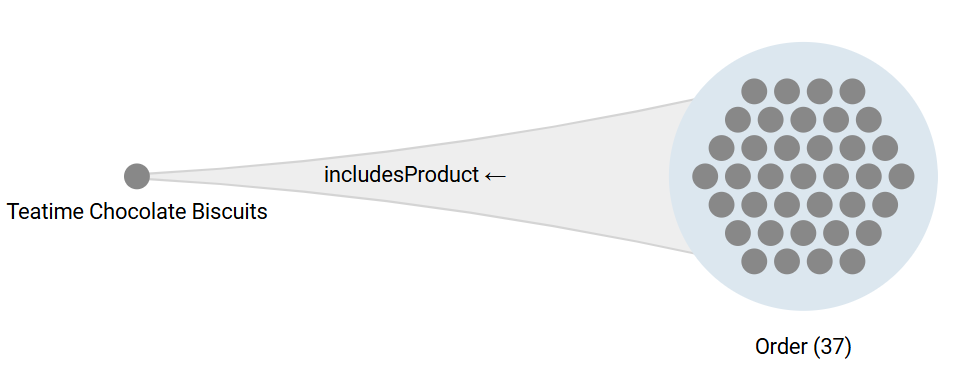

# Resources

Most investigations require **isolating individual resources** at some point for closer inspection. This page covers the **resource details pane**, the **highlighting and flagging tools**, and **single resource traversals**. 

---

## Resource Details {#object-details}

Select a visible resource in a group or its row in the group table to open the `Details` in the right pane. It displays the resource identity and data properties.

{ class="bordered" width="45%" }

### Components

1.  **Header:** Displays the **caption** and **description** , as well as the IRI of the resource.
2.  **Classes:** List of all classes assigned to the resource.
3.  **Data Properties:** List of all data properties organized in sections by their "usage domain" classes (see below).

### Controls
- **Hide empty fields:** Toggles visibility of data properties that have no value for this specific resource.
- **Copy Data:** Right-click any row to copy the **data property** or **data property assertion**.

!!! info "Why are there sections?"

    - Graph Insights analyses the actual graph data and infers at which level of the class hierarchy each data properties is effectively used. Besides giving some insights about the real usage domain of data properties, it is used to prevent the [resources table](objects-table.md) of the higher level classes from being "polluted" by all specific data properties of all their sub-classes.
    - If a data property is "defined" by multiple classes (e.g., `rdfs:label` used by both `Clothing` and `SeasonalCollection`), Graph Insights groups them into a shared section (e.g., `Clothing & SeasonalCollection`) to avoid duplication.

---

## Flags and Notes {#flagging}

Flags display colored resource captions directly in the exploration for identification and easy tracking.

### Standard Flags

The standard flags are persistent markers used to track the appearance of specific objects in any group over multiple exploration steps.

- **Action:** Right-click a resource to open its context menu, open the `Flag resource` submenu and pick a color.
- **Outcome:** A flag of the selected color displaying the caption is attached to every visible occurrence of the resource in the exploration tree.
- **Alternative:** Click `Add note` to flag the object and attach a text comment to the flag. The note appears in the tooltip on hover.

{ class="bordered" width="80%" }

!!! info "About Persistence"

    - A flag will appear anytime a new instance of the flagged resource is visible in a subsequent exploration step (even in new explorations).
    - Flags and notes can be removed using the context-menu of the resource, the group, or the exploration (canvas). 

### Temporary Flags {#temporary-flags}

Most flagging actions that might affect numerous nodes create temporary flags for easy discarding (e.g., [histogram-based flagging](groups.md#flagging) or [global search](canvas-ui.md#global-search)).

- **Standard behavior:** Temporary (orange) flags disappear when the exploration tree is modified (e.g., expanding/filtering).
- **Locking:** To preserve a selection, use the `Temporary flags` menu button at the top-left of the canvas:
    - `Clear last flags:` Removes the current unlocked temporary flags.
    - `Keep last flags:` Locks the current temporary flags to survive exploration tree updates (locked flags are light orange).
    - `Clear all flags:` Removes all locked and unlocked temporary flags.

{ class="bordered" width="80%" }

!!! tip "Useful Tip"

    Add a standard flag to a temporarily flagged resource you identified via a global search and clear the temporary flags for a cleaner exploration.

---

## Paths Highlighting and Flagging

Visualize upstream and downstream connections of a resource in the exploration tree.

**Highlighting:**

- **Action:** point at a visible resource in a group
- **Outcome:**
    - The pointed resource turns **yellow** (**red on click**).
    - Connected predecessors and successors turn green (**blue on click**).

**Flagging:**

- **Action:** Right-click and select `Flag all connected resources...` 
- **Outcome:** [Temporary flags](#temporary-flags) are added to all connected resources visible.

{ class="bordered" width="95%" }

!!! warning "Line of Sight"

    Path highlighting is blocked by **count-only groups** (count > threshold).

---

## Connectivity Visualization (Predecessors) {#predecessors}

In the **groups in instance rendering mode** (count <= threshold), Graph Insights visually encodes the local "centrality" of resources based on their connectivity to the previous group in the exploration tree (if any). 
 
- **Definition:** The **number of predecessors** of a resource is the number of distinct resources from the *previous* group in the current branch of the exploration tree connected to it.
- **Visualization:**
    - The number of predecessors is displayed in the dot representing the resources, no number meaning there is only a single predecessor.
    - The highly connected resources (i.e., with higher predecessor counts) are located at the center of the groups.

{ class="bordered" width="65%" }

---

## Single Resource Exploration

Analysts can focus on a specific resource within a group to analyze its relationships.

!!! warning "Prerequisite"

    - These actions require the group containing the object to be in **instance rendering mode** (resources visible).
        - If it is not the case, consider reducing the group size by filtering or directly selecting the resource from the resources table of the group.
    - Locate the resource via [search](canvas-ui.md#global-search) or the [resource table](objects-table.md).

### Resource Exploration from a Group

Expand the exploration with specific connections from a single resource within a larger group.

- **Action:** Right-click a resource to open its context menu, open `Explore connections of the resource`, and select the target class and connecting object property and direction (just like a group expansion).
- **Outcome:** A new connection beam connects the individual resource to a new group to its right.

{ class="bordered" width="75%" }

!!! info "Independence of the Explorations"

    The resource exploration does not depend on the exploration that leads to the group. Any change to the main exploration either preserves the resource exploration (if the resource is still visible) or drops it (if the resource is no longer visible).

### Simple Resource Exploration

Start a new exploration tree with a specific resource found in the current exploration.

- **Action:** Right-click the resource to open its context menu and select `Start exploration with resource`.
- **Outcome:** The canvas clears and places the single resource as starting point of the exploration.

{ class="bordered" width="70%" }