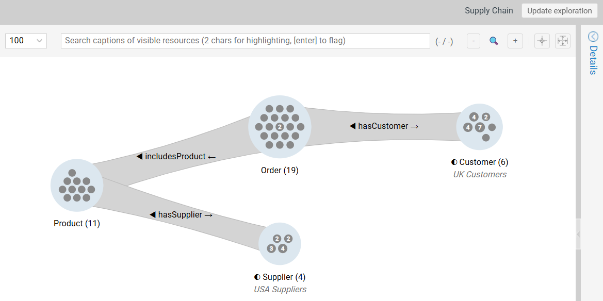
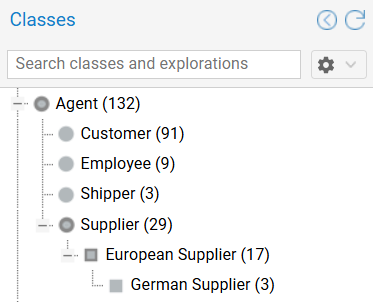

# Persistence

Graph Insights provides mechanisms to persist analysis logic, annotate findings, and extend the class taxonomy. This page covers **saving and sharing explorations**, **group annotations**, and **user-defined classes**.

!!! info "Dynamic Persistence"
    
    Saved items preserve the **query logic** (the sequence of expansions and filters), not a static snapshot of data. If the underlying dataset changes, loading a saved exploration will reflect the current state of the database.

---

## Saved Explorations {#saved-explorations}

A **saved exploration** preserves the **structure** of the analysis: classes of the groups, expansion steps, applied filters, and group annotations.

To save the current exploration, either right-click the canvas background to open the exploration context menu or open the `Exploration` top menu, then select `Save exploration`.

!!! warning "Structure over Layout"
    
    The **structure** is not the exact **visual layout** (x/y coordinates). When loaded, the exploration tree re-arranges itself for optimal readability, adapting the rendering to the possibly modified number of resources in the groups.

### Saved Exploration Folders

The saved explorations folders behave like a usual file system:
 
- Use the **context menu of the folders** in the saved explorations section of the left pane **to create new subfolders**.
- New saved explorations are placed **in the folder highlighted at the time of the operation.**
- **Names** must only be **unique within their folder**.
- **Drag and drop** the saved explorations to **move them between folders**.

### Save Exploration Update

If you load and modify a loaded exploration (e.g., add a filter), Graph Insights detects the change. Click the `Update exploration` button in the top-right corner to overwrite the previously saved version.

{ class="bordered" width="85%" }

### Annotations (Group Notes)

Add context to the analysis by attaching text notes to important groups. 

- **Add note:** Right-click a group to open its context menu  and select `Add note`.
- **Toggle visibility:** Use the group context menu to toggle the visibility of a single note, or use the context menu of the canvas (or the `Exploration` top menu) and select `Hide/Show all group notes`.

{ class="bordered" width="75%" }

!!! tip "Notes as Documentation"
    
    The notes are persisted in saved explorations to allow documentation for future usage.

---
  
## User-Defined Classes {#custom-categories}

**User-defined  Graph Insights classes** are customizable tools designed to analyze data with specific goals (e.g. identifying high-risk suppliers based at a given location and having a specific contract type).

They act as **"virtual classes"**, refining the model within the exploration layer without altering the underlying ontology.

A user-defined Graph Insights class can be defined for any group in any exploration (e.g., "High-volume suppliers located in Germany").

- **Action:** Right-click the group or its caption to open its context menu and select `Add Graph Insights class for this group`.
- **Outcome:** 
    - The group is relabeled with the name of the new class.
    - The new class is **added to the class tree** and the Graph Insights classes list in the right pane, and is handled like a standard class.

{ class="bordered" width="30%" }

!!! info "Non-Destructive Model Refinement"
    
    User-defined classes are **non-destructive**. They exist only in the visualization layer and do **not** write changes back to the RDF store.

!!! tip "Hints"
    
    - User-defined classes also appear in an additional specific Graph Insights class histogram for improved visibility (e.g. it allows you to see at first glance how many "High-Risk Suppliers" exist within a larger "Supplier" group).
    - You can create a user-defined class based on *another* user-defined class.

---
## Sharing and Portability {#sharing}

### Stateless JSON Sharing {#json-sharing}

Share an exploration serialized as a JSON string.

1.  **Export:** Right-click the canvas to open the exploration context menu or use the `Exploration` top menu, then select `Copy exploration as JSON`.
2.  **Share:** Send the text blob to another user.
3.  **Import:** The recipient selects `Start exploration from JSON` from the canvas context menu or the `Exploration` top menu, and pastes the string.

!!! warning "Limitations"
    
    The success of exploration sharing on distinct servers depends greatly on the similarity between the source and target dataset and the specificity of the exploration. Sharing an exploration is in fact just like sharing multiple complex queries.

---

## Exporting Visuals {#export-visuals}

Export the current canvas state for reporting.

- **Access:** Right-click the canvas background or use the `Exploration` top menu.
- **Formats:**
    - **Raster (PNG):** For slides and quick sharing.
    - **Vector (SVG):** For high-resolution print or editing.
  
