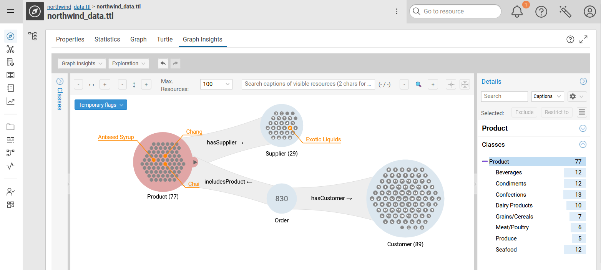

# Graph Insights

{ class="bordered" }

## Introduction

Graph Insights allows you to explore your knowledge graph through grouped nodes and aggregated relations to keep the view readable.
Expansions are data-guided to avoid dead ends, while on-demand details give you context without clutter.
Interactive filters help you shape the exploration, building query paths with class, attribute, and relation filters along the way.
Each exploration can be converted to SPARQL, effectively serving as a no-code query builder. This also provides table-like views for users less familiar with graphs.

## Configuration Info

A specific configuration is required to activate this feature.

!!! info "Configuration"

    See [Graph Insights Configuration](../../../deploy-and-configure/configuration/graphinsights/index.md) to learn how to enable and configure this feature.

<!--
## Usage

...
-->

## Management

In order to manage Graph Insights snapshots, you can use the
[`graph insights`](../../../automate/cmemc-command-line-interface/command-reference/graph/insights/index.md)
command group of `cmemc`.
With this command group, you can list, create, delete, and inspect Graph Insights snapshots.

## Automation

To automate re-creation of Graph Insights snapshots, you can use the
[Update Snapshots](../../../build/reference/customtask/cmem_plugin_graph_insights-Update.md)
task in your workflows.
This task allows for updating snapshots based on the specification of an affected graph.

## User Guide

The **user guide** presents the visual analysis workflow of Graph Insights. It demonstrates how it empowers analysts and domain experts to extract insights from graph data without technical prerequisites.

### Where to Start?

1.  **[Core Concepts](concepts.md):** *(Recommended)* Before diving in, understand the **aggregated exploration tree** paradigm of Graph Insights that prevents the visual clutter of traditional force-directed graph renderings ("hairballs").

2.  **[Tutorial: Supply Chain Analysis](tutorial.md):** A step-by-step walkthrough using the Northwind dataset. Learn how to filter for **VIP customers**, analyze **product vulnerabilities**, and use **backpropagation** to propagate filtering.

3.  **[Feature Reference](features/index.md):** Detailed documentation for every component of the interface.
    - **Workspace:** [Canvas](features/canvas-ui.md), [Search](features/category-tree.md), and [Settings](features/application-settings.md#settings).
    - **Interaction:** [Groups](features/groups.md), [Connections](features/connections.md), and [Details](features/objects.md#object-details).
    - **Analysis:** [Histograms](features/groups.md#histograms) and [Persistence](features/persistence.md).

4.  **[Platform Integration](navigating-to-cmem.md):** Learn how to seamlessly jump from a graph node to other Corporate Memory views.
