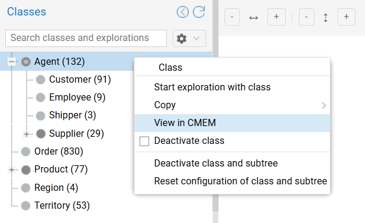
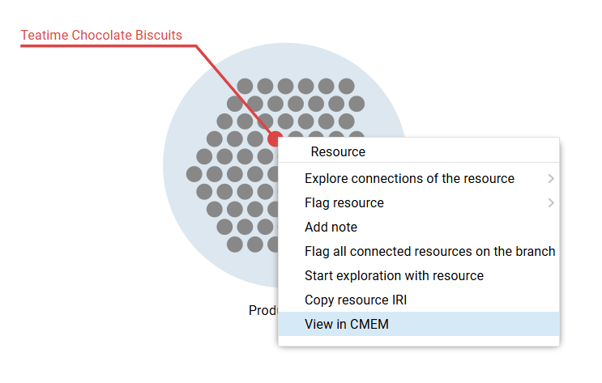

# Navigating to Corporate Memory

Graph Insights allows you to seamlessly jump from your visual analysis directly back to the source records in Corporate Memory. This creates a smooth transition from a high-level exploration to operational data management.

---

## Navigating from a Class

You can open the Corporate Memory view of a specific class directly from the class tree.

- **Action:** Right-click a class in the left pane tree to open its context menu.
- **Select:** `View in CMEM`.
- **Outcome:** The corresponding class model opens in a new tab.

{ class="bordered" width="65%" }

---

## Navigating from a Resource

If you isolate a specific resource of interest during your exploration, you can instantly inspect its full source record.

There are two ways to trigger this navigation:

**From the Canvas**

- **Action:** Right-click a specific resource dot within a group to open its context menu.
- **Select:** `View in CMEM`.

{ class="bordered" width="75%" }

**From the Details Pane**

- **Action:** Select a resource on the canvas or in the resource table to load its details in the right pane.
- **Select:** Click the `View in CMEM` button located at the top of the Details pane.
- **Outcome:** The specific instance record opens in a new tab.
