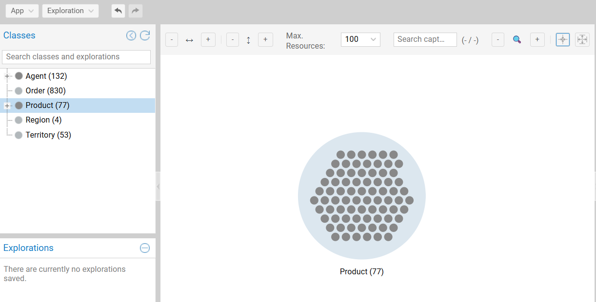
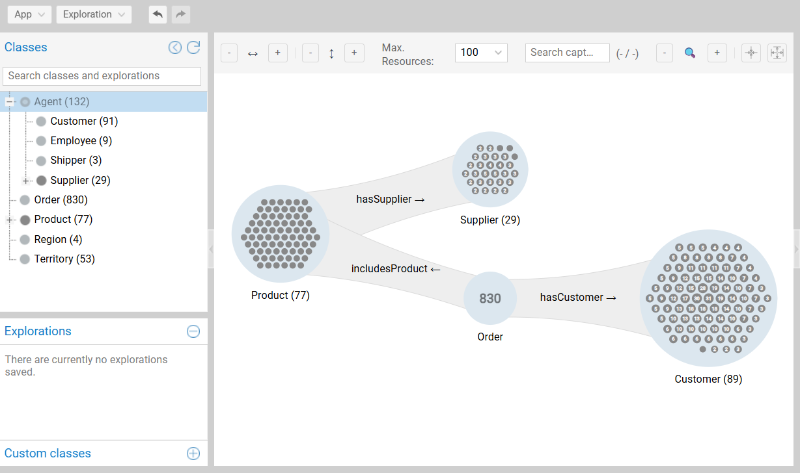
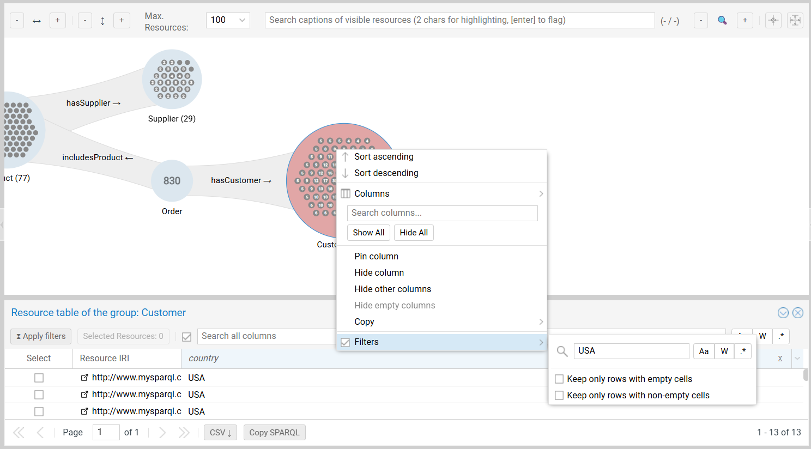
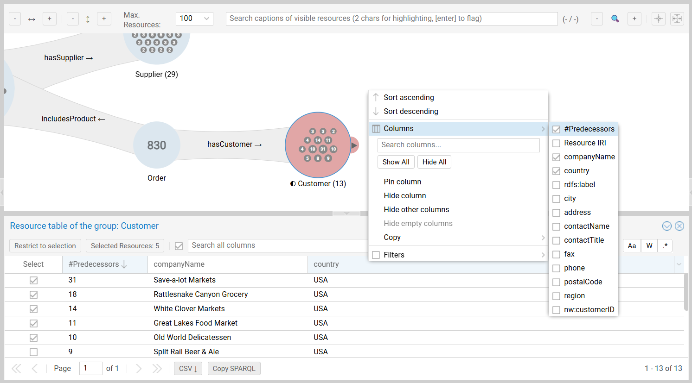
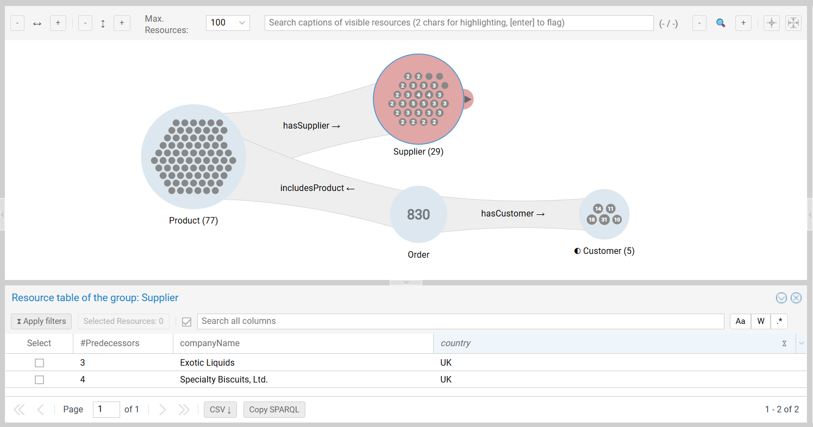
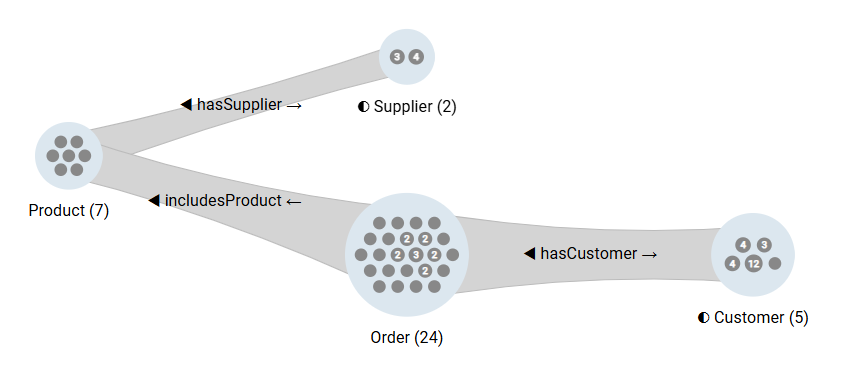
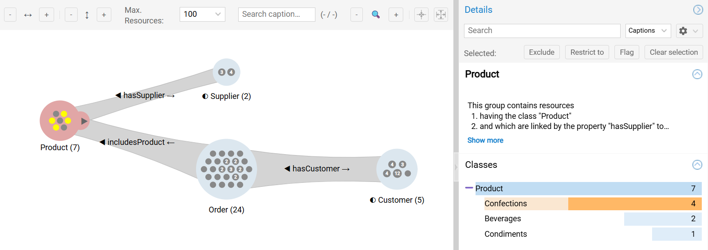
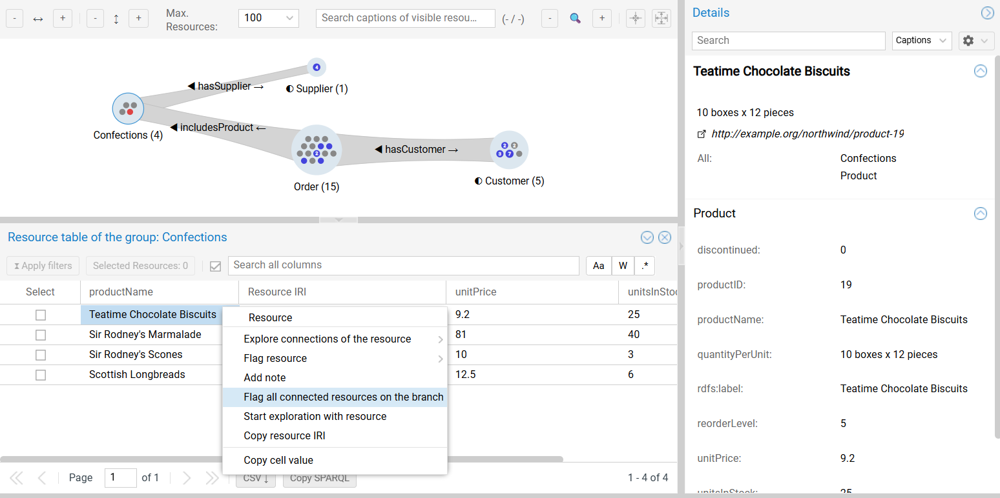
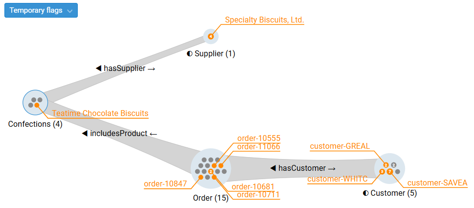

---
tags:
  - AdvancedTutorial
  - GraphInsights
  - KnowledgeGraph
---

# Graph Insights Tutorial – Supply Chain Risk Analysis

This tutorial demonstrates a workflow of Graph Insights using the **Northwind** dataset.

## Business Scenario

Northwind Traders needs to identify vulnerabilities in the trade network by answering a critical question:

> *"Which **VIP US customers** will be impacted if the **UK supply chain** fails, and which products will be involved?"*

We will traverse the ordering chain, identify high-volume US partners, and isolate the product mix.

---

## 1. Seed the Canvas

Every exploration requires a starting point. We begin with the central entity: The **product**.

1.  Locate the `Product` **class** in the [class tree](features/category-tree.md) in the left pane.
2.  Drag it to the center of the canvas.
3.  **Outcome:** A group appears, representing the entire inventory (e.g., 77 Products).

{ class="bordered" width="80%" }

---

## 2. Build Traversals to the Interest Groups

Next, we expand the exploration tree to connect Suppliers and Customers.

### Preparation

To simplify the expansion menus, hide generic classes that are not relevant to this analysis.
- Right-click the `Agent` class in the class tree.
- Select `Deactivate class`.

### Expansion Steps

We extend the exploration tree from the central `Product` group.

1.  **Add suppliers:**
    - Select the `Product` group.
    - Expand to the `Supplier` class via `→ hasSupplier`.

2.  **Add customers:**
    - Select the `Product` group again.
    - Expand to the `Order` class via `← includesProduct`.
    - From the new `Order` group, expand to the `Customer` class via `→ hasCustomer`.

{ class="bordered" width="80%" }

---

## 3. Filter Key Players

The exploration tree currently visualizes all connections. We must now isolate the high-value targets (VIPs) and the specific risk region (UK).

### 3.1. Identify VIP US Customers
We define "VIP" as customers with the highest volume of incoming orders.

1.  Select the `Customer` group and open the [resource table](features/objects-table.md).
2.  **Filter by country:** Open the menu of the `country` column from its header (using the menu dropdown or a right-click) and enter `USA` in the text field of the filter submenu.
3.  **Identify VIPs:** Click the **Predecessors** column header to **Sort Descending**. This ranks customers by their incoming connection count (number of Orders).

{ class="bordered" width="80%" }

4.  **Select and restrict:** Check the boxes for the top 5 customers and click `Restrict to selection`.

{ class="bordered" width="85%" }

### 3.2. Isolate UK Suppliers

1.  Select the `Supplier` group to open the table.
2.  Filter `Country` to `UK`.
3.  Click `Apply filters`.

{ class="bordered" width="85%" }

!!! info "The Disconnected State"

    At this stage, you have filtered the *ends* of both traversals, but their *start* (Products) still shows the total inventory (left-join pattern). The branches of the exploration tree represent independent aggregated traversals sharing the same starting point.

{ class="bordered" width="75%" }

---

## 4. Propagate the Filtering to the Products {#backpropagation}

We now need to identify the *intersection*: Which products are **both** sold by UK Suppliers **and** bought by VIP US Customers?

We apply [**left group restriction**](features/connections.md#backpropagation) (i.e., switching from left join to inner join) on the connections to retain only resources of the left group having at least one object property assertion in the connection (i.e., successor in the right group).

### 4.1. Identify Products from UK Suppliers

Right-click the connection beam between `Supplier` and `Product` and select `Restrict left group`:

- This retains only products having a UK supplier.
- As this reduces the start group of the second branch of the exploration tree, the `Order` and `Customer` groups might be impacted.

### 4.2. Identify Products ordered by VIP USA Customers

Apply the same restriction to the connections between `Order` and `Customer` as well as between `Product` and `Order`:

- This retains only products appearing in at least one order of at least one VIP USA customer.
- All products having been constrained to have a UK supplier in the previous step, the `Products` group now contains the high risk products.

{ class="bordered" width="75%" }

---

## 5. Analyze Impact

We have isolated the high risk product group, that we can now analyze:

1. Select the filtered `Product` group to display the [class histogram](features/groups.md#histograms) in the right pane.
2. Expand the `Product` class bar to display its sub-classes (e.g., *Beverages, Confections*).
3. **Insight:** The products of the `Confections` class are the most represented in this high impact risk group.

{ class="bordered" width="85%" }

---

## 6. Operationalize Findings

Finally, we convert this visual insight into an actionable list for the procurement team.

1.  **Drill down:**
    - In the histogram, right-click the `Confections` bar.
    - Select `Restrict group to class`. This discards the other product types, leaving only the high-risk confections, with the side effect of reducing the UK suppliers to a single resource.

2.  **Visualize traversals including a specific resource:**
    - Open the resource table of the `Products` group.
    - Right-click a specific high-value item (e.g., "Teatime Chocolate Biscuits") to open its context menu.
    - Select `Flag all connected resources on the branch`.

{ class="bordered" width="85%" }

  - Graph Insights highlights all resources on a specific high-risk traversal: The specific UK Supplier &rarr; The specific Biscuit &rarr; The specific VIP US Customers buying it.

{ class="bordered" width="85%" }

---

## Summary and Next Steps

You have successfully modeled a complex dependency network, filtered it by geo-location and volume, and identified a risk cluster.

- **Share:** [Save the exploration](features/persistence.md#saved-explorations) to share this view with colleagues.
- **Monitor:** [Create a user-defined class](features/persistence.md#custom-categories) called "High-Risk Confections" to permanently track this segment.
- **Report:** [Export the CSV](features/groups.md#group-operations) of the flagged branch for the procurement team.
