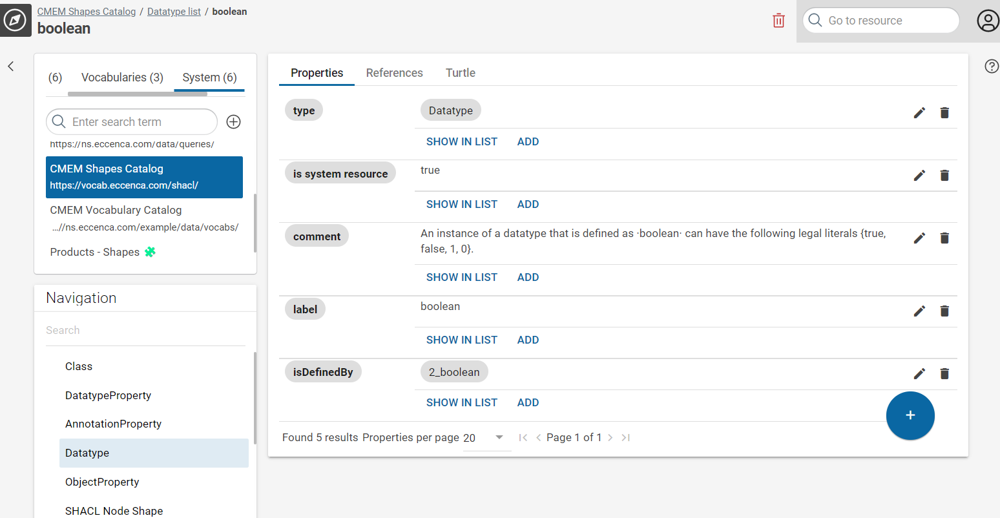
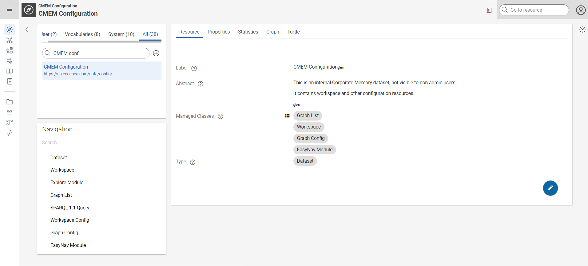
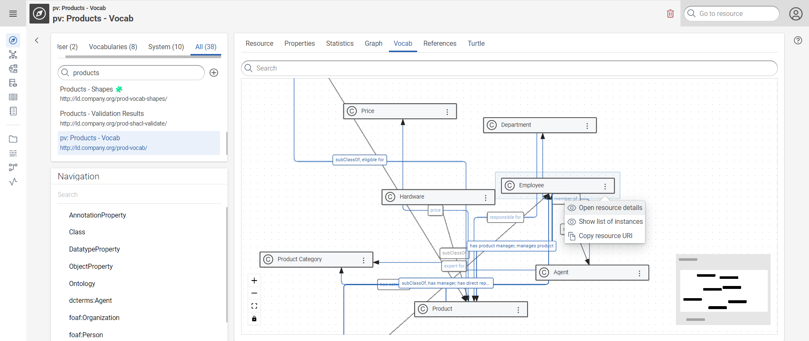

# Graph Exploration

## Introduction

The Explore module provides a generic and extensible RDF data browser and editor.
Use this module to browse through your resources, to change between list and detail views and to edit resources.

To open the Explore module, click **:eccenca-application-explore: Knowledge Graphs** in the main menu.

The user interface of the Explore module shows the following main areas:

- the header area, showing selected elements, possible actions (e.g. **:eccenca-item-add-artefact: create** or **:eccenca-item-remove: remove resource**), a **:eccenca-module-search: Go to resource** input field, and a **:eccenca-application-useraccount: user menu**
- the navigation area, showing the [Graphs](#graphs) and the [Navigation](#navigation) structures, (1)
- the main area, providing multiple views, depending on which resource has been selected.

1.  If necessary, you can toggle the navigation area by using the
    :eccenca-toggler-moveleft: (hide) and :eccenca-toggler-tree: (show) buttons.

## Graphs

The Graphs box shows lists of graphs you have access to.
To select a graph click the graph name in the Graphs box.
The navigation structure of the selected graph is displayed in the Navigation box below.
In the main area, the Metadata view of the selected graph appears, showing several tabs with metadata information.

!!! note inline end

    This default categorization is just a suggestion and can be modified by
    changing the workspace configuration in the **CMEM Configuration** graph.

The Graphs are categorized into groups as follows:

-   User: All graphs which represent user data (created manually or by build processes). 
-   Vocabularies: All graphs containing vocabularies.
-   System: All graphs containing configuration data.
-   All

You can search for a specific graph with **:eccenca-module-search: Search**.

### :eccenca-item-add-artefact: Adding a new graph

To add a new graph to the Graphs list:

- Click **:eccenca-item-add-artefact: Add new graph**. A dialog appears.
- Select a graph type. (1)
- Provide a name and enter the graph URI (e.g. `https://ns.eccenca.com`).
- Click **Next** and provide metadata (different types, require different metadata to enter).
- Click **Save** to create the new graph.

1.   More concrete, you select a shape here.
     This can be configured in the workspace configuration as well.

### :eccenca-item-download: Downloading a graph

To download a graph from the Graphs list:

- In the **Graphs** list, click **:eccenca-item-download: Download graph** on the graph you want to download.
- A message box appears, stating that downloading can take a long time.
- Click **Download**.

### :eccenca-item-edit: Managing a graph

Use this function to add or replace data in the a graph.

To update or replace data of a graph:

- In the **Graphs** box, select **:eccenca-item-download: Manage graph** on the graph you want to update or replace.
- A dialog box appears.
- Click **Choose file** to upload a file containing the new or updated data. (1)
- Choose one of the following options:
  - **Update**: add uploaded data to Graph.
  - **Replace**: clear Graph and add uploaded data.
- Click **Update** to start the upload process.

1.   You can upload one of the following file formats: Turtle, N-Triples, RDF/XML, or JSON-LD.

To delete a graph, select **:eccenca-item-remove: Remove graph** on the graph you want to remove and confirm deletion process.

## Navigation

When a graph is selected in the Graphs box, the structure of the graph is displayed in the Navigation box.
By default, only the top classes of the graph are listed.
An arrow (**:eccenca-toggler-moveright: Open tree**) indicates that a class has subclasses.
Click the arrow to show the subclasses.

Use the **:eccenca-module-search: Search** field of the Navigation box to search for an item in the navigation structure of the graph.
Enter a keyword and press Enter to start the search.
To reset the results delete the keyword and press Enter.

### Instance List of a class

Select a class in the Navigation box to show all instances of this class in the main area. (1)
{ .annotate }

1.   The table uses a default query to list all resources with a given class.
     This can be configured by adding a `shui:navigationListQuery` to the class shape.

### Instance Details

To open the Instance Details of a resource click on that resource in the Instance List.
Resources are shown as grey chip buttons.

!!! warning inline end

    When you remove the resource, all triples related to that resource are deleted as well.

Select **:eccenca-item-remove: Remove resource** on the upper right corner to remove the resource.
A dialog box appears where you are asked to confirm the operation.

In the Instance Details view, multiple horizontal tabs provide different views in the resource.
The availability of these views depends on the context and the resource type.

#### Resource

The Resource tab provides a view based on the shapes of the selected resource.
The details of the shaped view depends on the configuration.

#### Properties

The Properties tab shows all properties and objects of the selected resource independently from a shape selection.

Use the icons on the right side to edit or delete properties.
Use **SHOW IN LIST** to display objects in a list view.
Select **ADD** to add a new value as an object to a property.
In the dialog box, select the type from the drop-down list and enter the value. Click SAVE to save your changes.

To add a new property select **:eccenca-item-add-artefact: Add Property** .
In the dialog box, enter a property, select the value type from the drop-down list and enter a value.
Click **SAVE** to save your changes.

#### Statistics

!!! note inline end

    This view is only available on graphs (not on resources).

The Statistics tab indicates the number of classes, properties, entities and triples of the graph.

#### Graph

!!! note inline end

    This view is only available on graphs (not on resources).

The Graph tab shows a visual graph representation of the graph.

#### Vocab

!!! note inline end

    This view is only available on graphs (not on resources).

This tab shows a graph visualization of an installed vocabulary.
It displays all classes showing the class-subclass.  You can open the class details and view the list of instances related to that class. It also allows you to copy the resource IRI.

#### References

This tab shows all resources that link back to the selected resource.

#### Turtle

This tab shows the turtle RDF representation of the raw data representing the resource.
You can use this tab to edit the selected resource:

- Enter your changes in turtle.
- Click **UPDATE** to save your changes.

Deleting the entire turtle representation deletes the resource.

