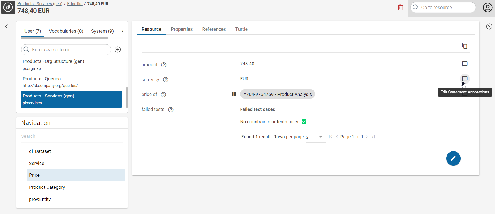

# Statement Annotations

## Introduction

Statement Annotations provide a way to express knowledge about statements.
Typical use cases for Statement Annotations include:

-   the temporal validity of information,
-   the origin of information, or
-   just a way to annotate a specific statement with a human readable comment.

## Usage

If enabled on a specific type of statement or type of resource, you see a Statement Annotation text bubble beside every annotatable statement:

{ class="bordered" }

This bubble has different status:

-   A **empty text bubble** indicates, that there is no annotation on the statement, but the annotation feature is enabled for this statement.
-   A **filled text bubble** indicates, that there is at least one annotation on the statement.
-   **No bubble** indicates, that the annotation feature is NOT enabled on this type of statement.

Clicking on one of the text bubbles opens the Statement Annotation dialog for this specific statement:

{ class="bordered" }

In the Statement Annotation dialog, you can select the Statement Annotation Template and click **Create**.

{ class="bordered" }

## Setup

In order to have a working Statement Annotation setup, the following steps need to be done in the component **:eccenca-application-explore: Knowledge Graphs**:

??? note "1. Create a Statement Annotation Graph"

    Open the graph selection and create a new graph :material-plus-circle-outline:.
    Choose **New Statement Annotation Graph** and provide the needed meta data.

    { class="bordered" }

??? note "2. Setup and import the Statement Annotation Graph in your data graph"

    Open the graph selection and switch to your data graph where the resources exist which you want to annotate.
    :material-pencil-circle-outline: Edit the graph description and :material-plus-circle-outline: add the property **Statement Annotation Graph** as well as **Imports**, where your select your newly created annotation graph in both fields.

    { class="bordered" }

??? note "3. Create a shape which will be used to annotate statements"

    Open the graph selection and switch to your Shape Catalog where your project shapes are managed.
    Create a node shape which can be used as an Annotation and configure **Provide as Shape** in the Group **Statement Annotation** to true for this node shape.

    { class="bordered" }

??? note "4. Allow statement annotations for specific Classes or Properties"

    Open the graph selection and switch to your Shape Catalog where your project shapes are managed.
    Select the Node or Property Shape from your Shape Catalog and enable annotations by setting the Enable option in the Statement Annotations group to true.

    { class="bordered" }

    This will enable the feature on the statements of all resources shown with this Node Shape or on all statements shown with this Property Shape.

## Technical Background

From the technical point of view, the Statement Annotation feature uses RDF Reification to annotate Statements (Triples) with additional background information.
Statement resources can be annotated with custom Annotation Resources.
These Annotation Resources are based on specific Shapes which are enabled as Statement Annotation shapes.
Reification Resources as well as Annotation Resources are managed in a Statement Annotation Graph, which need to be configured on a Graph as well as imported to this Graph.
The following illustration depicts this schema with boxes and arrows:

{ class="bordered" }

!!! note "Some notes on this:"

    - There is one Statement Reification Resource per Statement Annotation.
    - Removing the Statement Annotation also removes the Statement Reification Resource.
    - All annotation triples (8 triples in the image) are created in the Statement Annotation Graph, so Step 2 of the setup procedure is important.

## Querying Statement Annotations

In order to automate access to Statement Annotations, you can query them with SPARQL e.g. via [cmemc](../../../automate/cmemc-command-line-interface/index.md) or the API endpoint.

Here is a query example to start with:

```sparql
# Select resources with statement annotations and statement annotation graph
PREFIX rdf: <http://www.w3.org/1999/02/22-rdf-syntax-ns#>
SELECT DISTINCT ?AnnotatedResource ?StatementAnnotationGraph ?AnnotationResource
WHERE {
  GRAPH ?StatementAnnotationGraph {
    [] a rdf:Statement ;
        rdf:subject ?AnnotatedResource ;
        rdf:value ?AnnotationResource .
  }
}
```

