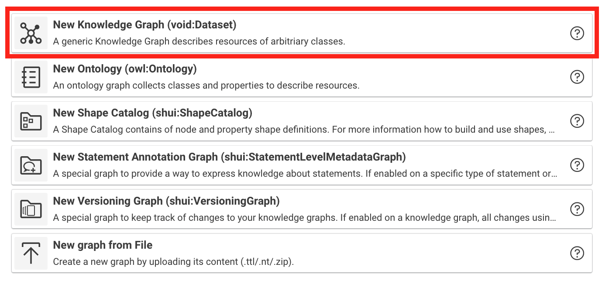
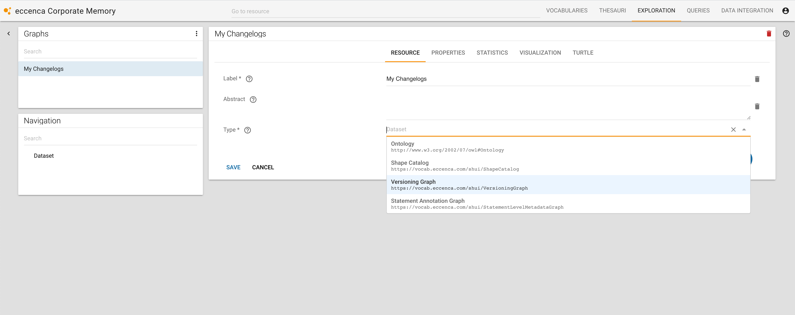

# Versioning of Graph Changes

## Introduction

This feature keeps track of changes to your Knowledge Graphs by creating change set data based on the user's editing activities.

!!! info

    Versioning of graph changes is currently supported for (tracked) graphs of type `void:Dataset` only.

    { class="bordered" }

## Usage

If enabled on a graph, all changes using shaped user interfaces will be tracked in the configured Versioning Graph.

{ class="bordered" }

## Setup

To enable this feature on a specific graph you need to setup the following steps.

??? success "1. Create a Versioning Graph"

    In Exploration, create a new graph and define it as a Versioning Graph.

    { class="bordered" }

??? success "2. Configure a graph to use this Versioning Graph"

    In Exploration, edit this graph and add the Versioning Graph property to select the newly created Versioning Graph.

    { class="bordered" }

## Technical Background

For each editing activity (→ Save a Form), a ChangeSet resource will be created.
This resource has some metadata (user, timestamp, label) as well as links to added and deleted Statements (using RDF Reification).

The details of the used vocabulary are available at the [Changeset Vocabulary](https://vocab.org/changeset/) page.
