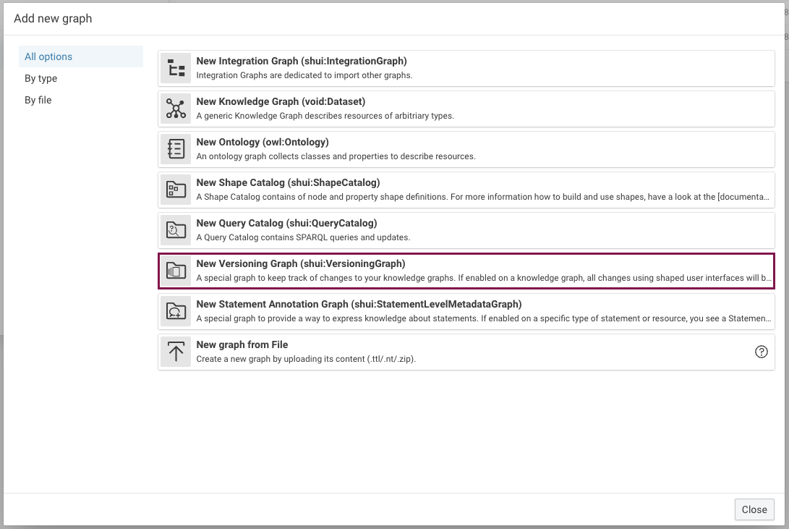
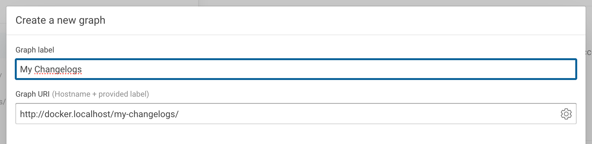
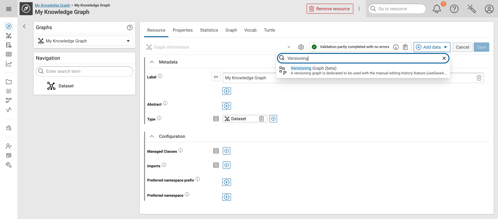
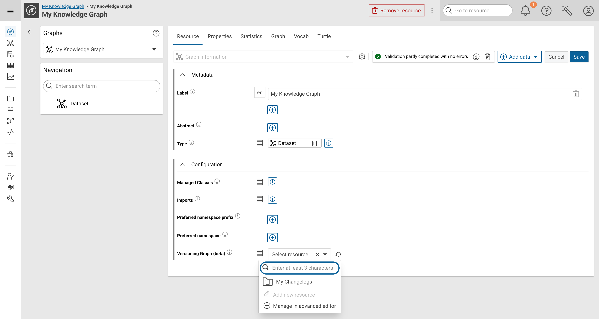
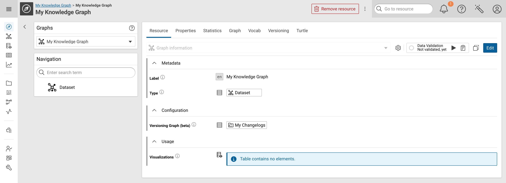
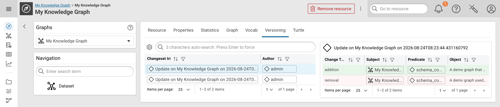
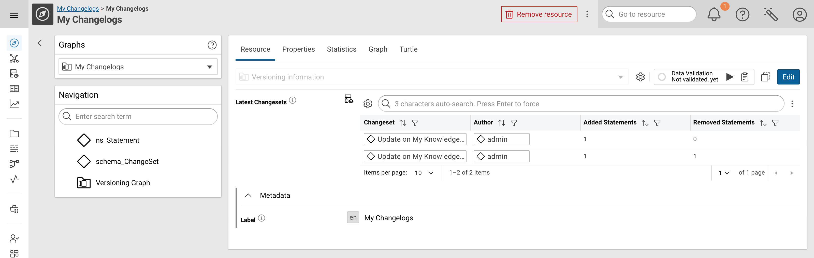

# Versioning of Graph Changes

## Introduction

This feature keeps track of changes to your Knowledge Graphs by creating change set data based on the user's editing activities.

Changes are not stored in the edited graph itself, but in a separate graph of type `shui:VersioningGraph` — the **Versioning Graph**.
Setting this up is a two step process: you create a Versioning Graph, and then configure the graph you want to track to use it.

!!! info "Supported graph types"

    Versioning of graph changes is currently supported for (tracked) graphs of type `void:Dataset` only,
    i.e. graphs created as **New Knowledge Graph (void:Dataset)**.

    On other graph types, the **Versioning Graph** property described in
    [Step 2](#2-configure-a-graph-to-use-the-versioning-graph) is not offered.

## Setup

To enable this feature on a specific graph, carry out the following steps in the
**:eccenca-application-explore: Knowledge Graphs** module.

### 1. Create a Versioning Graph

Open the graph selection and click **:eccenca-item-add-artefact: Add new graph**.
In the **Add new graph** dialog, choose **New Versioning Graph (shui:VersioningGraph)**.

{ class="bordered" }

Provide a **Graph label** (e.g. `My Changelogs`).
The **Graph URI** is generated from it, by default from your hostname and the label.
You can simply type your own URI into the field, which switches the generation mode to **Custom**.
Alternatively, use the :material-cog-outline: button to pick a different generation template
(**Hostname + provided label**, **Selected graph + provided label**, **UUID** or **Custom**).

{ class="bordered" }

Click **Next** to get to the metadata form, then click **Save** to create the graph.

### 2. Configure a graph to use the Versioning Graph

Switch to the Knowledge Graph whose changes you want to track and click **Edit** on the **Resource** tab.

The **Versioning Graph** property is not part of the default graph form, so you have to add it first:
open the **Add data** menu, type `Versioning` in the filter field,
and select **Versioning Graph (beta)**.

{ class="bordered" }

The **Versioning Graph (beta)** field is now shown in the **Configuration** section.
Open its dropdown and select the Versioning Graph you created in step 1.

!!! note

    Only graphs of type `shui:VersioningGraph` are offered here.
    If the list is empty, the Versioning Graph from step 1 was not created or does not have the correct type.

{ class="bordered" }

Click **Save**.
The Versioning Graph is now listed in the **Configuration** section, and an additional
**Versioning** tab appears for this graph.

{ class="bordered" }

## Usage

Once enabled on a graph, all changes made through shaped user interfaces are tracked in the configured Versioning Graph.
You can inspect the recorded change sets either on the tracked graph or on the Versioning Graph.

!!! info "Versioning limitations"

    The graph change history only captures changes made through the supported versioning workflow - namely the [SHACL defined **Resource** tab](../building-a-customized-user-interface/index.md).

    The following changes are **not versioned**:

    - edits made in the **Turtle** tab
    - edits made in the **Properties** tab in the UI
    - changes executed through **SPARQL UPDATE** queries, including updates from the **Queries catalogue** or external clients

### Change sets of a tracked graph

The **Versioning** tab of a tracked graph lists all change sets recorded for it, with author and timestamp.
Select a change set to see the individual statements it added (`addition`) and removed (`removal`).

{ class="bordered" }

### Change sets in the Versioning Graph

The **Resource** tab of the Versioning Graph itself shows the **Latest Changesets** table,
listing the change sets of all graphs tracked by it, together with the number of added and removed statements.

{ class="bordered" }

## Technical Background

For each editing activity (→ Save a Form), a ChangeSet resource will be created.
This resource has some metadata (user, timestamp, label) as well as links to added and deleted Statements (using RDF Reification).

The details of the used vocabulary are available at the [Changeset Vocabulary](https://vocab.org/changeset/) page.
