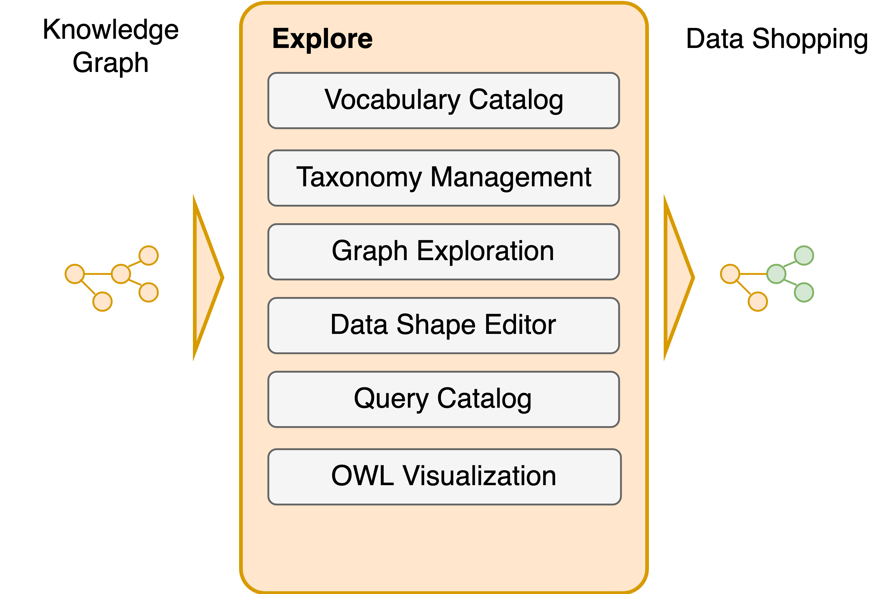

# ★ Explore and Author

Explore, author and interact with your Knowledge Graph.

In the Explore section you will learn how Corporate Memory allows you to interact with your Enterprise Knowledge Graph. All relevant modules and functionalities are described. You will also learn how we make use of [SHACL Shapes](https://www.w3.org/TR/shacl/) in order to [customize the way how you can interact with your data](./building-a-customized-user-interface) in DataManager.

{ width="50%" }

- :material-file-document: [Building a customized User Interface](./building-a-customized-user-interface) --- Working with shapes allows for creation of a customized Linked Data user interface.

- :material-file-document: [Graph Exploration](./graph-exploration) --- The **Explore** module provides a generic and extensible RDF data browser and editor.

- :material-file-document: [Query Module](./query-module) --- The **Query** module provides a user interface to store, describe, search and edit SPARQL queries.
