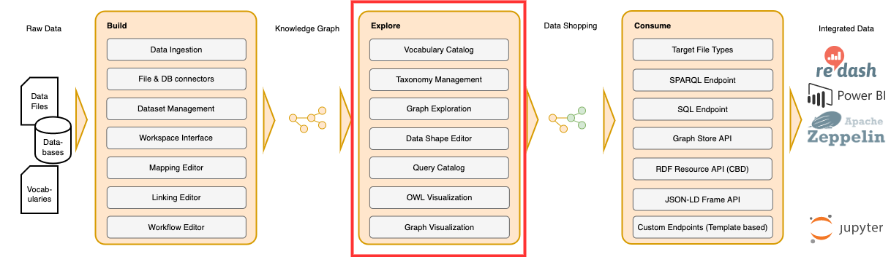

!!! info inline end ""

    

# :material-star: Explore and Author

In the Explore section you will learn how Corporate Memory allows you to interact with your Enterprise Knowledge Graph.
All relevant modules and functionalities are described.
You will also learn how we make use of [SHACL Shapes](https://www.w3.org/TR/shacl/) in order to [customize the way how you can interact with your data](./graph-exploration/building-a-customized-user-interface/index.md).

**:octicons-people-24: Intended audience:** Linked Data Experts and Domain Experts

-   :eccenca-application-explore: [Graph Exploration](graph-exploration)

    ---

    This module provides a generic and extensible RDF data browser and editor.

-   :eccenca-application-vocabularies: [Vocabulary Catalog](vocabulary-catalog)

    ---

    This module allows for managing vocabularies in Corporate Memory that are accessible for the user.

-   :eccenca-module-thesauri: [Thesauri Management](thesauri-management)

    ---

    The Thesaurus module provides a user interface to create, browse and edit thesaurus resources and general taxonomical data modeled in SKOS.

-   :eccenca-application-queries: [Query Module](query-module)

    ---

    The Query module provides a user interface to store, describe, search and edit SPARQL queries.

