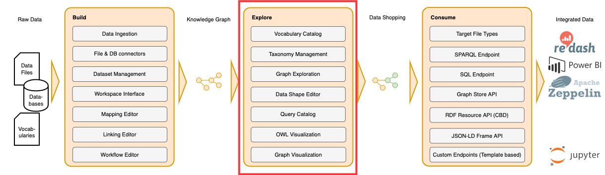

!!! info inline end ""

    

# :material-star: Explore

In the Explore section you will learn how Corporate Memory allows you to interact with your Enterprise Knowledge Graph.
Exploring includes authoring: besides browsing, searching and visualizing, the modules described here let you create, edit and curate graph content.
All relevant modules and functionalities are described.
You will also learn how we make use of [SHACL Shapes](https://www.w3.org/TR/shacl/) in order to [customize the way how you can interact with your data](./graph-exploration/building-a-customized-user-interface/index.md).

**:octicons-people-24: Intended audience:** Linked Data Experts and Domain Experts

- :eccenca-application-explore: [Knowledge graphs](graph-exploration/index.md)

    ---

    The Knowledge graphs module provides a generic and extensible RDF data browser and editor.

- :eccenca-module-bke: [Business knowledge editor](bke-module/index.md)

    ---

    The Business knowledge editor module allows the visual exploration of Knowledge graphs.

- :eccenca-application-queries: [Queries](query-module/index.md)

    ---

    The Queries module provides a user interface to store, describe, search and edit SPARQL queries.

- :eccenca-module-thesauri: [Thesauri](thesauri-management/index.md)

    ---

    The Thesauri module provides a user interface to create, browse and edit thesaurus resources and general taxonomical data modeled in SKOS.

