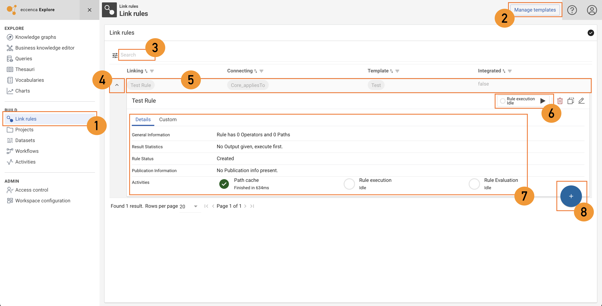
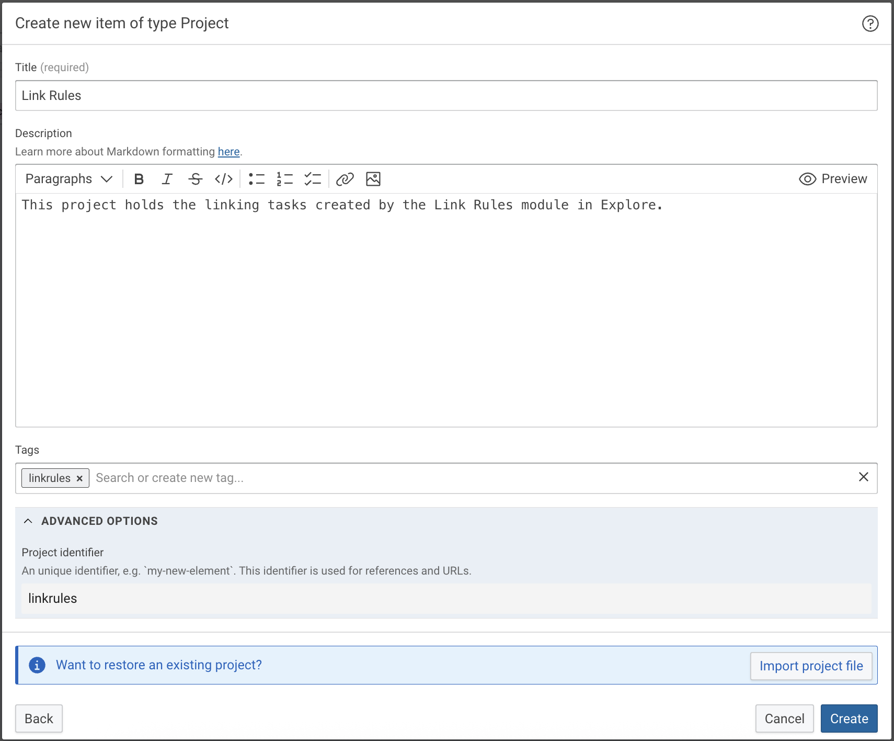
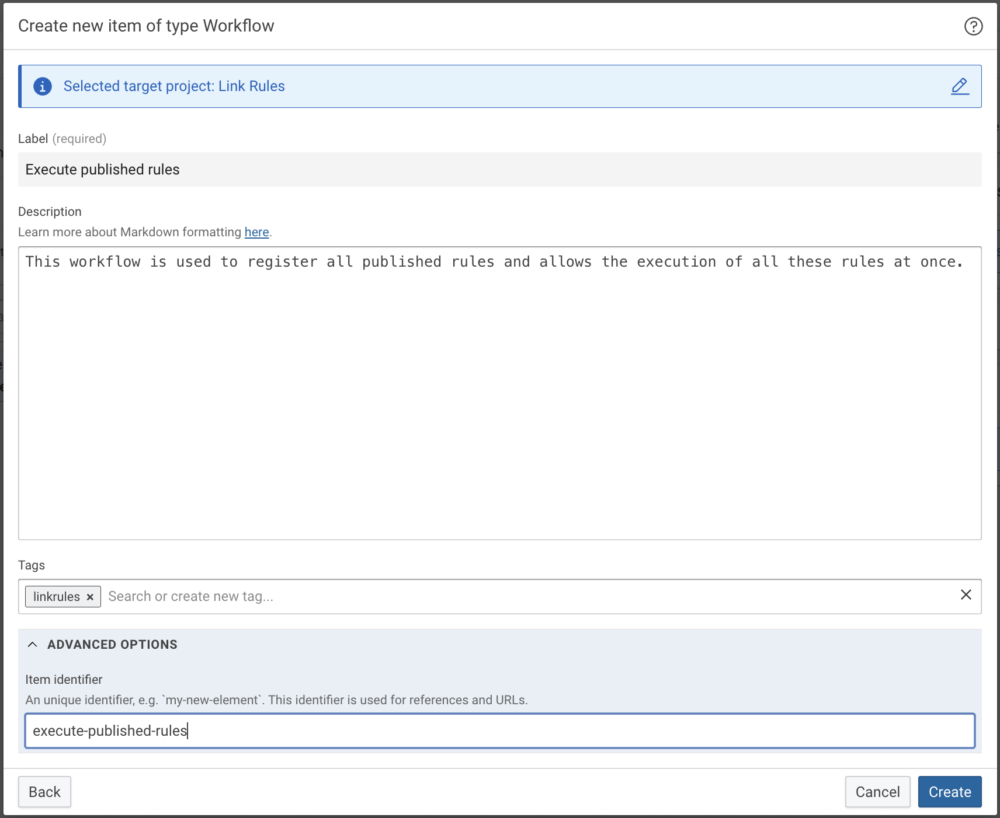

# Link Rules Module

## Introduction

The Link Rules module provides mechanisms to simplify creating data linking and to imposes role specific workflows over the whole process.

Linking tasks allow the creation of links between resources based on rules in the Corporate Memory Build component. Such a linking task demands the configuration of source and target input resource selections (dataset, resource type or additional restrictions), the link type and an output dataset. These configurations demand a thorough understanding of your knowlege graph internals and may become a repetitive task. The Link rules module allows to streamline this process in a way that also users with limited understanding of the knowledge graph can create link rules based on pre-defined templates.

## Usage

This guide explains how to navigate, search, create, and manage Link Rules in the interface.

{ class="borderer"}

### Open the Link Rules Section

In the main navigation menu, under *BUILD* section, click *Link rules* (①).
This opens the list of existing link rules.

### Manage Templates (Optional)

If you want to work with predefined templates for link rules, click *Manage Templates* in the top right corner (②).

### Search for Link Rules

Use the Search field (③) to quickly locate an existing link rule by name or keyword in the description.

### Expand or Collapse Rule Details

Click the arrow icon (④) next to a rule to expand or collapse its details.

In the Details tab (⑦), you’ll find:
- General Information (operators, paths)
- Result Statistics
- Rule Status
- Publication Information
- Activities
- The Custom tab contains any additional user-defined properties.

In the rule execution panel (⑥), you can *Execute* the rule (▶ icon), *Delete* the rule (🗑 icon) and *Clone* (⿻ icon) it or modify its configuration (✏ icon).

### Open the Link Rule editor

Click on the rule name in the *Linking* column (⑤) to open the link rule editor.

### Create a New Link Rule

To create a new rule, click the blue plus button (⑧) in the bottom-right corner.
Follow the prompts to define the template, connecting predicate, etc.


## Setup

### Template Catalog

Create a new graph that holds templates for Link Rules. The graph IRI will be needed for configuration later on.

!!! info

    Suggestion for Template Catalog Graph IRI: ´https://ns.eccenca.com/data/linkruletemplates/´. You may use [this file](./CMEM_Link_Rule_Template_Catalog.ttl) as the graphs content.

!!! info
    
    This graph could be prepared even it is not used in many setups.

!!! info

    If there is no Shape for Link Rule Template load this file as a `New Shape Catalog` (Graph label: Link Rules Shape Catalog, Graph IRI: ´https://vocab.eccenca.com/shacl/link_rules/´).


### Link Rules Build project

Create a new project in Build that holds all linking tasks created in the Link Rules module.

{ class="bordered" }

In the *Advanced Options* section set a *Project Identifier* as this needs to be configured in the next steps.

Inside this project create a new workflow that will be used to register all published rules, so that all these rules can be executed at once. Again it is recommended to set a *Item Identifier* as this needs to be configured in the next steps.

{ class="bordered" }

Inside this project create *Knowledge Graph datasets* for these graphs you want to use for linking.

!!! info

    This project is managed by the *Link Rules module*. You should not alter elements inside the project unless you know what you are doing.

### Access condition

Create a dedicated access condition that allows users to execute link rules and write results to the output graphs of created link rules.

This access conditions is used by the Link Rules module to grant write access to the output graph whenever a new rule is created.

!!! info

    It is currently not possible to set a *Access Condition Identifier* nor to simply retrieve the IRI of an existing access condition. Hence the admin needs to retrieve the IRI of this access condition from the CMEM Access Conditions graph. 

### Workspace configuration

Enable the *Link Rules* module.

In the following let us walk through the configuration options.

- **Order**: The position of the Link Rules module in the menu.
- **Template Catalog IRI**: The IRI of the template catalog we just created. As the name implies, the Template Catalog holds all templates for usage in the Link Rules module. Templates allow preselecting patterns for easier rule creation.
- **Project ID**: The *Project Identifier* of the Link Rules Build project we just created. Link Rules will be managing this project and add the rules to it. To get the id of a project, open the project in the build component, select the project and choose 'Show identifier' in the context menu, in the top right. The project needs to have a workflow, which is used to execute the rules and has to be configured in this section. Furthermore, the projects needs one or more Datasets, which can be selected in the templates.


- **Published Rules Workflow ID**: The *Item Identifier* of the workflow in the Link Rules Build project we just created.
- **Access Condition IRI**: The IRI of the Access Condition we just created.
- **Output Graph Template**: A template for graph IRIs which will hold the results of a linking rule. It needs to include the placeholder `{name}`, for example `http://eccenca.com/user_rules/result_{name}`.
- **Publication Graph Template**: A template for graph IRIs which will import the result graph once the results are published. This can be a simple graph IRI, for example `http://eccenca.com/user_rules/results_published`.
- **Result Download Query**: A query that will be used to download the results of a linking rule. By default all resource IRIs will be listed as `resource1` and `resource2`. Whenever you want to provide other data via the *Download results* function, such as a specific identifier or a label instead of the IRI, this query can be adopted here.
- **Annotation Class IRI** (optional): Rule results can be enriched with annotations. Instances of this class can be selected in the link rules interface. Instances have both a connection to the rule and the result. The connection is defined by the *Annotation Link Property IRI*. The values of the annotation are defined by the *Annotation Value Property IRI*. This relation is materialized as `rdf:value` in the output graph upon execution.
- **Annotation Value Property IRI** (optional): Values of sub-properties of this property are actually connected as `rdf:values` to the generated links of a rule.
- **Annotation Link Property IRI** (optional): The connection between a rule and an annotation resource (i.e. instance of *Annotation Class IRI*) is defined by this property.
- **Annotation Graph IRI** (optional): The IRI of the graph, from which instances of the *Annotation Class IRI* are selected.

When the configuration is saved the *Link Rules module* should appear in the *Build* section of the menu.


### Create a Link Rule Template

Templates can be managed at *Link Rules module* -> *Manage Templates*.

Create a new Link Rule Template. Such a template describes an abstract link rule with pre-defined settings.

- **Label**: A mandatory label for the template.
- **Target Property**: The (default) connecting property for the derived link rules. The property can be individually set for each link rule later on.
- **Input** group: The datasets which hold the subjects (source) and objects (target) to link.
 - **Source/Target Dataset**: The dataset holding the resources to link.
 - **Source/Target Resource Pattern**: A filter description template for the resources to link. This is a JSON object as described in [Graph Resource Pattern](#graph-resource-pattern). When creating a Link Rule based on this template these resource patterns can be altered. So this template may remain simple, but should provide sufficient help for the end user to define a proper resource selection.
- **Output** group: The dataset which will hold the Link Rule results.
 - **Output Graph**: The graph IRI where to write the Link Rule results. Available placeholders: `{name}` for the Link Rules name.

##### <a name="graph-resource-pattern"></a> Graph Resource Pattern

This section specifies the JSON object used to provide a search filter configuration for source and target resources used for the Link Rule.

The source / target resources are always referred as variable `a`.

In the example below, resources are selected which are of type variable `class` and are referenced another resource named `subResource` by the property `http://example.com/vocab/hasParent`. The `class` variable is restricted to be one of `http://example.com/vocab/Company` or `http://example.com/vocab/Department`.

```json
{
    "paths": [
        {
            "subjectVarName": "a",
            "predicate": "http://www.w3.org/1999/02/22-rdf-syntax-ns#type",
            "objectVarName": "class"
        },
        {
            "subjectVarName": "subResource",
            "predicate": "http://example.com/vocab/hasParent",
            "objectVarName": "a"
        }
    ],
    "pathFilters": [
        {
            "varname": "class",
            "varIsAnyOneOfResource": [
                "http://example.com/vocab/Company",
                "http://example.com/vocab/Department"
            ]
        }
    ]
}
```

In the `paths` section triple patterns are defined using `subjectVarName`, `predicate`, `objectVarName`.

The `pathFilters` section defines restrictions on the variables defined above.
The following path filter properties can be used:

- `isNoneOfLiteral`
- `isNoneOfResource`
- `varIsAnyOneOfLiteral`
- `varIsAnyOneOfResource`
- `literalFilters`
 - `GreaterThan`
 - `LessThan`
 - `GreaterEqualsThan`
 - `LessEqualThan`
 - `NotEquals`
 - `Contains`
 - `Regex`
