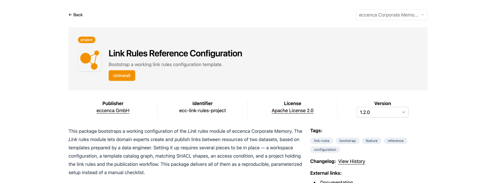
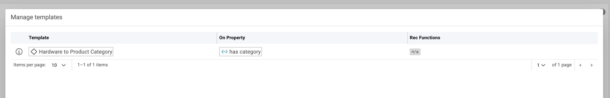
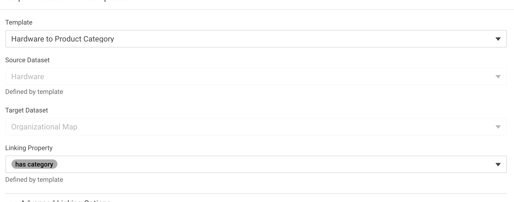
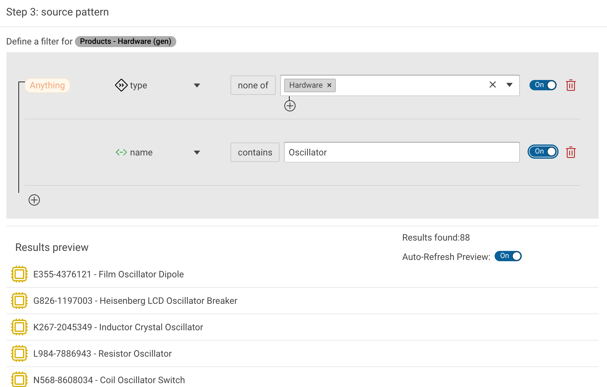
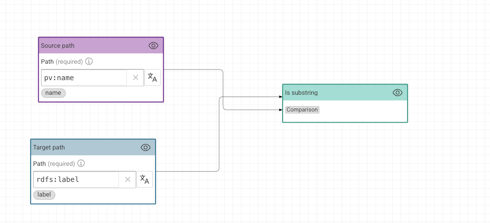
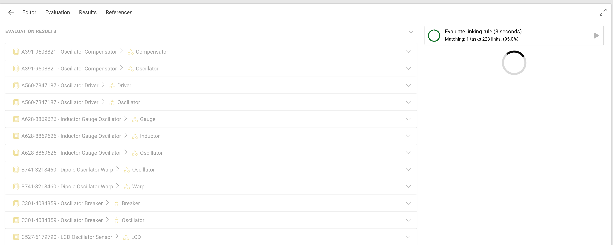
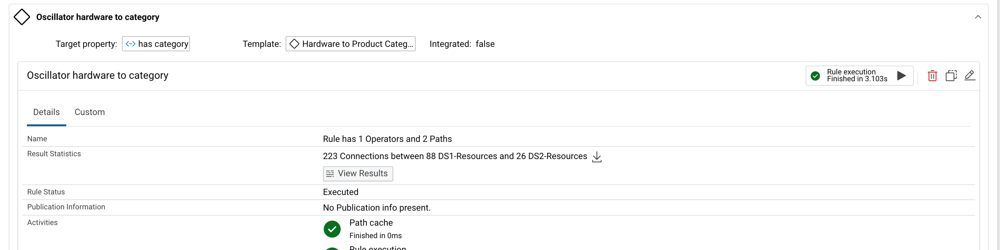
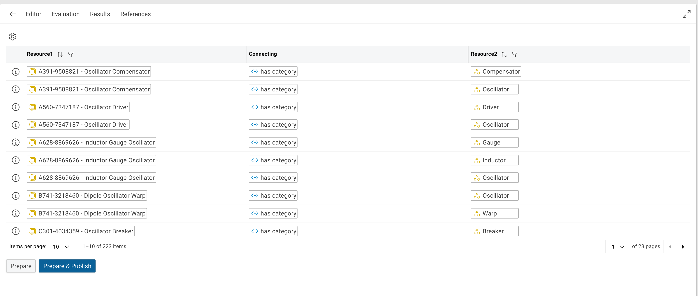
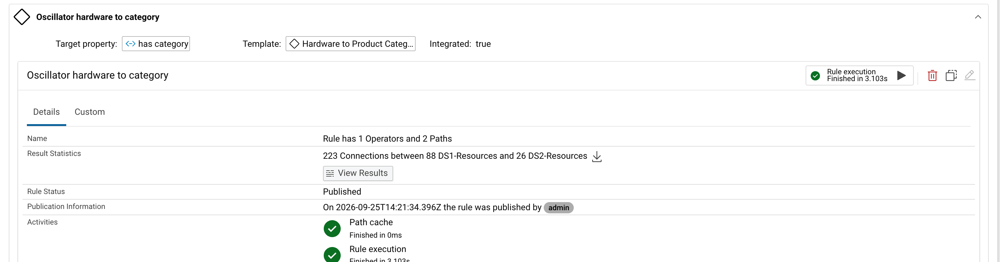

# Creating and publishing link rules

## Introduction

The Link Rules module of eccenca Corporate Memory lets domain experts create links between resources of two knowledge graphs without building a linking task in Build.
A data engineer prepares a **Link Rule Template** that fixes the datasets, the connecting property and the result graph.
Domain experts then create rules from that template, narrow the resource selection to the part of the data they are responsible for, review the generated links and publish them.

This tutorial walks through that division of work once, end to end:

1. Install and activate the module from the `ecc-link-rules-project` package
2. Register the knowledge graphs that the rules link
3. Create a link rule template
4. Create a link rule from the template
5. Build and evaluate the linkage rule
6. Review the results and publish them

The [Link Rules](../index.md) page describes every configuration option in detail.
This tutorial uses one concrete example instead and refers to that page where a setting needs more explanation.

!!! info

    The tutorial was written against Corporate Memory 26.2 and the `ecc-link-rules-project` package in version `1.2.0`.

## The example scenario

The example uses the product data of the Product Data Integration Demo project.

Two knowledge graphs take part:

- **Products - Hardware (gen)** (`http://ld.company.org/hardware/`) holds 1000 instances of `pv:Hardware`, each with a `pv:name` such as `Heisenberg LCD Oscillator Breaker`.
- **Products - Org Structure (gen)** (`http://ld.company.org/orgmap/`) holds 26 instances of `pv:ProductCategory`, labeled `Coil`, `Oscillator`, `Breaker` and so on.

A hardware product belongs to a category when the category label occurs in the product name.
The connecting property is `pv:hasCategory`.

The data engineer turns this into a template.
The domain expert responsible for the oscillator product line then creates a rule that applies it to the 88 hardware products whose name contains `Oscillator`.

## 1 Installing the package

The `ecc-link-rules-project` package delivers the whole setup: the workspace configuration, the template catalog graph, the SHACL shapes for templates, an access condition, and the project that holds the rules and the publication workflow.

1. Click **Packages** under **MARKETPLACE** in the navigation.
2. Enter `link rules` in the **Search** field.
3. Click **Details** on **Link Rules Reference Configuration**.
4. Click **Install**.

{ class="bordered" }

The package description on this page lists the setup steps and the `cmemc` commands for each of them.
The following sections carry out the same steps in the user interface.

## 2 Initializing graphs, shapes and configuration

The package installs a project named **Bootstrap Link Rules Configuration** whose `initialize` workflow creates everything the module needs.

1. Click **Projects** under **BUILD** and open **Bootstrap Link Rules Configuration**.
2. Open the `initialize` workflow.
3. Click the :eccenca-item-start: button in the toolbar of the workflow editor.

The workflow writes the workspace configuration, creates the template catalog graph `https://ns.eccenca.com/data/linkrules-templates/`, loads the template shapes into `https://vocab.eccenca.com/shacl/link_rules/`, and creates the access condition.

!!! info

    The project variables of **Bootstrap Link Rules Configuration** carry the identifiers and IRIs that the setup uses, among them the project identifier `linkrules` and the output graph template `http://eccenca.com/linkrules/user_rules/result_{name}`.
    Change them before running the workflow to set up an isolated second configuration.

## 3 Creating the link rules project

The module manages its rules inside one Build project.
The package ships **Link Rules Reference Project** as the blueprint for it.

1. Open **Link Rules Reference Project** under **BUILD** > **Projects**.
2. Click the :eccenca-item-moremenu: **Show more options** button next to the project title and select **Clone**.
3. Enter the following values:

    - **New name of cloned project:** `Link Rules`
    - **Custom identifier for project (optional):** `linkrules`

4. Click **Clone**.

The identifier has to match the **Project ID** in the workspace configuration, which the bootstrap workflow set to `linkrules`.
The cloned project contains the **Execute published rules** workflow that collects every published rule.

!!! warning

    The Link Rules module manages this project.
    Do not rename, move or delete the items that the module creates inside it.

## 4 Registering the knowledge graphs as datasets

A template can only reference knowledge graphs that exist as datasets inside the link rules project.
Create one Knowledge Graph dataset per graph that takes part in linking.

1. Open the `Link Rules` project.
2. Click **Create new** and select **Knowledge Graph**.
3. Enter the following values:

    - **Label:** `Hardware`
    - **Description (optional):** `Hardware products of the product data integration demo.`
    - **Graph:** `http://ld.company.org/hardware/`

4. Click **Create**.
5. Repeat the steps for the second graph:

    - **Label:** `Organizational Map`
    - **Description (optional):** `Departments, employees and product categories.`
    - **Graph:** `http://ld.company.org/orgmap/`

After the workspace configuration is in place, **:eccenca-artefact-linking: Link rules** appears under **BUILD** in the navigation.

## 5 Creating a link rule template

A template is the data engineer's contribution.
It fixes what stays the same for every rule derived from it: the two datasets, the connecting property and the graph that receives the results.

1. Click **:eccenca-artefact-linking: Link rules** under **BUILD**.
2. Click the :eccenca-application-config: **Manage templates** button in the top right corner.
3. Click **New Template**.
4. Enter the following values:

    - **Label:** `Hardware to Product Category`
    - **Target Property:** `has category`
    - **Source Dataset:** `Hardware`
    - **Source Resource Pattern:** the source pattern below
    - **Source Class (optional):** `Hardware`
    - **Target Dataset:** `Organizational Map`
    - **Target Class (optional):** `Product Category`
    - **Target Resource Pattern:** the target pattern below
    - **Output Graph:** `http://eccenca.com/linkrules/user_rules/result_{name}`

5. Click **Create**.

The **Target Property**, **Source Dataset** and **Target Dataset** fields search by label, not by IRI.
Enter `category` to find `pv:hasCategory`, which the product vocabulary labels `has category`.

**Source Resource Pattern** and **Target Resource Pattern** restrict the resources that a rule offers for linking.
Both are JSON objects in the format described under [Graph Resource Pattern](../index.md#graph-resource-pattern).
The source pattern selects instances of `pv:Hardware`:

``` json
{
  "paths": [
    {
      "subjectVarName": "a",
      "predicate": "http://www.w3.org/1999/02/22-rdf-syntax-ns#type",
      "objectVarName": "class"
    }
  ],
  "pathFilters": [
    {
      "varname": "class",
      "varIsAnyOneOfResource": [
        "http://ld.company.org/prod-vocab/Hardware"
      ]
    }
  ]
}
```

The target pattern is identical except for the class, which is `http://ld.company.org/prod-vocab/ProductCategory`.

Keep a pattern permissive.
It is the starting point that every rule creator refines, not the final selection.

Set **Source Class** and **Target Class** to precompute the facets of the candidate resources, which speeds up rules over large graphs.
Both fields are optional.

{ class="bordered" }

## 6 Creating a link rule from the template

Creating a rule is the domain expert's task.
The wizard asks for a name, a template and the two resource selections.

1. Click **Create new linkage rule**.
2. Enter the following values in **Step 1: common fields**:

    - **Name:** `Oscillator hardware to category`
    - **Description:** `Assigns product categories to the oscillator hardware line.`

    The name has to be unique among the existing rules.

3. Click **Next**.
4. Select `Hardware to Product Category` in the **Template** field.

    **Source Dataset**, **Target Dataset** and **Linking Property** are filled from the template and marked **Defined by template**.

    { class="bordered" width="70%" }

5. Click **Next**.

    **Step 3: source pattern** shows the resource selection that the template defines, together with a live preview of the matching resources.
    **Results found** reports 1000 hardware products.

6. Narrow the selection down to the oscillator product line:

    1. Click the :eccenca-item-add-artefact: **Add path** button at the lower left of the filter box.
    2. Click **Select property** and select `name`.
    3. Enter `Oscillator` in the **Filter value** field.
    4. Switch the toggle of the new filter row to **On**.

    A filter row only takes effect once its toggle is **On**.
    **Results found** drops to 88, and **Results preview** lists the matching products.

    { class="bordered" width="70%" }

7. Click **Next**.

    **Step 4: target pattern** works the same way for the link objects.
    Leave it unchanged to offer all 26 product categories.

8. Click **Save**.

The rule appears in the list with the status `Created`.
It has no linkage rule yet, which the **Details** tab states as `Rule has 0 Operators and 0 Paths`.

!!! warning "Check the target dataset of the generated linking task"

    In version 26.2 the module writes the source dataset into the target dataset of the linking task it generates, regardless of what the template defines.
    The evaluation then reports `The evaluation yielded no results.` because no target resources are found.

    Correct it once per rule:

    1. Open the `Link Rules` project under **BUILD** > **Projects**.
    2. Open the linking task that carries the rule name.
    3. Set the target dataset to the dataset that the template defines, `Organizational Map` in this example.

## 7 Building the linkage rule

The template and the wizard define which resources are compared.
The linkage rule defines how they are compared.

1. Click the rule name to open the rule editor.
2. Drag **Source path** from the operator list onto the canvas and set its **Path** to `pv:name`.
3. Drag **Target path** onto the canvas and set its **Path** to `rdfs:label`.
4. Drag the **Is substring** comparison onto the canvas.
5. Connect the output of each path to an input of **Is substring**.
6. Click **Save**.

{ class="bordered" width="70%" }

**Is substring** accepts a pair when one value occurs inside the other, which matches the category `Oscillator` to the product name `Film Oscillator Dipole`.

The operator list on the left groups the available building blocks, among them **Lower case** and **Tokenize** to normalize values before comparing, the comparisons **Levenshtein distance**, **String equality** and **Jaccard**, and the aggregations **Average** and **Or** to combine several comparisons into one score.

!!! tip

    Add reference links on the **References** tab before refining a rule.
    A reference link marks a pair as `positive` or `negative` and turns the evaluation statistics into a measure of how well the rule reproduces those decisions.

## 8 Evaluating the rule

The evaluation runs the rule without writing anything.

1. Select the **Evaluation** tab.
2. Click the :eccenca-item-start: button next to **Evaluate linking rule**.

{ class="bordered" }

**EVALUATION RESULTS** lists every proposed link, **EVALUATION STATISTICS** summarizes the run.
For this rule it reports 88 source resources, 26 target resources and 223 links.

The list shows why the rule is useful and where it is imprecise.
`Inductor Gauge Oscillator` is matched to `Gauge`, `Inductor` and `Oscillator`, which is correct.
A product named `Film Oscillator Dipole` is matched to `Oscillator` but also to any category whose label happens to occur in the name.

Refine the rule in the editor and evaluate again until the result is acceptable.

## 9 Executing the rule

The execution writes the links into the output graph of the rule.

1. Return to the rule list and expand the rule.
2. Click the :eccenca-item-start: button next to **Rule execution**.

The **Details** tab now reports the result under **Result Statistics** and the status changes to `Executed`.

{ class="bordered" }

The output graph follows the **Output Graph** of the template, with `{name}` replaced by the identifier of the linking task.

## 10 Reviewing and publishing the results

Publication is the approval step.
Until a rule is published, its links stay in its own result graph and no consumer sees them.

1. Click **View Results**.

    The **Results** tab lists every link as **Resource1**, **Connecting**, **Resource2**.

    { class="bordered" }

2. Work through the list and confirm that the links are correct.
3. Click **Prepare & Publish**.

Publishing has three effects:

- The result graph is imported into the publication graph `http://eccenca.com/linkrules/user_rules/results_published` through `owl:imports`, which makes the links visible to everything that reads that graph.
- The rule is added to the **Execute published rules** workflow of the `Link Rules` project, so that all published rules can be run again in one go after the source data changes.
- **Rule Status** changes to `Published`, **Integrated** changes to `true`, and **Publication Information** records who published the rule and when.

{ class="bordered" }

**Un-Publish** and **Un-Publish & Un-Prepare** withdraw the publication again.
**Un-Publish & Un-Prepare** also empties the result graph, so the rule has to be executed again before it can be published a second time.

!!! info

    A published rule cannot be edited.
    The :eccenca-item-edit: **Edit setup** button on the rule card stays disabled until the rule is un-published.

## Next steps

- Create a second rule from the same template for another product line, to see how one template serves many rules.
- Run the **Execute published rules** workflow of the `Link Rules` project after the source graphs change, to refresh every published rule at once.
- Read the [Link Rules](../index.md) page for the remaining configuration options, among them the annotation properties and the result download query.
