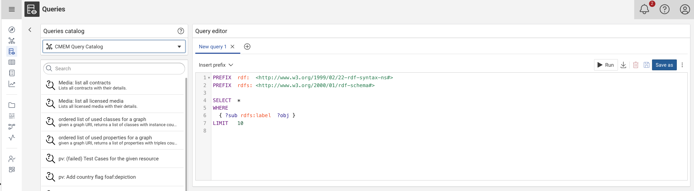

# Query Module

## Introduction

The Query module provides a user interface to store, describe, search and edit SPARQL queries.
The queries are evaluated on the Knowledge Graph and provide a way to granularly aggregate semantic data as tables.
These tables can then be exported as CSV, Excel or JSON documents.

The Query module features two areas, the catalog and the editor.

## Query catalog

The catalog lists all existing SPARQL queries including name, type and description.

Use the **:eccenca-operation-search: Search** bar in order to look for a specific query.



Select the query from the Queries catalog, to open and load the query. 


## Query editor

Use the Query editor to edit and execute SPARQL queries.
In this view you can also browse query result previews and download full query results as CSV files.

The Query editor provides an interface where you can write and edit your SPARQL queries.
The query editor features SPARQL syntax highlighting and SPARQL validation, allowing only syntactically correct SPARQL queries to be executed.

The Query editor allows to Run query, Download Results, Delete, Save and Save as Queries.


### Run a query

Click **:eccenca-item-start: Run** to execute the query and to display a preview of the query results under the query editor.
The results are presented as a table with pagination.

### Export results

To export the full set of results without any limits in the form of a CSV file click **:eccenca-item-download: Download result** at the top right. 


!!! info

    The preview result ordering has no impact on the result ordering in the exported file.
    If you want to export ordered query results, you need to use the `ORDER BY` construct in the SPARQL query itself.

### Save a query

To save a query in the Query catalog click **:material-floppy: Save**.
This opens a dialog that allows you to overwrite the existing query.


### Placeholders

In addition to the standard SPARQL syntax, placeholders can be used to parameterize a query.
Placeholders are indicated in the query using a string of the form `{{placeholdername}}`.
Multiple placeholders can be defined by changing the name inside the brackets.

When a query contains a placeholder, the placeholder list to the right of the query editor shows a field with its name.


When running a query that contains placeholders, the query editor replaces the `{{placeholdername}}` string in the query with the respective string entered into the placeholder list.
This is a direct string replacement, so placeholders can contain simple strings and literal values, URIs, variables or even subqueries.

Running a query with a placeholder is only possible when all placeholder fields in the placeholder list have been filled.

A typical use case is restricting a query to a specific class of objects stated by a placeholder:

```sparql
SELECT * WHERE { ?classInstance a <http://dbpedia.org/ontology/{{class}}> .}
```

This query selects all instances of a specific DBpedia Ontology class.
When you enter `Person` into the `class` placeholder field in the placeholder list the following query is executed:

```sparql
SELECT * WHERE { ?classInstance a <http://dbpedia.org/ontology/Person> .}
```

