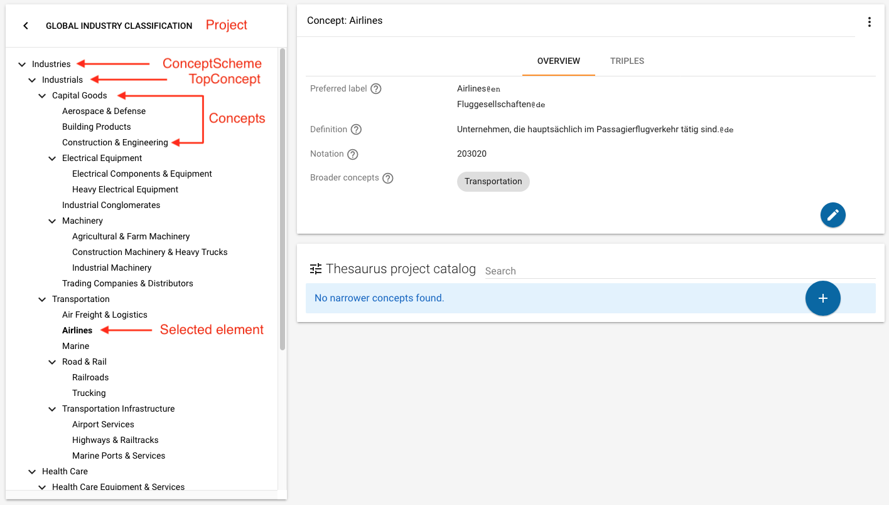
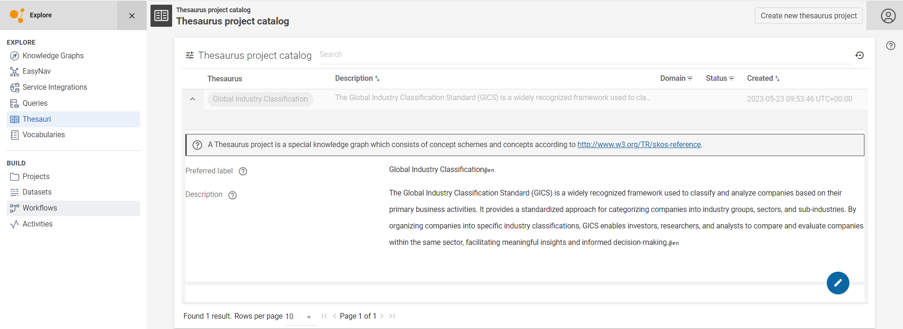

# Thesauri Management

## Introduction

The Thesaurus module provides a user interface to create, browse and edit thesaurus resources and general taxonomical data modeled in the [Simple Knowledge Organization System (SKOS)](https://www.w3.org/2004/02/skos/vocabs).

> A thesaurus is a reference work that lists concepts with similar meaning, containing for example synonyms, often including taxonomical relations between these concepts.
> Taxonomies describe classifications of concepts into categories sharing particular features and their relations to broader (parent) and narrower (child) concepts.

An example for a taxonomy or classification is how companies can be categorized into industries, industry groups and sectors.
An airport belongs to the sector Airport Services, the broader category Transportation Infrastructure, the broader category Transportation and the broader category Industrials.
You can think of these relations as a hierarchical tree representing the relations as individual branches like shown in the navigation tree on the left side of the Thesaurus view.
In a concept scheme Industries, a top branch in this tree, as for example the sub-industry Industrials or Health Care, is called a top concept.
All branches together belong to the concept scheme Industries.

{ class="bordered" }

!!! info

    In order to build thesauri or taxonomies with the Thesaurus module you should be familiar with SKOS structures.

SKOS is a convenient way to model taxonomical data.
The [SKOS Reference](https://www.w3.org/TR/2009/REC-skos-reference-20090818/) provides detailed documentation on the usage of SKOS.
The Thesaurus module allows to create, browse and edit such structures, providing a way to structure your hierarchical data in a simple interface and make it accessible for use cases like documentation and master data management.

!!! info

    Before you start working with the Thesaurus module ensure that the vocabulary *Simple Knowledge Organization System* is installed in the Vocabulary catalog (see section [Vocabulary Catalog](../vocabulary-catalog/index.md)).

Click **:eccenca-module-thesauri: Thesauri** in the main menu, to open the Thesaurus project catalog.

## Thesaurus project catalog

The Thesaurus project catalog lists thesaurus projects with relevant metadata in a searchable and sortable table.

In order to get more information on a thesaurus project and edit its metadata, click **:eccenca-toggler-showmore: Show more** in the table row.
The view expands showing the project metadata.
Click **:eccenca-item-edit: Edit** on the right side of the row to open the edit mode, enter your changes and click **SAVE**.

{ class="bordered" }

To open the detail view of a thesaurus project, click the project name in the catalog.

### Creating a new thesaurus project

In order to create a new thesaurus project, select **Create new thesaurus project** on the upper right of the thesaurus project catalog.
Enter a name for your thesaurus project and more metadata if required and click **SAVE**.
The thesaurus detail view is shown, displaying an empty thesaurus project.

### Importing an existing thesaurus

You can import existing thesaurus data in a thesaurus project.
To import a thesaurus make sure that the data is in Turtle format and you are on project level in the thesaurus detail view.
Click the context menu **:eccenca-item-moremenu: Show more options** in the upper right of the thesaurus detail view, then select **Import data**.
Upload the file containing the thesaurus.
Click **SAVE** to import the data.

### Exporting a thesaurus project

To export a thesaurus project, go to the project level, click the context menu **:eccenca-item-moremenu: Show more options** in the upper right of the thesaurus detail view, then select **Export project**.
Confirm the dialog and click **DOWNLOAD** to download the thesaurus project.

### Removing a thesaurus project

To remove a thesaurus project, go to the project level in the navigation tree, click the context menu **:eccenca-item-moremenu: Show more options** in the upper right of the thesaurus detail view, then select **Remove project**.
Confirm the removal and click **REMOVE** to delete the thesaurus project.

## Thesaurus detail view

After selecting a thesaurus project in the Thesaurus project catalog, the thesaurus detail view is shown.
This view consists of three components.
The navigation tree component is displayed to the left.
It displays the hierarchical structure of the thesaurus.
The upmost element is the project level.
Clicking :eccenca-navigation-previous: brings you back to the Thesaurus project catalog.

Below the project level, the concept scheme(s) and concepts are displayed.
A *Concept scheme* serves as a meaningful aggregation of a number of concepts.
A concept itself constitutes a unit of thought, a conceptual class or category of objects you want to describe.
For example, all concepts on a particular topic or domain could belong to the same concept scheme.

If a concept in the navigation tree has narrower (child) concepts, you can expand this branch of the tree by clicking the arrow displayed in front of the concept.
Arrows are only shown for concepts for which narrower concepts exist.
Clicking the name of a concept scheme or concept updates both the detail view as well as the concept list to the right of the navigation tree.

The tab **Statistics** shows statistical information about the content of the thesaurus project.

A list of concept schemes of the thesaurus project is shown in the lower part as a searchable table.

To edit project metadata in the thesaurus detail view click **:eccenca-item-edit: Edit**.

### Concept detail view

Clicking on a **Concept scheme** or a **Concept** in the navigation tree displays information on that resource in the concept detail view to the right.

The concept detail view displays the concept's preferred and alternative labels in the **Overview** tab, as well as definitions and other metadata.
A list of top concepts of a concept scheme or narrower (child) concepts of a concept is shown below these metadata as a searchable table called concept list.

To find specific sub concepts of a concept, you can use the search bar in the concept list.
Click any result row to display more information on the concept, like its labels, definition and notation.
Click the concept name in the row itself to open the concept detail view for this concept.
Selecting a concept in the concept list updates the navigation tree to highlight the concept's position in the tree.

In case of concept schemes, the **Statistics** tab can be used to learn more about the number of concepts in this concept scheme, as well as their relations.

The **Triples** tab shows the RDF source code of the concept as Turtle serialization.
The triples in this view are editable, but be aware that changes in the triple editor can cause major errors in the Thesaurus module.
When you are not an expert in working with triples do not use the triple view as an editor.

### Adding new concepts and concept schemes

Concept schemes can be added on project level in an opened thesaurus project.
Click on the project name in the navigation tree, then click the context menu **:eccenca-item-moremenu: Show more options** and select **Create new concept scheme**.
You can return to this level by clicking the name of the thesaurus project above the navigation tree.

Enter at least one preferred label naming the concept scheme.
Select the language of the preferred label to the right of the label field.
Click :material-plus: under the label field to set multiple labels.
Create the concept scheme by clicking **SAVE**.
A new concept scheme will appear in the concept list as well as the navigation tree.

Top concepts can be added in the same way.
Instead of starting on project level, select an existing concept scheme first.
Click the context menu **:eccenca-item-moremenu: Show more options** and a new option **Create new top concept** is available.
Use it to create a new top concept.

Selecting a normal concept brings up the option **Create new concept** in the same menu.
Using this option creates a new concept and automatically add it as a narrower concept to the concept you created it on.
It also automatically adds the `broader` back link on the newly created concept.

To edit a concept or concept scheme, click **:eccenca-item-edit: Edit** to get a form displaying all available fields, like labels and definition.

!!! info

    For each concept, you have to enter one preferred label per language.
    Be aware that SKOS allows only one preferred label per language.
    If you want to enter more labels use alternative or hidden labels as specified by SKOS.

### Creating relations between concepts

Besides the narrower relation automatically generated when a new concept is created, you can add further relations between concepts.
You can add, for example, a second broader concept for an existing concept or a related concept to indicate associative relations.

To add relations, select the concept in the navigation tree.
In the detail view, click **:eccenca-item-edit: Edit** to open the edit mode.

- To add an associative relation to another concept, enter the concept name in the field **Related concept**.
- To add a further broader relation, enter the name of the broader concept in the field **Broader concepts**.

You can only choose from existing concepts.
Click **SAVE** to confirm your changes.

In the same way you can also add a top concept to a second concept scheme.
Use therefore the field Top concept of in the editing mode of a top concept.

When adding relations the inverse relation is automatically added, too.

### Removing concepts and concept schemes

!!! Warning

    Be aware that removing a concept or concept scheme with child elements (top concepts or narrower concepts) means that the complete substructure, i.e. all childs, are also deleted regardless whether they are used in another concept scheme.

To remove concepts or concept schemes, select the resource in the navigation tree, click the context menu **:eccenca-item-moremenu: Show more options** and select the **Remove** option.
Confirm the dialog and click **REMOVE**.
